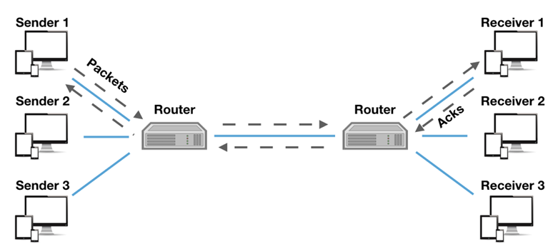

ネットワークの制御は機械的で状況に応じた制御できないかと感じることがあります。
そんな中状況に応じて制御という言葉が出てくると、まあ、[深層強化学習](https://yoshishinnze.hatenablog.com/entry/2025/12/01/000000)ですよね。
ネットワークのルーティングや制御に強化学習を用いたものがないかを調べてみるとありました。
内容が結構興味湧いたので論文読んでみます。

## 論文情報

- タイトル： A Deep Reinforcement Learning Perspective on Internet Congestion Control
- 著者: Nathan Jay ら（University of Illinois 等）
- 発表: ICML 2019
- 概要: インターネットの輻輳制御を「RL問題」として定式化した先駆的研究です。送信側エージェントが、ネットワークの遅延やパケットロスを**状態**、送信レートの増減を**行動**、スループットと遅延のトレードオフを**報酬**として学習します。従来のTCP（Cubic, BBR等）と比較して、様々なネットワーク環境で**より高いスループットと低遅延**を達成しました。
- URL: https://proceedings.mlr.press/v97/jay19a.html

## 解決しようとした課題

この研究が解決しようとした課題は、**「TCP輻輳制御アルゴリズムの設計が、人手によるヒューリスティクスに依存しすぎている」** という根本的な問題です。

具体的には、以下の3つの課題を解決しようとしました。

### 課題1：人手によるアルゴリズム設計の限界

従来のTCP輻輳制御（Cubic, BBR, Vegasなど）は、**人間のエンジニアが経験と直感で設計したルール**に基づいています。しかし、インターネットの環境は以下のように極めて多様です。

- **リンク帯域**: 数kbps（IoT）から数百Gbps（データセンター）まで
- **RTT（往復遅延）**: 数msから数百msまで
- **バッファサイズ**: 深いバッファ（Bufferbloat）から浅いバッファまで
- **輻輳の性質**: ポイント輻輳、ワイヤレスによるランダムロス、複数ボトルネックなど

**人間が設計した固定ルールでは、すべての環境に最適に対応できません**。例えば、Cubicは高帯域遅延積環境で有効ですが、浅いバッファ環境ではパケットロスを頻発させます。

### 課題2：環境変化への適応の遅さ

従来のTCPアルゴリズムは、**一度デプロイされるとパラメータが固定**されます。しかし、現代のネットワークでは以下のような動的変化が頻繁に起こります。

- モバイル端末の移動による経路変更
- 背景トラフィックの増減
- ワイヤレスリンクの品質変動

**固定ルールでは、こうした変化にリアルタイムで適応できません**。

### 課題3：複数目的のトレードオフ最適化の困難さ

輻輳制御では、以下の複数の目的を同時に最適化する必要があります。

- **スループットの最大化**
- **遅延の最小化**
- **公平性の確保**（複数フローが帯域を公平に共有）

これらは**トレードオフ関係**にあり、人間が設計したルールでは「どの環境でどの目的を優先するか」の微妙なバランス調整が困難でした。

### この研究のアプローチ

これらの課題に対し、著者らは **「輻輳制御をRL問題として定式化」** することで、以下の解決を図りました。

| 従来のTCP | この研究（RLベース） |
|----------|-------------------|
| 人間が設計した固定ルール | エージェントが経験から学習 |
| 環境変化に弱い | 観測に基づき動的に適応 |
| トレードオフ調整が困難 | 報酬関数で目的を明示的に最適化 |

### 一言でまとめると

> **「人間が一つ一つTCPアルゴリズムを設計する時代を終わらせ、機械がネットワーク環境に応じて最適な送信戦略を自律的に学習できるようにする」**

これが、この研究の核心的な課題意識です。

## 解決法

この研究では、**「Aurora」** というRLベースの輻輳制御フレームワークを提案し、以下の4つの要素で課題を解決しました。

### 1. 輻輳制御を「RL問題」として定式化

送信者（Sender）を**RLエージェント**としてモデル化し、以下のように定義しました。

| 要素 | 具体的な内容 |
|------|-------------|
| **状態（State）** | 過去数ステップの観測履歴（送信レート、受信レート/スループット、遅延、パケットロス率などの統計量） |
| **行動（Action）** | 次の**送信レート**を決定（現在のレートから増減または絶対値で選択） |
| **報酬（Reward）** | スループットと遅延のトレードオフを表現するutility関数（例: 高スループット・低遅延を高報酬とする） |
| **環境（Environment）** | ネットワークシミュレータ（リンク帯域、バッファ、競合フローなどが動的に変化） |

### 2. Deep RLで「履歴からパターン」を学習

従来のTCPが「直近のパケットロスだけ」で反応するのに対し、Auroraは**過去の時系列データ全体**をニューラルネットワークに入力し、以下の複雑なパターンを学習します。

- **輻輳ロスと非輻輳ロスの区別**: ランダムな無線ロス（1%程度）があっても、帯域が余っていればレートを維持・増加
- **動的帯域への適応**: リンク帯域が20Mbpsと40Mbpsを交互に変化しても、素早く追従

### 3. PCC（Performance-oriented Congestion Control）を拡張

既存の**PCC**という「オンライン学習」ベースの輻輳制御アプローチを、**より強力なDeep RLに置き換え**ました。

- PCCは「直近の小さな試行」で勾配を推定
- Auroraは**深層ポリシー network**（おそらくTRPO/PPO系）を使い、より長期的で複雑な戦略を獲得

### 4. OpenAI Gym形式のシミュレーション環境を構築

実世界で直接訓練するのは危険・非現実的なため、以下の環境を提供しました。

- **多様なネットワーク条件**（帯域、RTT、バッファサイズ、ランダムロス率をランダムに変化）で訓練
- 単一リンクの簡易環境で訓練したポリシーが、**未知の環境でも汎化**することを確認
- 後続研究のため、コードと環境を**オープンソース**で公開

### まとめ：解決方法の核心

> **「輻輳制御を‘状態→行動’のマッピングとして定式化し、多様なシミュレーション環境でDeep RLを訓練することで、人手では設計困難な‘環境に応じた最適な送信レート戦略’を自動獲得する」**

これがAuroraの解決方法です。

## 実験

以下、論文「A Deep Reinforcement Learning Perspective on Internet Congestion Control」（ICML 2019）の実験と実験結果をまとめます。

### 実験の目的

1. **RLベースの輻輳制御（Aurora）が、従来の手作りアルゴリズムを超えられるか**を検証
2. **単純なシミュレーション環境で訓練したポリシーが、未知の実世界に近い環境でも汎化するか**を確認
3. **ランダム損失や動的帯幅といった困難な条件下**での頑健性を評価

### 実験設定

__訓練環境__
- **シミュレータ**: OpenAI Gym形式のカスタム環境（後にGitHubで公開）
- **ネットワーク**: 非常に単純な1本のボトルネックリンク
- **ランダム化**: 各エピソードで以下のパラメータをランダムに変更
  - リンク帯域
  - RTT（往復遅延）
  - バッファサイズ
  - パケットロス率
- **アルゴリズム**: Deep RL（おそらくTRPO/PPO系）でポリシーを学習

__テスト環境__
- **実パケット + Linuxカーネル + ネットワークエミュレーション**（Mininet系）
- **推論のみ**（テスト時は学習しない）
- 訓練時のパラメータ範囲を**50倍低く・20倍高く**超える環境も含む

__比較対象__
| アルゴリズム | 特徴 |
|------------|------|
| **TCP CUBIC** | Linuxデフォルト。損失ベースの従来手法 |
| **PCC Vivace** | 当時最先端の手作りオンライン学習ベース手法 |
| **Aurora（提案手法）** | Deep RLで学習したポリシー |

### 実験結果

__1. ランダム損失環境での性能__

**設定**: 30 Mbpsリンク、1%のランダムパケットロス（無線/ハンドオーバーのような非輻輳損失）

| 指標 | TCP CUBIC | Aurora |
|------|-----------|--------|
| **スループット** | 帯域を十分に活用できない | **高いリンク利用率を維持** |
| **挙動** | 損失のたびに送信レートを半減 | 輻輳損失とランダム損失を区別し、適切に対応 |

**核心**: TCP CUBICは「損失 = 輻輳」とみなしてレートを下げるが、Auroraは**ランダム損失ではレートを維持・増加**させ、輻輳損失時のみ抑制することを学習。

__2. 動的帯域環境での適応性__

**設定**: リンク帯域が20 Mbpsと40 Mbpsを**5秒ごとに交互に切り替え**

| 指標 | TCP CUBIC | Aurora |
|------|-----------|--------|
| **追従性** | 帯域変化に大きく遅れる | **理想動作（点線）に近い追従** |
| **安定性** | 変化後も長く振動 | 素早く新しい帯域に収束 |

**核心**: Auroraは「パケットロスの急激な増加 = 帯域減少」「20 Mbps超えても損失なし = 帯域余裕あり」といった**パターンを履歴から学習**。

__3. 最先端アルゴリズムとの比較__

- **パレートフロント上の位置**: Auroraは、スループットと遅延のトレードオフ曲線（パレートフロント）上に位置し、**PCC Vivaceと同等以上**の性能を達成
- **汎化能力**: 単純な単一リンクシミュレーションで訓練しただけで、**実世界に近い複雑な環境でも**良好に動作

### 実験が示した結論

| 主張 | 実験による証拠 |
|------|--------------|
| **RLが複雑なパターンを学習できる** | ランダム損失と輻輳損失の区別 |
| **単純環境での訓練が実世界に汎化** | 訓練範囲を大幅に超える環境でも有効 |
| **手作りアルゴリズムを超える性能** | CUBICを大きく上回り、Vivaceと同等以上 |
| **動的環境への適応性** | 帯域変動に素早く追従 |

## 総括

この論文の本質は、以下の3点に集約されます。

### 1. 「ネットワーク制御の設計」を人手から機械へ移行する先駆的宣言

30年以上続いた「人間が経験と直感でTCPアルゴリズムを設計する」というパラダイムに対し、**「輻輳制御は‘状態→行動’のマッピングとして定式化できる」** と示しました。これは、ネットワーキング研究における「設計者の役割」を、ルール作成者から報酬設計者へ移す根本的な転換です。

### 2. 「単純な訓練 → 複雑な実世界への汎化」という驚くべき可能性

Auroraの核心は、**極めて単純な単一リンクシミュレーションで訓練しただけで、訓練範囲を50倍超える未知の環境でも、人手設計の最先端アルゴリズム（CUBIC、Vivace）を超える性能を発揮する**という点です。これは「ネットワークの複雑性を、ニューラルネットが内部表現として吸収できる」ことを実証しました。

### 3. 古典的ネットワーキング問題に「学習のパラダイム」を持ち込んだ

輻輳損失とランダム損失の区別、動的帯域への追従など、**人間が明示的にルール化できなかった微妙なパターンを、エージェントが経験から自動獲得**しました。これは「ネットワーク制御にも、囲碁やロボティクスと同様に、学習による超越が可能である」というメッセージです。

### 一言でまとめると

> **「インターネットの根幹制御である輻輳制御を、人手のヒューリスティクスからデータ駆動の学習へ移行させ、単純なシミュレーションで訓練したRLエージェントが、未知の複雑環境でも最先端アルゴリズムを超えられる可能性を世界に示した」**

