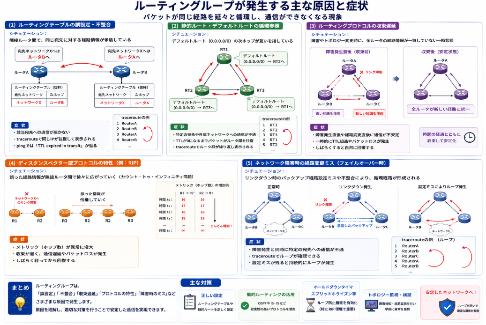

自分たちの組織でLANを構築した場合に接続は一見問題なくできているはずなのに、ある時通信ができなくなるような時があります。
そんな時に疑われるのがルーティングループと呼ばれる事象です。
本日はそんなルーティングループについて説明していきます。

## ルーティングループとは

ルーティングループとは、IPパケットが目的地に到達せず、同じルータ群の間をTTL（Time To Live）が0になるまで循環し続ける状態です。(IT用語辞典 e-Words)[https://e-words.jp/w/%E3%83%AB%E3%83%BC%E3%83%86%E3%82%A3%E3%83%B3%E3%82%B0%E3%83%AB%E3%83%BC%E3%83%97.html] パケットが一度通過したルータが、経路上にもう一度現れ、宛先に届かずに回り続けてしまいます。

## ループが発生する主な原因

ルーティングループが生じる原因についてまとめました。

### (1) ルーティングテーブルの誤設定・不整合

**シチュエーション：**  
複数のルータ間で、特定の宛先ネットワークに対する経路情報に矛盾が生じている状態。

**原因：**  
ルータAが「宛先XはルータBへ」と学習し、ルータBが「宛先XはルータAへ」と学習しているなど、隣接ルータ間でルーティングテーブルの内容が衝突している。(SEの道標)[https://milestone-of-se.nesuke.com/nw-basic/routing/avoid-routing-loop/]

**症状：**  
該当宛先への通信が届かず、tracerouteで同じIPアドレスが往復して表示される。pingでは「TTL expired in transit」が返される。

### (2) 静的ルート・デフォルトルートの循環参照

**シチュエーション：**  
複数のルータにデフォルトルート（0.0.0.0/0）を手動設定した際、次ホップが互いを指すように循環参照してしまう状態。

**原因：**  
たとえばRT1のデフォルトルートがRT2へ、RT2のデフォルトルートがRT3へ、RT3のデフォルトルートがRT1へ向いているような設定により、どのルータにも該当しない宛先のパケットが永遠に循環してしまう。(hetare-nw.net)[https://hetare-nw.net/archives/680]

**症状：**  
特定の宛先や外部ネットワークへの通信が不通となり、TTLが0になるまでパケットがルータ間を往復する。tracerouteでルータ群が繰り返し現れる。

### (3) ルーティングプロトコルの収束遅延

**シチュエーション：**  
ネットワーク障害発生時やトポロジー変更時に、全ルータが新しい正しい経路情報に更新されるまでの間に生じる一時的な不整合状態。

**原因：**  
各ルータが新しい経路情報を学習・反映する「収束」に時間がかかり、その間に古い経路情報と新しい経路情報が混在してしまう。(SEの道標)[https://milestone-of-se.nesuke.com/nw-basic/routing/avoid-routing-loop/]

**症状：**  
障害発生直後や経路変更直後に限って通信が不安定になり、しばらくすると自然に回復する。一時的なTTL超過やパケットロスが発生する。

### (4) ディスタンスベクター型プロトコルの特性

**シチュエーション：**  
RIPなどのディスタンスベクター型ルーティングプロトコルを使用している環境で、誤った経路情報が隣接ルータ間で伝播していく状態。

**原因：**  
各ルータが隣接ルータから受け取った情報を元に経路を更新するため、誤った情報が段階的に広がりやすく、「カウント・トゥ・インフィニティ問題」を引き起こす。(IT用語辞典 e-Words)[https://e-words.jp/w/%E3%83%AB%E3%83%BC%E3%83%86%E3%82%A3%E3%83%B3%E3%82%B0%E3%83%AB%E3%83%BC%E3%83%97.html]

**症状：**  
経路のメトリック（ホップ数）が異常に増大し、収束が遅れる。通信遅延やパケットロスが発生し、しばらく経ってから回復することが多い。

### (5) ネットワーク障害時の経路変更ミス

**シチュエーション：**  
リンクダウンなどの障害発生時に、バックアップ経路へフェイルオーバーする過程で、意図しない循環経路が形成される状態。

**原因：**  
障害検知後の経路再計算において、バックアップ経路の設定ミスやプロトコルの不整合により、パケットが循環する経路が選択されてしまう。(IT用語辞典 e-Words)[https://e-words.jp/w/%E3%83%AB%E3%83%BC%E3%83%86%E3%82%A3%E3%83%B3%E3%82%B0%E3%83%AB%E3%83%BC%E3%83%97.html]

**症状：**  
障害発生と同時に特定の宛先への通信が不通となり、tracerouteでループが確認できる。障害回復後も設定ミスが残っていると持続的に発生する。

## 代表的な防止・対策技術

以下、各対策技術がどのシチュエーション（原因）に対して効果を発揮するかを関連付けて整理しました。

### 対策技術とシチュエーションの関連マトリックス

| 対策技術 | 主に有効なシチュエーション | 補足的に有効なシチュエーション |
|---------|------------------------|------------------------|
| **TTL / Hop Limit** | すべてのシチュエーション | - |
| **スプリットホライズン** | (4) ディスタンスベクター型プロトコルの特性 | (3) ルーティングプロトコルの収束遅延 |
| **ルートポイズニング** | (3) 収束遅延 / (4) ディスタンスベクター型 / (5) 障害時の経路変更ミス | - |
| **ホールドダウンタイマー** | (3) 収束遅延 / (4) ディスタンスベクター型 / (5) 障害時の経路変更ミス | - |
| **Null0ルート** | (1) ルーティングテーブルの誤設定・不整合 / (2) 静的ルート・デフォルトルートの循環参照 | (5) 障害時の経路変更ミス |

### 各対策技術の関連性の詳細

__TTL / Hop Limit__

**対象シチュエーション：すべて**

どのような原因で発生したルーティングループであっても、IPパケットがルータを通過するたびにTTL（またはHop Limit）が減算され、0になると破棄されます。これは「治療」ではなく「最後の安全装置」です。設定ミス、プロトコルの不具合、障害時の経路変更ミスなど、あらゆるループ事象に対してパケットの永続的滞留を防ぎます。

__スプリットホライズン__

**対象シチュエーション：(4) ディスタンスベクター型プロトコルの特性、 (3) ルーティングプロトコルの収束遅延**

ディスタンスベクター型プロトコル（RIPなど）では、ルータが隣接ルータから学習した経路情報を、同じインターフェースから広告しないことで、誤った経路情報が元の経路へ逆伝播するのを防ぎます。これにより「A→B→A」という単純な2ノード間のループや、カウント・トゥ・インフィニティ問題の発生を抑制し、収束遅延時の一時的ループも防ぎます。

__ルートポイズニング__

**対象シチュエーション：(3) 収束遅延、 (4) ディスタンスベクター型プロトコルの特性、 (5) 障害時の経路変更ミス**

リンクダウンなどの障害発生時に、無効になった経路のメトリックを無限大（RIPでは16ホップ）に設定して隣接ルータへ広告します。これにより「この経路は使えない」という情報を確実に伝播させ、古い経路情報が残存することによる一時的ループや、障害時の経路変更ミスを防ぎます。

__ホールドダウンタイマー__

**対象シチュエーション：(3) 収束遅延、 (4) ディスタンスベクター型プロトコルの特性、 (5) 障害時の経路変更ミス**

経路がダウンした後、一定期間（通常は数十秒〜数分）はその経路に関する新しい情報を受け付けないようにします。これにより、ネットワーク障害時やトポロジー変更時に、不安定な経路情報が瞬時に伝播して一時的ループが発生するのを防ぎます。特にディスタンスベクター型プロトコルにおいて、誤った経路情報が早まって採用されることを阻止します。

__Null0ルート__

**対象シチュエーション：(1) ルーティングテーブルの誤設定・不整合、 (2) 静的ルート・デフォルトルートの循環参照**

ルート集約（サマリールート）を設定した際に、集約された範囲内に実際には存在しないサブネット宛のパケットが、デフォルトルートなどにマッチして循環参照してしまうケースがあります。Null0インターフェースへの静的ルートを設定することで、そのようなパケットを意図的に破棄し、ループを物理的に断ち切ります。静的ルートの循環参照や、誤設定による「行き先不明」パケットの暴走を防ぐのに特に有効です。

## ループによる影響とその制限

ループに入ったパケットは同じ経路を何度も循環し、帯域を無駄に消費し、ルータのCPU負荷を高めます。しかし、IPパケットにはTTL（IPv4）またはHop Limit（IPv6）という寿命カウンターがヘッダに設定されており、ルータを1つ通過するごとに1減算されます。値が0になるとそのパケットは破棄されるため、パケットが永遠にネットワーク内を残留し続けることはありません。(Packet Pushers)[https://packetpushers.net/blog/ip-time-to-live-and-hop-limit-basics/]

## 見極め方

ルーティングループは「症状が診断を教えてくれる」数少ない障害の一つです。(PingLabz)[https://www.pinglabz.com/routing-loops-detect-and-fix/] tracerouteでIPアドレスが繰り返される様子を確認できれば、ほぼ確実にルーティングループと判断できます。

以下、各項目を「シチュエーション」「原因」「症状」に整理したものです。

### (1) ルーティングテーブルの誤設定・不整合

**シチュエーション：**  
複数のルータ間で、特定の宛先ネットワークに対する経路情報に矛盾が生じている状態。

**原因：**  
ルータAが「宛先XはルータBへ」と学習し、ルータBが「宛先XはルータAへ」と学習しているなど、隣接ルータ間でルーティングテーブルの内容が衝突している。(SEの道標)[https://milestone-of-se.nesuke.com/nw-basic/routing/avoid-routing-loop/]

**症状：**  
該当宛先への通信が届かず、tracerouteで同じIPアドレスが往復して表示される。pingでは「TTL expired in transit」が返される。

### (2) 静的ルート・デフォルトルートの循環参照

**シチュエーション：**  
複数のルータにデフォルトルート（0.0.0.0/0）を手動設定した際、次ホップが互いを指すように循環参照してしまう状態。

**原因：**  
たとえばRT1のデフォルトルートがRT2へ、RT2のデフォルトルートがRT3へ、RT3のデフォルトルートがRT1へ向いているような設定により、どのルータにも該当しない宛先のパケットが永遠に循環してしまう。(hetare-nw.net)[https://hetare-nw.net/archives/680]

**症状：**  
特定の宛先や外部ネットワークへの通信が不通となり、TTLが0になるまでパケットがルータ間を往復する。tracerouteでルータ群が繰り返し現れる。

### (3) ルーティングプロトコルの収束遅延

**シチュエーション：**  
ネットワーク障害発生時やトポロジー変更時に、全ルータが新しい正しい経路情報に更新されるまでの間に生じる一時的な不整合状態。

**原因：**  
各ルータが新しい経路情報を学習・反映する「収束」に時間がかかり、その間に古い経路情報と新しい経路情報が混在してしまう。(SEの道標)[https://milestone-of-se.nesuke.com/nw-basic/routing/avoid-routing-loop/]

**症状：**  
障害発生直後や経路変更直後に限って通信が不安定になり、しばらくすると自然に回復する。一時的なTTL超過やパケットロスが発生する。

### (4) ディスタンスベクター型プロトコルの特性

**シチュエーション：**  
RIPなどのディスタンスベクター型ルーティングプロトコルを使用している環境で、誤った経路情報が隣接ルータ間で伝播していく状態。

**原因：**  
各ルータが隣接ルータから受け取った情報を元に経路を更新するため、誤った情報が段階的に広がりやすく、「カウント・トゥ・インフィニティ問題」を引き起こす。(IT用語辞典 e-Words)[https://e-words.jp/w/%E3%83%AB%E3%83%BC%E3%83%86%E3%82%A3%E3%83%B3%E3%82%B0%E3%83%AB%E3%83%BC%E3%83%97.html]

**症状：**  
経路のメトリック（ホップ数）が異常に増大し、収束が遅れる。通信遅延やパケットロスが発生し、しばらく経ってから回復することが多い。

### (5) ネットワーク障害時の経路変更ミス

**シチュエーション：**  
リンクダウンなどの障害発生時に、バックアップ経路へフェイルオーバーする過程で、意図しない循環経路が形成される状態。

**原因：**  
障害検知後の経路再計算において、バックアップ経路の設定ミスやプロトコルの不整合により、パケットが循環する経路が選択されてしまう。(IT用語辞典 e-Words)[https://e-words.jp/w/%E3%83%AB%E3%83%BC%E3%83%86%E3%82%A3%E3%83%B3%E3%82%B0%E3%83%AB%E3%83%BC%E3%83%97.html]

**症状：**  
障害発生と同時に特定の宛先への通信が不通となり、tracerouteでループが確認できる。障害回復後も設定ミスが残っていると持続的に発生する。

## 総括

ルーティングループとは、**「ルータ間の経路情報の不整合により、パケットが目的地へ到達できず循環してしまう状態」** です。

__根本原因の本質__

すべてのルーティングループは、**「ルータが持つ経路情報の整合性が崩れたこと」** に起因します。設定ミス、プロトコルの動作特性、障害時の収束遅延など、その直接的な引き金は様々ですが、根本は一つです。ルータは自身のルーティングテーブルを信じてパケットを転送するため、テーブルに誤りや矛盾があれば、パケットは「信頼できるが間違った道標」に従って永遠に迷走します。

__影響の本質__

ルーティングループは帯域を圧迫し、ルータのCPUを消耗させます。しかし、IPプロトコルには**TTL（Time To Live）** という最終防衛線が備わっており、パケットが無限に残留し続けることはありません。つまり、ルーティングループは「ネットワークを破壊する致命的な爆発」ではなく、「通信を断つこととリソースを浪費させる慢性的な病」であると言えます。

__対策の本質__

対策技術は大きく二つの側面を持ちます。

一つは **「ループが発生しても被害を限定する」** という受動的な側面（TTL）。もう一つは **「ループそのものを発生させない」** という能動的な側面（スプリットホライズン、ルートポイズニング、ホールドダウン、Null0ルート）です。前者は全ての事象に共通する安全装置であり、後者は原因に応じて使い分ける予防策です。

__診断の本質__

ルーティングループは数少ない **「症状が原因を直接示す障害」** です。tracerouteでIPアドレスが繰り返し現れ、pingでTTL期限切れが返されるなら、それはほぼ確実にルーティングループです。複雑なログ解析や高度なツールを必要とせず、基本的なコマンドで存在と発生箇所を特定できる点が、トラブルシューティングにおいて大きな利点となります。

__一言でまとめると__

> **ルーティングループは「ルータ間の経路情報の不整合」によって生じ、TTLによって被害が限定され、 tracerouteとpingで容易に検出でき、原因に応じたプロトコル設計と静的ルート管理によって防ぐことができる、ネットワーク層特有の経路迷走現象である。**

