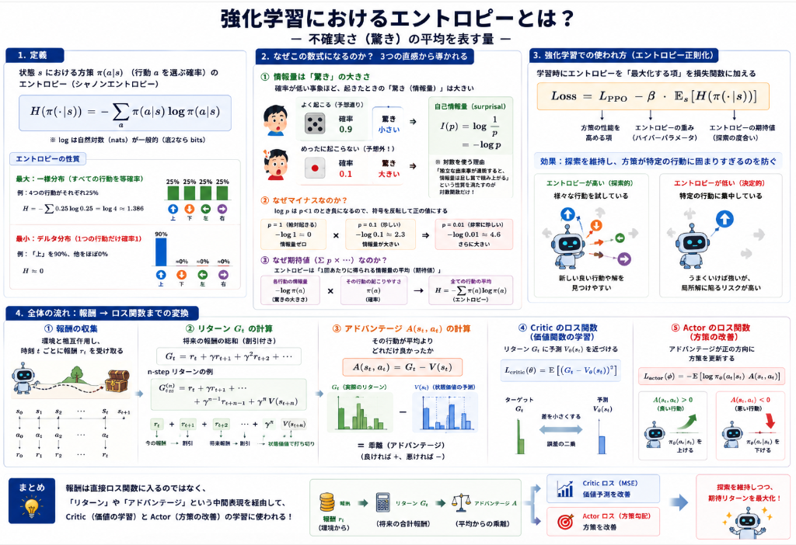

強化学習においてエージェントの学習の進行具合を測定する指標としてエントロピなるものが存在します。
エントロピの理論式や、強化学習での利用法について説明していきます。

## 定義

強化学習で計算されるエントロピーは、**情報理論におけるシャノンエントロピー（Shannon entropy）** を方策（policy）の確率分布に適用したものです。

### 一般的な定義式

離散行動空間において、状態 $s$ での方策を $\pi(a \mid s)$（状態 $s$ で行動 $a$ を選ぶ確率）とすると、エントロピー $H$ は以下で定義されます。

$$H(\pi(\cdot \mid s)) = -\sum_{a} \pi(a \mid s) \log \pi(a \mid s)$$

ここで、$\log$ は自然対数（ナット：nats）を使うことが多いですが、底が2（ビット：bits）の場合もあります。

### 性質

- **一様分布（すべての行動を等確率で選ぶ）のとき最大**  
  例：4つの行動がそれぞれ25%なら、$H = -\sum 0.25 \log 0.25 = \log 4 \approx 1.386$

- **デルタ分布（特定の行動1つだけ確率1、他は0）のとき最小（0）**  
  例：上90%、他0%に近いとき、$H \approx 0$

### 強化学習での使われ方

学習時にこの $H$ を**最大化する項（エントロピー正則化）**として損失関数に加えます。

$$\text{Loss} = L_{\text{PPO}} - \beta \cdot \mathbb{E}_{s}[H(\pi(\cdot \mid s))]$$

これにより、方策が特定の行動に固まりすぎる（エントロピーが0に近づく）ことを防ぎ、**探索を維持**しながら学習を進めます。

### なんでこの数式になった？

その数式は、**「不確実さ（驚き）の平均」を数学的に表現したもの**です。情報理論の創始者であるクロード・シャノンが導いた定義で、以下の3つの直感から必然的に導かれます。

__1. 情報量は「驚き」の大きさ__

ある事象が起きたとき、それが「どれだけ予想外だったか」を **自己情報量（surprisal）** と呼びます。

- 確率が低い事象（珍しい出来事）→ 起きたら非常に驚く → **情報量が大きい**
- 確率が高い事象（当たり前の出来事）→ 起きても驚かない → **情報量が小さい**

この「驚き」は、確率 $p$ の逆数を対数で表すのが自然です。

$$I(p) = \log \frac{1}{p} = -\log p$$

**なぜ対数（$\log$）なのか？**  
情報には「足し算で積み上がる性質」があるからです。例えば、コインを1回投げて表が出る情報量を $I$ とすると、2回連続で表が出る情報量は $2I$ であってほしい。確率が $p \times p = p^2$ になるので、$I(p^2) = 2I(p)$ を満たす関数が必要です。これを満たすのが対数関数です。

__2. なぜマイナスなのか__

$\log p$ だけでは確率が1未満なので常に負の値になります。情報量は「正の値」として扱いたいので、マイナスをつけて符号を反転させています。

- $p=1$（絶対起きる）→ $-\log 1 = 0$（情報量ゼロ）
- $p=0.1$（珍しい）→ $-\log 0.1 \approx 2.3$（情報量が大きい）

__3. なぜ期待値（$\sum p \times \dots$）なのか__

エントロピーは「**その確率分布に従って事象を観測し続けたとき、1回あたりに得られる情報量の平均（期待値）** 」です。

各事象の情報量 $-\log p(a)$ が、その事象の起きる確率 $\pi(a)$ で重み付けされた平均が取られます。

$$H = \sum_{a} \pi(a) \times (-\log \pi(a)) = -\sum_{a} \pi(a) \log \pi(a)$$



## 強化学習のエントロピの算出法

強化学習におけるエントロピーの算出は、以下のステップで行います。

### ステップ1：方策（policy）から行動確率を取得する

エージェントの[方策ネットワーク](https://yoshishinnze.hatenablog.com/entry/2026/08/03/043000) $\pi_\theta$ は、状態 $s$ を入力として、各行動 $a$ の選択確率を出力します。

例えば、行動が「上・下・左・右」の4つある状態で、方策の出力（Softmax適用後）が以下だったとします。

| 行動 | 確率 $\pi(a \mid s)$ |
|---|---|
| 上 | 0.7 |
| 下 | 0.1 |
| 左 | 0.15 |
| 右 | 0.05 |

### ステップ2：各行動の「自己情報量」を計算する

各行動の確率に対して、$-\log \pi(a \mid s)$ を計算します。ここでは自然対数（$\ln$）を使用します。

| 行動 | 確率 $p$ | $-\ln(p)$ |
|---|---|---|
| 上 | 0.7 | $-\ln(0.7) \approx 0.357$ |
| 下 | 0.1 | $-\ln(0.1) \approx 2.303$ |
| 左 | 0.15 | $-\ln(0.15) \approx 1.897$ |
| 右 | 0.05 | $-\ln(0.05) \approx 2.996$ |

### ステップ3：期待値（重み付き平均）を取る

各行動の自己情報量を、その行動の確率で重み付けして合計します。

$$H = \sum_{a} \pi(a \mid s) \times (-\ln \pi(a \mid s))$$

具体的な計算：

$$H = 0.7 \times 0.357 + 0.1 \times 2.303 + 0.15 \times 1.897 + 0.05 \times 2.996$$
$$H \approx 0.250 + 0.230 + 0.285 + 0.150 = 0.915$$

この状態でのエントロピーは約 **0.915** です。

### ステップ4：ミニバッチ全体の平均を取る（学習時）

実際の学習では、1つの状態だけでなくミニバッチ内の複数の状態 $s_1, s_2, \dots, s_N$ に対して計算します。

$$\text{Entropy} = \frac{1}{N} \sum_{i=1}^{N} H(\pi(\cdot \mid s_i))$$

### 実装例（PyTorch）

Pythonで計算するならばこんな感じになります。
`logits`は強化学習で学習を行っている方策モデルの出力です。

```python
import torch
import torch.nn.functional as F

# 方策の生の出力（ロジット）
logits = torch.tensor([[2.0, 0.5, 1.0, 0.2]])  # 上, 下, 左, 右

# 行動確率に変換
probs = F.softmax(logits, dim=-1)
# probs = tensor([[0.7006, 0.1275, 0.1292, 0.0427]])

# エントロピーの計算
entropy = -torch.sum(probs * torch.log(probs + 1e-10), dim=-1)
# 1e-10 は log(0) = -∞ を防ぐための微小値

print(f"エントロピー: {entropy.item():.4f}")
# 出力例: エントロピー: 0.9150
```

### 補足：一様分布との比較

上記の例ではエントロピーが約0.915でしたが、すべての行動を等確率（各0.25）で選ぶ一様分布の場合：

$$H_{\text{max}} = -\sum_{i=1}^{4} 0.25 \ln(0.25) = \ln(4) \approx 1.386$$

つまり、**エージェントが「上」にかなり偏っている**ため、エントロピーは最大値1.386よりも小さくなっています。学習が進んで特定の行動に確率が集中すればするほど、エントロピーは0に近づいていきます。

## 総括

エントロピーは、**方策（行動選択の確率分布）の「多様性・不確実性」を数値化した指標**です。特定の行動に確率が偏れば偏るほど0に近づき、行動が均等に散らばれば最大となります。情報理論における「驚きの平均」がその数式的根拠であり、エージェントが「どれくらい迷っているか（＝探索的か）」を測るセンサーです。

**有効な利用場面**
1. **探索の維持（エントロピー正則化）**：PPO等の損失に「エントロピーを最大化する項」を加え、学習中に方策が早々に特定行動に固まり（局所最適に陥り）すぎるのを防ぎます。
2. **学習進行の監視**：エントロピーが急速に0に近づくと「エージェントが行動パターンに固執し始めた」サインであり、探索不足やcollapseの早期発見に有効です。
3. **行動空間が大きい・報酬がスパースな環境**：正しい行動が判明するまでに多様な行動を試行する必要がある場合、エントロピーを維持することで学習効率が大きく改善します。
