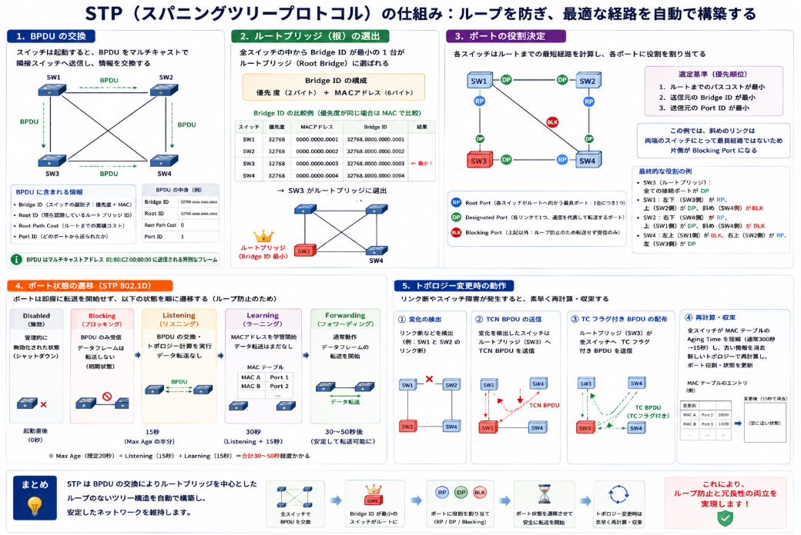

STP（Spanning Tree Protocol）

## 概要

STPとは、**レイヤー2（データリンク層）のネットワークにおいて、ループ（ループトポロジー）を検出して論理的にブロックし、正常なツリー状のトポロジーを構築するプロトコル**です。

IEEE 802.1D として標準化されています。

## なぜ必要なのか

STPが生まれた背景は、**「イーサネットを冗長化したいが、レイヤー2の仕組み上ループが致命的だった」** という問題の解決です。

### 歴史的背景

1980年代後半、イーサネットは**バス型の同軸ケーブル**から、**ツイストペア＋LANスイッチ**の時代へ移行しました。スイッチの登場により、複数のポート間で同時通信ができるようになり、ネットワークは高速・高機能化しました。

しかし、**ケーブルやスイッチの単一障害点（SPOF）** を避けるため、管理者はスイッチ同士を複数の経路で冗長接続するようになりました。

### 致命的な問題：レイヤー2ループ

スイッチは基本的に**ブロードキャストフレームを受け取ったら、全ポートにフラッディング（転送）します**。これにループ構造が加わると：

- **ブロードキャストストーム**：同じフレームが永遠に循環し、ネットワーク帯域を食い尽くす
- **MACアドレスのフラッピング**：同一MACアドレスが複数ポートから学習され、スイッチの転送テーブルが混乱し、通信が不可能になる
- **複数コピー到達**：1つのフレームが受信側に何度も到達し、上位プロトコルを破壊する

これらは**数秒でネットワーク全体を麻痺させる**致命的な障害でした。

### 解決策の発明

この問題に対し、DECの**Radia Perlman**（ラディア・パールマン）が1985年にアルゴリズムを考案しました。  
「**物理的には冗長ケーブルを繋いでおき、論理的にループ箇所をブロックする**」という発想です。

これが後にIEEE **802.1D STP**として標準化されました。

## 仕組みの概要

STPの仕組みは、**全スイッチでBPDUという制御フレームを交換し、ルートブリッジを中心としたツリー構造（ループなしの論理トポロジー）を自動で計算する** ことです。

以下、ステップごとに説明します。

### 1. BPDU（Bridge Protocol Data Unit）の交換

スイッチは起動すると、**BPDU**という特殊なフレームをマルチキャストで隣接スイッチへ送信し始めます。  
このBPDUには以下の情報が含まれます。

- **Bridge ID**（スイッチの識別子：優先度＋MACアドレス）
- **Root ID**（現在認識しているルートブリッジのID）
- **Root Path Cost**（自スイッチからルートまでの累積コスト）
- **Port ID**（どのポートから送られたか）

### 2. ルートブリッジ（根）の選出

全スイッチの中から **Bridge IDが最小** の1台が **ルートブリッジ（Root Bridge）** に選ばれます。  
Bridge IDは「優先度（2バイト）＋MACアドレス（6バイト）」で構成され、通常は優先度をデフォルト（32768）から下げて、意図的にルートを決めます。

### 3. ポートの役割決定

ルートブリッジが決まった後、各スイッチはルートまでの最短経路を計算し、ポートに役割を割り当てます。

| 役割 | 説明 |
|------|------|
| **Root Port（RP）** | 各スイッチがルートブリッジへ向かうための **最良のポート**（1台につき1つ） |
| **Designated Port（DP）** | 各リンク（セグメント）につき1つ選ばれる、**通信を代表して転送するポート** |
| **Blocking Port（非DP）** | 上記以外のポート。ループ防止のため **受信のみ許可（またはブロック）** し、データフレームの転送は行わない |

**選定基準（優先順位）**：
1. ルートまでのパスコストが最小
2. 送信元のBridge IDが最小
3. 送信元のPort IDが最小

### 4. ポート状態の遷移（STP 802.1D）

ポートは即座に転送を開始せず、以下の状態を順に遷移します（ループ防止のため）。

| 状態 | 動作 |
|------|------|
| **Disabled** | 管理的に無効（シャットダウン） |
| **Blocking** | BPDUのみ受信。データフレーム転送しない（初期状態） |
| **Listening** | BPDUの交換・トポロジー計算を実行。データ転送なし（15秒） |
| **Learning** | MACアドレスを学習開始。データ転送はまだなし（15秒） |
| **Forwarding** | 通常動作。データフレームの転送を開始 |

→ **合計30〜50秒**（Max Age 20秒＋Listening 15秒＋Learning 15秒）かかって初めて通信が可能になります。

### 5. トポロジー変更時の動作

リンク断やスイッチ障害が発生すると、以下が起こります。

1. **TCN BPDU（Topology Change Notification）** をルートブリッジへ向けて通知
2. ルートブリッジが全スイッチに **TC（Topology Change）フラグ付きBPDU** を送信
3. 全スイッチはMACアドレステーブルの **Aging Time（通常300秒）を短縮（15秒）** し、古い学習情報を速やかに消去
4. 新しいトポロジーで再計算・収束

## バリエーション

| 種類 | 特徴 |
|------|------|
| **STP（802.1D）** | オリジナル。収束に30〜50秒かかる |
| **RSTP（802.1w）** | 高速収束版（数秒以内） |
| **MSTP（802.1s）** | VLANごとに複数のスパニングツリーを構築できる |
| **PVST/PVST+** | Cisco独自。VLANごとにSTPインスタンスを持つ |

## STPを有効にするには？

L2スイッチを購入した場合、機能としてはほぼ確実に搭載されていますが、デフォルトで有効になっているかどうかはベンダーや機種によって異なります。

以下、3つのポイントで整理します。

__1. 業務用・マネージドL2スイッチ → ほぼ搭載済み__

Cisco、Aruba（HPE）、Juniper、NEC、Yamaha（スイッチ機能付き）などの**企業・業務向けL2スイッチ**であれば、STP（正確にはRSTPやMSTP）の機能は標準で備わっています。

__2. デフォルトのON/OFFはベンダーによる__

- **有効がデフォルト**のベンダーも多い（例：Ciscoの多くの機種ではPVST+やRSTPがデフォルトで動作）
- 一方で、**無効（OFF）がデフォルト**の機種も存在します。安価なマネージドスイッチや、特定の国産ネットワーク機器では、意図的に無効になっている場合があります。
- **アンマネージドスイッチ**（設定画面がなく単にポートを増やすだけの安価機器）には、STP機能自体がないことも多いです。

__3. 現代では「STP」ではなく「RSTP/MSTP」がデフォルト__

購入した機器の説明書に「STP対応」と書いてあっても、実際のデフォルト動作は**RSTP（802.1w）**や**MSTP（802.1s）**であることがほとんどです。オリジナルのSTP（802.1D）は収束が遅いため、最近の機器ではRSTPが標準です。

**実務での注意点**：導入時に必ず`show spanning-tree`（Cisco系）やWeb GUIで「スパニングツリーが有効かどうか」「どのモード（RSTP/MSTP等）か」を確認してください。無効のまま冗長接続すると、即座にループ障害が発生します。

## 総括

STPの本質は、イーサネットの『どこへでも flood する』という性質と、『障害に備えて余分なケーブルを繋いでおきたい』という運用の要請の間に生まれた、論理的な安全弁だということです。

もう少し具体的に言うと、以下の3つに集約されます。

### 1. 物理と論理の分離
ケーブルは冗長に繋いだまま、**論理的にはツリー（一本道）にしてループを断つ**。これにより、ケーブル断線時も自動で経路を切り替えられる「生きた冗長性」を保ちます。

### 2. イーサネットの「無制限フラッディング」を縛る
スイッチはブロードキャストを全ポートに放ってしまうため、ループがあると**永遠に回り続ける**。STPはその「暴走」を物理的に抜くかわりに、**論理的にブロック**することで止めます。

### 3. 自律的なトポロジー管理
人間が「このポートを塞いでおいて」と毎回設定するのではなく、**BPDUを交換してスイッチ同士が話し合い、自動でどれを塞ぐか決める**。障害が起きれば再び話し合って新しい一本道を作り直します。

一言で表せば、STPは**イーサネットのループという致命傷を、冗長性を殺さずに塞ぐための、スイッチ同士の自動合意プロトコル** です。