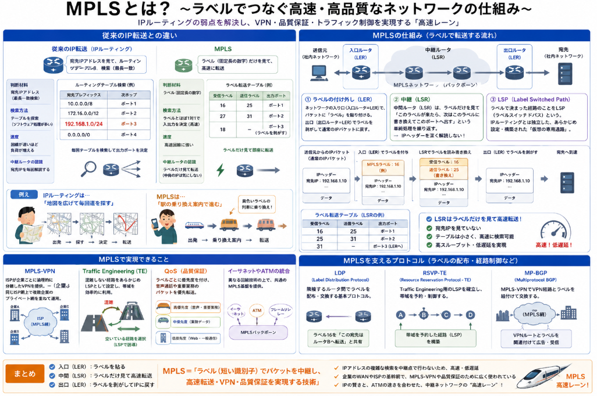

**MPLS（Multiprotocol Label Switching）** とは、**IPアドレスではなく「ラベル（短い識別子）」を使ってパケットを高速に転送する技術**です。

一言で言えば、「**住所（IP）を見て道を探すのではなく、色付きのシール（ラベル）を見てスイスイ進ませる中継システム**」です。

### 従来のIP転送との違い

通常のIPルータは、パケットが届くたびに**宛先IPアドレスを見て「最長一致」でルーティングテーブルを検索**します。これはパケットごとに計算が必要で、高速な回線では負荷がかかります。

MPLSはこれを変えました。

| | **従来のIP転送** | **MPLS** |
|---|---|---|
| **判断材料** | 宛先IPアドレス（最長一致検索） | **ラベル（固定長の数字）** |
| **検索方法** | テーブルを探索（ソフトウェア処理が多い） | ラベルとほぼ1対1で入出力を決定（高速） |
| **速度** | 回線が速いほど負荷が増える | **高速回線に強い** |
| **中継ルータの認識** | 宛先IPを毎回解読する | **ラベルだけ見て転送**（中身のIPは気にしない） |

> **例え：** IPルーティングは「地図を広げて毎回道を探す」、MPLSは「駅の乗り換え案内で『黄色いラベルの列車に乗り換え』とだけ見て進む」イメージです。

### MPLSの仕組み

__1. ラベルの付け外し（LER）__

ネットワークの**入り口（入口ルータ＝LER）** で、パケットに「**ラベル**」を貼り付けます。出口（出口ルータ＝LER）でラベルを剥がして通常のIPパケットに戻します。

__2. 中継（LSR）__

ネットワークの**中間ルータ（LSR）** は、ラベルだけを見て「**このラベルが来たら、次はこのラベルに書き換えてこのポートへ出す**」という単純な処理を繰り返します。IPヘッダーを深く解読する必要がありません。

__3. LSP（Label Switched Path）__

ラベルで決まった経路のことを**LSP（ラベルスイッチドパス）** と呼びます。これはIPルーティングとは独立して、あらかじめ設定・構築された「**仮想の専用通路**」です。

### MPLSで実現できること

| 用途 | 説明 |
|------|------|
| **MPLS-VPN** | ISPが企業ごとに論理的に分離したVPNを提供。同じISP網上で複数企業のプライベート網を重ねて運用 |
| **Traffic Engineering（TE）** | 混雑しない経路をあらかじめLSPとして設定し、帯域を効率的に利用 |
| **QoS（品質保証）** | ラベルごとに優先度を付け、音声通話や重要業務のパケットを優先転送 |
| **イーサネットやATMの統合** | 異なる回線技術の上で共通の転送基盤を作る |

### 補足：MPLSは「プロトコル」なのか？

厳密には、MPLSは「プロトコル」というより **「転送メカニズム・アーキテクチャ」** です。ラベルを配布・管理するためのプロトコルとして以下があります。

- **LDP（Label Distribution Protocol）**：基本的なラベル配布
- **RSVP-TE**：Traffic Engineering用のLSP確立
- **MP-BGP**：MPLS-VPNでVPN経路とラベルを紐付けて交換

### まとめ

> **MPLS＝「ラベル（短い識別子）でパケットを中継し、高速転送・VPN・品質保証を実現する技術」**

- **入口**でラベルを貼り、**中間**ではラベルだけ見て高速転送、**出口**で剥がす
- IPアドレスの複雑な検索を中継点で行わないため、**高速・低遅延**
- 企業の**WANやISPの基幹網**で、MPLS-VPNや品質保証のために広く使われている

一言で言えば、MPLSは **「IPの賢さと、ATMの速さを合わせた、中継ネットワークの高速レーン」** です。

