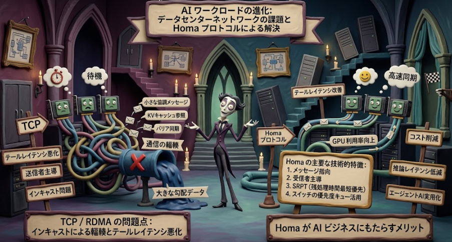

現在データセンターには様々なメッセージが流れ込み、GPUのワークロードにおいて通信の輻輳が課題となりつつあります。
そんな中で注目を集めているのがTCPに代わる通信プロトコルでHomaと呼ばれるものです。

## 概要

Homa プロトコルについて説明します。

まず一点補足すると、Homa は厳密には「AI 専用」のプロトコルではなく、**データセンター内の RPC（Remote Procedure Call）向けトランスポートプロトコル**です。ただし、近年の AI / ML ワークロード（特に分散推論やエージェント処理）において、TCP や RDMA の代替として大きな注目を集めています。

### Homa とは

Homa は、Stanford 大学の John Ousterhout 氏（Raft アルゴリズムの作者でも有名）らが提唱した、**データセンター内で TCP に代わる新しいトランスポートプロトコル**です。SIGCOMM 2018 で論文発表され、現在は Linux カーネルへの実装・upstreaming が進行中です。

参考: [USENIX ATC Homaスライド](https://www.usenix.org/system/files/atc21_slides_ousterhout.pdf)、[LWN.net Homaカーネルupstream](https://lwn.net/Articles/1034324/)

### なぜ AI クラスターで注目されているか

近年の AI ワークロードは変化しています。

- 従来のワークロード : 大規模な勾配データの転送（スループット重視）
- 新興のワークロード : 小さな協調メッセージ、KV キャッシュ参照、バリア同期（レイテンシ重視）

分散推論やエージェント処理では、GPU 同士が**小さなメタデータや同期メッセージ**を頻繁に交換します。一つの遅延メッセージがシステム全体の GPU を待機させる「テールレイテンシ」の問題が深刻化しています。

参考: [AIE Talks Homa解説](https://aietalks.com/talks/homa-the-end-of-tcp-for-ai-clusters)

### TCP / RDMA の問題点

Homa が解決しようとする、既存プロトコルの課題は以下の通りです。
分散したデータセンタによるメッセージの同時受信時の輻輳が課題ということになります。

__1. 送信者主導の輻者主導の輻輳制御は遅すぎる__

TCP や RDMA は送信側で輻輳を検知しますが、複数の送信者が同じ宛先に同時に送る「インキャスト（incast）」が発生すると、最終ホップのスイッチでパケットが滞留します。送信側に遅延情報が届くまで輻輳は続き、結果としてレイテンシが悪化します。

__2. バイトストリームモデルがメッセージ境界を隠す__

TCP は「バイトの流れ」としてデータを扱います。個々のメッセージの長さや境界をトランスポート層が認識できないため、短いメッセージが先行する大きな転送の後ろで**先頭ブロッキング（head-of-line blocking）** を起こします。

### Homa の主要な技術的特徴

__1. メッセージ指向（Message-Oriented）__

Homa は RPC を「リクエストメッセージ＋レスポンスメッセージ」として扱い、**メッセージ境界をトランスポート層が認識**します。これにより、個々のメッセージに対して優先順位付けが可能になります。

参考: [SIGCOMM 2018 Homa論文](https://dl.acm.org/doi/10.1145/3230543.3230564)

__2. 受信者主導（Receiver-Driven）__

輻輳制御を**受信者側**で行います。受信者は自分の受信能力や到着パケットの状況を最も正確に把握できるため、送信者に対して「送信許可（grant）」を出すことで、宛先側の輻輳を未然に防ぎます。

__3. SRPT（Shortest Remaining Processing Time）__

メッセージの残りサイズに基づいて優先度を付け、**短いメッセージを先に処理**します。短いメッセージが長い転送の後ろで待たされることを防ぎます。

__4. スイッチの優先度キュー活用__

現代のデータセンタースイッチは各ポートに複数の優先度キューを持っています。Homa は長いメッセージを低優先度キュー、短いメッセージを高優先度キューに割り当てることで、短いメッセージが既に待っている大きな転送を「追い越す」ことができます。

### パフォーマンスの比較

John Ousterhout 氏のベンチマークによると、短いメッセージの P99（99パーセンタイル）レイテンシは以下の通りです。

- TCP : 1 ミリ秒以上
- Homa : 100 マイクロ秒未満（約 13 倍高速）

さらに、大きなメッセージについても TCP と比較して約 2 倍のスループット向上が報告されています。

参考: [AIE Talks Homa解説](https://aietalks.com/talks/homa-the-end-of-tcp-for-ai-clusters)

## 注目を集めている理由

Homa が近年（特に生成 AI ブーム以降）注目を集めている理由は、**AI ワークロードの性質そのものが変化し、データセンター内ネットワークのボトルネックが「スループット」から「テールレイテンシ」へと移行した**ことにあります。

以下、その背景を整理して説明します。

### 1. AI ワークロードの変化：「大きな転送」から「小さな協調」へ

従来の大規模モデル学習（トレーニング）では、主な通信は**数十 GB 規模の勾配データ**の同期でした。このような場面では、スループット（帯域の使い切り方）が重要で、TCP や RDMA でも十分な性能が出せました。

しかし、近年の AI システムでは以下のようなワークロードが増加しています。

- **分散推論（Inference）**: 複数の GPU / ノードが協調して推論を行い、KV キャッシュの参照や中間結果のやり取りを頻繁に行う
- **エージェント（Agentic）処理**: 推論の各ステップで小さな協調メッセージを交換し、バリア同期（全ノードの待ち合わせ）が頻発する
- **推論サーバーのマイクロバッチ処理**: ミリ秒単位のレイテンシ要求のもとで、小さなリクエスト・レスポンスを大量に処理する

これらのワークロードでは、**メッセージサイズは小さい（数十〜数百バイト）が、頻度が極めて高く、一つの遅延がシステム全体を止めてしまう**特徴があります。

参考: [AIE Talks Homa解説](https://aietalks.com/talks/homa-the-end-of-tcp-for-ai-clusters)

### 2. テールレイテンシがシステム全体の性能を支配する

分散システムにおいて、複数のノードが協調して一つの処理を行う場合、**最も遅いノードの応答を待つ必要があります**。これが「テールレイテンシ（Tail Latency）」問題です。

例えば、100個の GPU が並列で計算し、その後に小さな同期メッセージを交換する場合：

- 99個の GPU は 50 マイクロ秒で応答
- 1個の GPU だけが 2 ミリ秒で応答（TCP の輻輳による遅延）

この場合、システム全体は **2 ミリ秒待たされる**ことになります。推論の各ステップがミリ秒オーダーで完了する現代の AI システムでは、この遅延は GPU の空転を意味し、スループットを直接的に低下させます。

John Ousterhout 氏は、この問題がエージェントワークロードでは特に深刻だと指摘しています。計算フェーズがミリ秒単位で完了するため、ネットワークの数ミリ秒の遅延が GPU 時間の大きな割合を無駄にしてしまうのです。

参考: [AIE Talks Homa解説](https://aietalks.com/talks/homa-the-end-of-tcp-for-ai-clusters)

### 3. TCP / RDMA が AI ワークロードに対して「構造的に」不利

なぜ既存のプロトコルではこの問題を解決できないのか。Homa の議論では、TCP と RDMA に**設計上の構造的問題**があるとされています。

__(1) 送信者主導の輻輳制御は遅すぎる__

TCP は送信側で輻輳を検知し、レートを調整します。しかし、データセンター内で典型的な「インキャスト（incast）」問題、つまり複数ノードが同時に一つの宛先へ送信した際には、**輻輳は最終ホップのスイッチで発生**します。

送信者に輻輳情報が届くまでに時間がかかり、その間パケットはドロップまたは長時間キューに滞留します。短いメッセージであっても、先行する大きな転送の後ろに並ばされるため、レイテンシが悪化します。

__(2) バイトストリームモデルがメッセージ境界を隠す__

TCP は「バイトの流れ」としてデータを扱います。個々のメッセージの長さや境界をトランスポート層が認識できないため、短いメッセージが先行する大きな転送の後ろで**先頭ブロッキング（head-of-line blocking）** を起こします。

つまり、AI システムが急いで送りたい「小さな同期メッセージ」が、先にキューに入っていた「大きな勾配データ」の後ろで待たされるのです。

参考: [LWN.net TCP代替議論](https://lwn.net/Articles/914030/)、[AIE Talks Homa解説](https://aietalks.com/talks/homa-the-end-of-tcp-for-ai-clusters)

### 4. Homa の設計が AI ワークロードに「ピッタリ」合う

Homa が近年注目を集めるのは、上記の問題に対して**設計段階から対処している**からです。

__(1) メッセージ指向：小さな RPC を第一級の対象にする__

Homa は RPC を「リクエストメッセージ＋レスポンスメッセージ」として扱い、**メッセージ境界をトランスポート層が認識**します。これにより、個々のメッセージに対して独立に優先順位付けが可能です。短いメッセージを特別扱いできるのです。

__(2) 受信者主導（Receiver-Driven）の輻輳制御__

輻輳制御を受信者側で行います。受信者は自分の受信能力や到着パケットの状況を最も正確に把握できるため、送信者に対して「送信許可（grant）」を出すことで、宛先側の輻輳を未然に防ぎます。インキャスト問題に対して構造的に強いです。

__(3) SRPT（Shortest Remaining Processing Time）__

メッセージの残りサイズに基づいて優先度を付け、**短いメッセージを先に処理**します。AI ワークロードで頻出する小さな協調メッセージが、大きなバックグラウンド転送に阻害されにくくなります。

__(4) スイッチの優先度キューとの連携__

現代のデータセンタースイッチは各ポートに複数の優先度キューを持っています。Homa は長いメッセージを低優先度キュー、短いメッセージを高優先度キューに割り当てることで、短いメッセージが既に待っている大きな転送を「追い越す」ことができます。

参考: [SIGCOMM 2018 Homa論文](https://dl.acm.org/doi/10.1145/3230543.3230564)

### 5. 実際のパフォーマンス向上が実証されている

注目が集まる最大の理由は、**実際のベンチマークで劇的な改善が示されている**ことです。

John Ousterhout 氏のベンチマークでは、短いメッセージの P99（99パーセンタイル）レイテンシは以下の通りでした。

| プロトコル | 短いメッセージ P99 レイテンシ |
|---|---|
| TCP | 1 ミリ秒以上 |
| Homa | 100 マイクロ秒未満（約 13 倍高速） |

さらに、大きなメッセージについても TCP と比較して約 2 倍のスループット向上が報告されています。つまり、**短いメッセージのレイテンシを改善しつつ、大きな転送のスループットも損なわない**という、理想的な特性を持っています。

参考: [AIE Talks Homa解説](https://aietalks.com/talks/homa-the-end-of-tcp-for-ai-clusters)

### 6. Linux カーネル実装の進展

注目度が高まっているもう一つの理由は、**Homa が「研究プロトコル」から「実用的なインフラ技術」へと移行しつつある**ことです。

- Linux カーネルモジュールとしての実装が GitHub で公開されている
- 2025年8月には、カーネル upstreaming へのパッチが投稿され、本格的な標準化が進行中
- IETF Internet-Draft としての RFC 化も進行中

これにより、Homa は「いつか使えるかもしれない技術」ではなく、「近い将来、AI データセンターの標準になりうる技術」として認識されるようになりました。

参考: [LWN.net Homaカーネルupstream](https://lwn.net/Articles/1034324/)、[GitHub HomaModule](https://github.com/PlatformLab/HomaModule)、[GitHub Homa RFC](https://github.com/johnousterhout/homa-rfc)

## データセンタが抱える課題と Homa による解決

冒頭で述べたデータセンタが抱える課題について少し解像度を挙げてみます。

### 1. インキャスト（incast）による輻輳

**課題**: 複数のノードが同時に一つの宛先へ送信すると、最終ホップのスイッチでパケットが滞留・ドロップします。TCP は送信側で輻輳を検知するため、情報が届くまでに遅延が生じ、キューが蓄積し続けます。

**Homa の解決**: 受信者主導（Receiver-Driven）の輻輳制御を採用。受信者が「送信許可（grant）」を出すことで、宛先側の輻輳を未然に防ぎます。受信者は自分の受信状況を最も正確に把握できるため、インキャスト問題に構造的に強いです。

参考: [AIE Talks Homa解説](https://aietalks.com/talks/homa-the-end-of-tcp-for-ai-clusters)

### 2. テールレイテンシ（Tail Latency）の悪化

**課題**: 分散システムでは「最も遅いノードの応答」を待つ必要があります。TCP では短いメッセージが大きな転送の後ろで待たされるため、P99 レイテンシが悪化し、システム全体が遅延します。

**Homa の解決**: SRPT（Shortest Remaining Processing Time）とスイッチの優先度キューを活用し、短いメッセージを優先処理。ベンチマークでは TCP の P99 レイテンシ（1 ミリ秒以上）に対し、Homa は 100 マイクロ秒未満（約 13 倍高速）を達成しています。

参考: [AIE Talks Homa解説](https://aietalks.com/talks/homa-the-end-of-tcp-for-ai-clusters)

### 3. ヘッドオブラインブロッキング（Head-of-Line Blocking）

**課題**: TCP はバイトストリームモデルを採用しており、個々のメッセージの境界や長さを認識しません。そのため、短い緊急メッセージ（同期信号など）が、先行する大きなデータ転送の後ろでブロックされます。

**Homa の解決**: メッセージ指向（Message-Oriented）の設計を採用。RPC を「リクエスト＋レスポンス」のメッセージとして扱い、各メッセージの長さを認識することで、短いメッセージが独立して優先処理されるようになります。

参考: [LWN.net TCP代替議論](https://lwn.net/Articles/914030/)

### 4. 送信者主導の輻輳制御の遅延と振動

**課題**: TCP の輻輳制御は送信側で行われ、ECN マーキングなどの情報も往復の遅延を伴います。複数の送信者が不完全な情報に基づいてレートを調整するため、送信レートが振動し、キューとレイテンシが高止まりします。

**Homa の解決**: 受信者が直接輻輳状況を把握し、送信者に許可を出す方式にすることで、遅延フィードバック問題を根本的に解消します。

参考: [SIGCOMM 2018 Homa論文](https://dl.acm.org/doi/10.1145/3230543.3230564)

## AI ビジネス利用にもたらすメリット

### 1. GPU 利用率の向上（最も大きなビジネスインパクト）

分散推論やエージェント処理では、GPU 同士が小さな同期メッセージを頻繁に交換します。一つの遅延メッセージがあれば、全 GPU が待機状態になります。

Homa によるテールレイテンシの低減は、**GPU の空転時間を直接的に削減**します。例えば、推論の各ステップが 5 ミリ秒で、同期が 2 ミリ秒遅れると GPU は 40% の時間を待ちに費やします。Homa で同期を 0.1 ミリ秒に抑えれば、この待ち時間は劇的に減少し、同じインフラでより多くの推論リクエストを処理できます。

参考: [AIE Talks Homa解説](https://aietalks.com/talks/homa-the-end-of-tcp-for-ai-clusters)

### 2. 推論レイテンシの低減（ユーザー体験の向上）

リアルタイム AI アプリケーション（チャットボット、音声アシスタント、自動運転の推論など）では、**応答時間がユーザー体験を直接左右**します。

Homa は短いメッセージのレイテンシを 1/13 に抑えるため、分散推論システム全体の応答時間が短縮されます。これにより、競合よりも高速な AI サービスを提供できる差別化要因となります。

### 3. インフラコストの削減

同じ処理能力を実現するために必要な GPU・サーバー・ネットワーク機器の数を減らせます。

- 現在のデータセンターでは、ネットワークのテールレイテンシによる GPU 待機が無駄なコストになっています
- Homa により GPU 利用率が向上すれば、**同じ性能をより少ない GPU で実現可能**
- クラウド利用の場合も、GPU インスタンスの使用時間が短縮され、ランニングコストが削減されます

### 4. エージェント（Agentic）AI の実用化を加速

エージェント AI は、複数のモデルやツールが連携して自律的にタスクを実行します。この過程では、マイクロ秒〜ミリ秒単位の小さな協調メッセージの交換が頻発します。

TCP のミリ秒オーダーのテールレイテンシでは、エージェントのステップ実行がネットワーク待ちで律速されるケースがあります。Homa はこの「協調の遅延」を解消し、**エージェント AI のスケーラブルな分散実行**を可能にします。

参考: [AIE Talks Homa解説](https://aietalks.com/talks/homa-the-end-of-tcp-for-ai-clusters)

### 5. 大規模クラスタのスケーラビリティ向上

AI モデルが大規模化するにつれ、学習・推論に必要な GPU 数は増加しています。数千〜数万 GPU のクラスタでは、インキャスト問題が頻発し、TCP の限界が顕在化します。

Homa は受信者主導の設計により、**クラスタ規模が大きくなってもテールレイテンシが劣化しにくい**特性を持ちます。これにより、将来的な大規模クラスタの拡張が容易になります。

参考: [SIGCOMM 2018 Homa論文](https://dl.acm.org/doi/10.1145/3230543.3230564)

## 総括

Homa は Stanford 大学が提唱する、**データセンター内の TCP に代わる RPC 向けトランスポートプロトコル**です。Linux カーネル実装が進行中で、標準化も進んでいます。
生成 AI の普及により、データセンター内の通信が「大きな勾配転送」から「小さな協調メッセージの頻繁な交換」へと変化しました。分散推論やエージェント処理では、**テールレイテンシ（最も遅い応答）** がシステム全体の性能を支配するようになりました。

### TCP の何が問題か
- **送信者主導の輻輳制御**: インキャスト時に遅延情報が届くまで輻輳が続く
- **バイトストリームモデル**: メッセージ境界を認識せず、短いメッセージが大きな転送の後ろでブロックされる

### Homa の解決策
- **メッセージ指向**: RPC をメッセージとして扱い、個別に優先度付け
- **受信者主導**: 受信者が「送信許可（grant）」を出し、宛先側の輻輳を未然に防ぐ
- **SRPT**: 短いメッセージを優先処理
- **スイッチ優先度キュー**: 短いメッセージが大きな転送を追い越せる

### パフォーマンス
短いメッセージの P99 レイテンシで **TCP の約 1/13（1ms → 100μs 未満）**、大きなメッセージでも **約 2 倍のスループット**向上。

### AI ビジネスへのインパクト
- **GPU 利用率向上**: 同期待ちによる空転を削減
- **推論レイテンシ低減**: リアルタイム AI サービスの応答性向上
- **インフラコスト削減**: 同じ性能をより少ない GPU で実現可能
- **エージェント AI の実用化加速**: 小さな協調メッセージの遅延を解消
- **大規模クラスタのスケーラビリティ**: 数千〜数万 GPU 規模でもテールレイテンシが劣化しにくい

一言でまとめると、**Homa は「AI ワークロード特有の小さな協調メッセージのテールレイテンシ問題」を解消し、高価な GPU インフラの利用率を最大化する、データセンター向け次世代トランスポートプロトコル**です。

