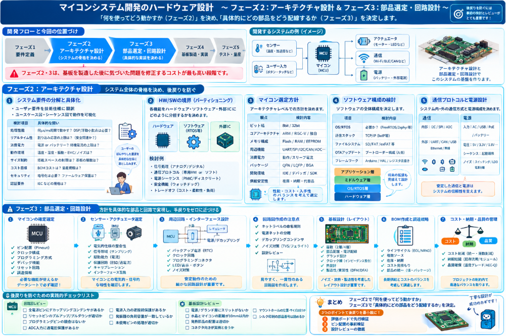

ハードウェアシステムを構築する場合、どういう手順で構築すると、通信や機器の選定で失敗がないかについて、やはり事前に知っておきたいと思います。
何度かしていると自然とシステム構築の順序は、こう、というのが分かってきますが、系統だって整理されていると、初めての方にとっては有用な情報源になると思いました。

本日テーマ：
>ハードウェアを用いたシステムの開発手順で、これが成功率高いと思われる順序について説明していきます。

## 開発順序
今回制作対象は、電子制御を用いたシステムが前提とします。
そうなる場合コアとなるハードウェア＝マイコンとします。
マイコンを用いたハードウェアシステム開発を成功させるための推奨開発順序を説明していきます。

### 成功しやすい開発順序

__フェーズ1: 要件定義・仕様化（Ideation & Specification）__

最初に「何を作るか」を明確にすることが最も重要です。

- **機能要件**: システムが何をするか
- **非機能要件**: 消費電力、コスト、サイズ、動作温度、リアルタイム性
- **入出力要件**: センサー、通信インターフェース、アクチュエータ
- **制約条件**: 認証（UL、CE など）、納期、予算

この段段階で曖昧なまま進めると、後の設計変更コストが指数関数的に増大します。

__フェーズ2: アーキテクチャ設計（System Architecture）__

ハードウェアとソフトウェアの境界を決定します。

- マイコンの選定方針（8bit vs 32bit、ARM vs RISC-V）
- ソフトウェア構成（OSあり/なし、RTOSの要否）
- 通信プロトコルの選定（UART、SPI、I2C、CAN、Ethernet など）
- 電源設計方針

__フェーズ3: 部品選定・回路設計（Component Selection & Hardware Design）__

- **マイコン選定**: 必要なGPIO数、メモリ容量、消費電力、周辺機能
- **センサー・アクチュエータ選定**
- **回路図作成・基板設計**
- **BOM（部品表）の作成**: 調達リスクやコストを考慮

__フェーズ4: テスト計画の作成（Test Plan）__

実装より前に「どうやって正しいかを確認するか」を決めます。

- ハードウェア単体テスト（電源電圧、信号品質）
- ソフトウェア単体テスト
- 統合テスト
- 環境テスト（温度、湿度、ノイズ）

__フェーズ5: プロトタイピング（Proof of Concept / Prototype）__

- **評価ボードでの先行検証**: 実際のマイコン評価ボードを使い、アルゴリズムや通信の検証を先行させる
- **プロトタイプ基板の製作**: 初版基板の製造
- **ソフトウェアの並行開発**: ハードウェアが完成する前に、シミュレータや評価ボードでソフトウェア開発を進める

__フェーズ6: ハードウェア・ソフトウェア統合（Integration）__

- プロトタイプ基板へのソフトウェア書き込み
- デバッグ（JTAG、SWD、シリアルログ）
- タイミング解析・電力測定

__フェーズ7: 検証・実証試験（Verification & Validation）__

- **ベンチテスト**: 管理された環境での動作確認
- **現地試験（Field Trial）**: 実際の使用環境での評価
- **ストレステスト**: 長時間運転、極端な条件での試験

### 成功のための重要なポイント

| ポイント | 説明 |
|---------|------|
| **ハードウェア先行、ソフトウェア並行** | 評価ボードを使ってソフトウェア開発を先行させ、基板完成後に統合する |
| **Fail Fast** | 早期にプロトタイプを作り、問題を早期発見する |
| **テストを最初に設計** | 実装後にテストを考えると手戻りが増える |
| **バージョン管理** | ハードウェアのリビジョンとソフトウェアのバージョンを厳密に管理 |
| **ドキュメントを同期** | 設計変更があれば即座にドキュメントを更新 |

## ハードウェア設計

マイコンシステム開発において、**フェーズ2（アーキテクチャ設計）**と**フェーズ3（部品選定・回路設計）** は、基板を製造した後に気づいた問題を修正するコストが最も高い段階です。以下に、各フェーズで実際に行うべき作業と、必要な検討事項を高い解像度でまとめました。

### フェーズ2: アーキテクチャ設計（System Architecture）

このフェーズの目的は、**「システム全体の骨格を決め、後戻りを防ぐ」** ことです。ここでの決定が部品選定、回路設計、ソフトウェア設計のすべてに波及します。

__1. システム要件の分解と具体化__

**やること:**
- ユーザー要件（曖昧な要求）を技術仕様に翻訳する
- ユースケース図・シーケンス図を作成し、システムの動作シナリオを可視化する

**検討が必要な事項:**

| 検討項目 | 具体的な問い |
|---------|------------|
| **処理性能** | 制御ループは何μs/ ms周期で回る必要があるか？ DSP処理や浮動小数点演算は必要か？ |
| **リアルタイム性** | 割り込み応答時間の上限は？ ミスした場合の影響は？（安全関連か？） |
| **消費電力** | バッテリー駆動か電源駆動か？ 待機時の消費電流の上限は？ |
| **動作環境** | 温度範囲（商用0~70℃、産業用-40~85℃、車載-40~125℃）? 湿度、振動、EMC/ノイズ環境は？ |
| **サイズ制約** | 搭載スペースの物理的制限は？ 基板の層数に制約はあるか？ |
| **コスト目標** | 目標BOMコストは？ 量産時のスケールは？（100台、1万台、100万台で選定が変わる） |
| **セキュリティ** | 通信の暗号化が必要か？ ファームウェアの読み出し保護は必要か？ |
| **認証要件** | 業界規格（IEC 62368、ISO 26262、IEC 61508 など）の適用は？ |

__2. ハードウェアとソフトウェアの境界（HW/SW Partitioning）__

**やること:**
- 各機能を「ハードウェアで実装するか」「ソフトウェアで実装するか」「外部ICに任せるか」を決定する

**検討が必要な事項:**
- **信号処理**: アナログフィルタ vs デジタルフィルタ（アンチエイリアシングはハードウェア必須）
- **通信プロトコル**: ソフトウェアビットバンギング vs 専用ハードウェアペリフェラル（後者が推奨）
- **電源シーケンス**: ディスクリート回路 vs 電源管理IC（PMIC） vs ソフトウェア制御
- **安全機能**: ウォッチドッグタイマーは独立ICにするか、マイコン内蔵で十分か
- **トレードオフ**: ハードウェア化はコスト増・柔軟性低下、ソフトウェア化は処理負荷増・消費電力増

__3. マイコン選定方針の検討__

**やること:**
- マイコンのアーキテクチャレベルでの方針決定

**検討が必要な事項:**

| 観点 | 検討内容 |
|------|---------|
| **ビット幅** | 8bit（単純制御、低コスト）、32bit（複雑処理、通信スタック） |
| **コアアーキテクチャ** | ARM Cortex-M（エコシステム豊富）、RISC-V（ライセンスフリー、新興）、独自コア（調達安定性） |
| **メモリ構成** | Flash容量（コードサイズ見積もり）、RAM容量（スタック、ヒープ、バッファ）、EEPROM要否 |
| **周辺機能** | 必要なUART/SPI/I2C/CAN/ADC/DAC/PWM/タイマーのチャンネル数と性能 |
| **消費電力** | 稼働時電流、スリープ時電流、起動時間（スリープ戦略との両立） |
| **パッケージ** | QFN（小型）、LQFP（実装容易）、BGA（高密度・検査困難） |
| **開発環境** | IDE（Keil、IAR、VS Code+gcc）、デバッガ（J-Link、ST-Link）、SDK品質 |
| **供給安定性** | メーカーの供給体制、複数ソースの有無、長期供給保証 |

__4. ソフトウェア構成の検討__

**やること:**
- ソフトウェアの全体構成（OS/RTOS、ミドルウェア、アプリケーション層）を決定

**検討が必要な事項:**
- **OS/RTOSの要否**: 単純な前処理なら裸（Bare-metal）で十分。複数タスク並行や通信スタックが必要ならFreeRTOS/Zephyr/ThreadX等
- **通信スタック**: TCP/IPスタック（lwIP等）、CANopen、Modbus、Bluetooth LEスタック等のメモリ占有量
- **ファイルシステム**: SDカードや外部Flash使用時のFAT/exFAT等の要否
- **OTAアップデート**: 将来のファームウェア更新を見越したブートローダー構成（A/Bパーティション等）
- **フレームワーク**: Arduino（プロトタイピング向け）、HAL（メーカー提供）、レジスタ直書き（性能重視）

__5. 通信プロトコルと電源設計方針__

**やること:**
- システム内・システム外の通信方式と電源構成を決定

**検討が必要な事項:**
- **内部通信**: センサーとのI2C（配線少、低速）、SPI（高速、配線多）、ADC（アナログ）
- **外部通信**: UART+外部トランシーバ（RS-485/CAN）、USB（デバイス/ホスト）、Ethernet（TCP/IP）、無線（Wi-Fi/BLE/LoRa/Zigbee）
- **電源入力**: ACアダプタ、USB、PoE、バッテリー、エネルギーハーベスティング
- **電圧レール**: システム内に必要な電圧（5V、3.3V、1.8V、負電圧等）と電流容量
- **電源シーケンス**: マイコンと周辺ICの起動順序に制約はあるか（FPGA等と接続する場合重要）
- **ノイズ対策**: スイッチングレギュレータ vs LDO（低ノイズ）、電源分離（アナログ/デジタル）

### フェーズ3: 部品選定・回路設計（Component Selection & Hardware Design）

このフェーズの目的は、**「アーキテクチャで決めた方針を具体的な部品と回路で実現し、基板製造後の手戻りをゼロに近づける」** ことです。

__1. マイコンの確定選定__

**やること:**
- 複数メーカーの候補を比較し、具体的な型番を決定する

**検討が必要な事項:**

| 項目 | 詳細 |
|------|------|
| **ピン配置（Pinout）** | 必要な周辺機能が物理的に同時使用可能か？ ピン多重化の制約を確認 |
| **クロック構成** | 外部水晶発振器が必要か、内蔵オシレータで十分か？ 精度要件（USBは±0.25%等） |
| **プログラミング方式** | SWD/JTAGピンの確保、ブートモード切り替えピンの確保 |
| **デバッグ機能** | トレース（SWO/ETM）ピンを確保するか、UARTログで十分か |
| **リセット回路** | 電圧監視IC（SV）の閾値、リセット遅延時間、手動リセットスイッチ |
| **調達情報** | 在庫状況、納期、価格、代理店の対応、代替品の有無 |

__2. センサー・アクチュエータの選定__

**やること:**
- システムの入出力に関わる部品を選定し、マイコンとのインターフェースを設計する

**検討が必要な事項:**
- **電気的仕様の整合性**: センサーの電源電圧（5V/3.3V/1.8V）とマイコンのI/O電圧が一致するか？ レベルシフトが必要か？
- **信号帯域**: センサーの出力帯域に対し、ADCのサンプリングレートは十分か？（ナイキスト定理の確認）
- **駆動能力**: アクチュエータ（モーター、リレー等）の駆動電流をマイコンIOやトランジスタ/MOSFETで賄えるか？
- **保護回路**: ESD保護、過電流保護、逆接続保護が必要か？
- **キャリブレーション**: センサーの個体差や温度ドリフトを補正する仕組みは必要か？
- **インターフェース互換**: I2Cデバイスのプルアップ抵抗値（1k~10k）、SPIのCPOL/CPHAモード確認

__3. 周辺回路・インターフェース回路の設計__

**やること:**
- マイコンと外部部品を接続するための各種回路を設計する

**検討が必要な事項:**
- **退避回路（バックアップ電源）**: RTCやバックアップレジスタ用のコイン電池回路
- **クロック回路**: 水晶発振子の負荷容量計算（クリスタルメーカーの推奨値）、発振開始時間の確認
- **プログラミングコネクタ**: 製造時の書き込みを考慮したテストポイント/コネクタの配置
- **LED/表示**: 電源・状態表示LEDの電流制限抵抗計算
- **ボタン/入力**: チャタリング防止（ハードウェアRCフィルタ or ソフトウェア対処）

__4. 回路図作成の注意点__

**やること:**
- 回路図をツール（KiCad、Altium Designer、Eagle等）で作成する

**検討が必要な事項:**
- **ネットラベルの命名規則**: 一貫性のある命名で可読性を確保（例: `UART_TX_MCU`, `3V3_ANA`）
- **電源ネットの分離**: アナログ電源（AVCC）とデジタル電源（DVCC）を分離するか？
- **デカップリングコンデンサ**: 各電源ピンに適切な容量（100nF + 10μF等）を配置する設計意図を明記
- **ノイズ対策**: フェライトビーズによる電源フィルタリング、TVSダイオードによる過電圧保護
- **レビュー工程**: 設計レビュー（Peer Review）を実施し、少なくとも2人の目で確認する

__5. 基板設計（レイアウト）の検討__

**やること:**
- 回路図を基に基板の物理的レイアウトを設計する

**検討が必要な事項:**

| 項目 | 詳細 |
|------|------|
| **層数** | 2層（安価、配線制約あり）vs 4層（電源/グランド層あり、ノイズ対策容易） |
| **部品配置** | コネクタは基板端、重い部品は基板中央、発熱部品の配置考慮 |
| **電源配線** | 電源層を使うか、太い配線でスター結線するか。電圧降下と発熱の計算 |
| **グランド設計** | アナロググランドとデジタルグランドの分離/結合ポイントの設計 |
| **クロック線** | 水晶発振子回路をマイコンに近接、クロック線のストリップライン化 |
| **シグナルインテグリティ** | 高速信号（USB/Ethernet）のインピーダンス整合、差動ペアの長さ合わせ |
| **熱設計** | レギュレータやパワーICの放熱（ヒートシンク、銅箔面積、ビアによる熱伝導） |
| **製造性（DFM）** | 部品間のクリアランス、リフロー実装を考慮した部品方向、テストパッドの配置 |
| **実装性（DFA）** | 手実装部品を減らす、両面実装の回避（コスト削減） |

__6. BOM作成と調達戦略__

**やること:**
- すべての部品をリストアップし、調達可能性とコストを確認する

**検討が必要な事項:**
- **部品のライフサイクル**: EOL（End of Life）予定の部品を避ける、NRND（Not Recommended for New Design）の確認
- **複数ソース**: 重要部品（マイコン、レギュレータ等）はピン互換の代替品を確保する
- **在庫・納期**: 半導体不足等を考慮し、長納期部品を早期発注する
- **コスト見積もり**: 量産時の価格交渉余地、代理店のサポート体制
- **部品の統一**: 抵抗・コンデンサの値を統一し、実装時の誤挿入を防ぐ（例: 100nFデカップリングは全所共通）
- **パッケージ統一**: 同じ容量でも0402/0603/0805等のパッケージを統一し、実装工程を簡略化

__7. コスト・納期・品質のトレードオフ管理__

**やること:**
- プロジェクト制約内で最適なバランスを取る

**検討が必要な事項:**
- **コスト削減**: 部品の統一、基板層数の削減、部品実装面の削減 vs 性能・信頼性の維持
- **納期短縮**: 既存評価ボードの回路を流用、モジュール（Wi-Fiモジュール等）の使用 vs コスト増
- **品質確保**: 部品の温度グレード、メーカーの品質実績、AEC-Q200（車載用）等の認証

### 後戻りを防ぐための実践的チェックリスト

基板製造前に必ず確認すべき項目をまとめてみました。

__回路図レビュー時のチェック項目__
- [ ] マイコンの全電源ピンにデカップリングコンデンサがあるか
- [ ] リセットピンにプルアップ/プルダウンが適切に入っているか
- [ ] プログラミングピンが他の機能と競合していないか
- [ ] ADC入力にアナログ電源電圧を超える電圧が入らない保護があるか
- [ ] 電源入力に逆接続保護ダイオードまたはMOSFETがあるか
- [ ] 発振器回路の負荷容量が計算値と一致しているか
- [ ] 全てのICの未使用ピンが適切に処理されているか

__基板設計レビュー時のチェック項目__
- [ ] 電源層/グランド層にスリットがなく、電流経路が確保されているか
- [ ] 水晶発振子とマイコンの距離が10mm以内か
- [ ] 発熱部品から熱敏感部品（センサー等）が離れているか
- [ ] コネクタの向きが実機のケース・配線と整合するか
- [ ] マウントホールの位置とサイズがケースと合うか
- [ ] シルク印刷の部品番号が実装後も読める位置にあるか

### まとめ

**フェーズ2**では「**何を使ってどう動かすか**」の方針を決め、**フェーズ3**では「**具体的にどの部品をどう配線するか**」を決定します。特に以下の3点を徹底することで、後戻りを最小限に抑えられます。

1. **評価ボードで先行検証**: マイコンやセンサーの評価ボードを使い、回路図作成前に動作確認を行う
2. **ピン配置の事前検証**: マイコンのピン多重化機能をデータシートで完全に確認し、必要な周辺機能が同時に使えるか検証する
3. **設計レビューの徹底**: 回路図・基板設計の段階で、少なくとも1回の正式な設計レビューを実施する

これらのフェーズで時間をかけて丁寧に検討することは、基板のリスピン（再製造）や部品の全面的な選定し直しという大きな手戻りを防ぐための最も効果的な投資です。

## 失敗しやすい点

マイコンを用いたハードウェアシステム開発において、**基板製造後や量産移行時に手戻りが発生しやすいポイント**を、原因・症状・影響・対策のセットで整理いたしました。これらは実際の開発現場で繰り返し発生する典型的な失敗パターンです。

### 1. マイコン選定・ピン配置関連

__1-1. ピン多重化（Pin Multiplexing）の見落とし__

**なぜ失敗するか:**
マイコンは1つの物理ピンに複数の機能（UART_TX、SPI_SCK、GPIO、ADC_IN等）が割り当てられていますが、**「機能Aと機能Bを同時に使える」という前提で設計し、実際には排他だった**というケースが頻発します。

**症状:**
- 基板製造後、特定のUARTが動作しない
- ADCとSPIが同時に使えないことが判明する
- ソフトウェアでどう工夫しても必要な周辺機能を全て有効化できない

**影響:**
- **基板のリスピン（全面設計し直し）**が必要になる
- 代替ピンを使う場合、配線が基板内を横断し、信号品質が悪化する

**対策:**
- データシートの「Pinout」章と「Peripheral Multiplexing」表を**一字一句確認**する
- メーカーが提供する「Pinout Diagram」や「Excelピン配置ツール」を使用し、衝突チェックを行う
- 評価ボードで**全周辺機能を同時に有効化するテストコード**を書いて動作確認してから回路図を確定させる

__1-2. デバッグピンの確保忘れ__

**なぜ失敗するか:**
小型化やコスト削減のために、SWD/JTAGピンやUARTログ出力ピンを「製品化時には不要」と判断して基板から排除する、あるいは他の機能に割り当ててしまう。

**症状:**
- 基板製造後、プログラムが書き込めない
- ハングアップ時にログが取れず、原因特定に数週間かかる
- 量産時のファームウェア書き込み工程でトラブルが発生する

**影響:**
- ブートローダー経由でなんとか書き込む苦肉の策が必要になる
- デバッグ不能でプロジェクトが数週間〜数月遅延する

**対策:**
- **テストパッド（Test Pad）**として少なくともSWDIO、SWCLK、UART_TX、GNDは必ず基板に残す
- プロダクションコードではデバッグピンを別機能に使わない設計とする
- プログラミング用コネクタ（1.27mmピッチの小さなものでも）を実装する

__1-3. メモリ容量の過小見積もり__

**なぜ失敗するか:**
開発初期では機能が少なくて済むため、Flash/RAMの使用量が少ない。しかし通信スタック、GUI、ログ機能などを追加していくと、後半で容量不足になる。

**症状:**
- コンパイル時に「flash overflow」「ram overflow」エラーが頻発する
- スタックとヒープが衝突し、不定動作（ランダムなハングアップ）が発生する
- 最適化レベルを上げることでデバッグが困難になる

**影響:**
- マイコンの変更（ピン互換のない場合は基板再設計）
- 機能の削減（ログ出力の停止、通信プロトコルの簡略化）

**対策:**
- 初期見積もり時に**余裕を2〜3倍**見積もる（Flashは実使用量の1.5〜2倍、RAMは2〜3倍）
- 通信スタック（TCP/IP、TLS、Bluetooth）のメモリ使用量を事前に調査する
- 開発初期から定期的にメモリマップ（`.map`ファイル）を確認し、使用量を追跡する

### 2. 電源設計関連

__2-1. 電源容量（電流）の過小見積もり__

**なぜ失敗するか:**
各部品の消費電流を単純に足し算するだけで、**ピーク電流**（通信時のバースト、モーター起動時、Wi-Fi送信時等）を考慮しない。

**症状:**
- Wi-Fi送信時やモーター駆動時にマイコンがリセットする
- 電源電圧が一時的に低下し、ブラウンアウトリセットが発生する
- ADCの読み値がノイズに埋もれる

**影響:**
- 電源ICの交換（場合によっては基板のパターン変更）
- 大容量コンデンサの追加実装（スペースがない場合困難）

**対策:**
- **ピーク電流**を考慮して電源レギュレータの電流容量を選定する（平均電流の2〜3倍を目安）
- 電源入力に十分な容量のバルクコンデンサ（10μF〜100μF）を配置する
- 大電流部品（通信モジュール等）には**独立した電源レール**を設ける

__2-2. デカップリングコンデンサの不備__

**なぜ失敗するか:**
「とりあえず100nFを入れておけばいい」という安易な考えで、配置や容量選定を適当にする。

**症状:**
- マイコンが不定周期でリセットする
- クロックが発振しない、または途中で止まる
- ESDやサージ試験で動作が不安定になる

**影響:**
- ノイズ対策のための基板修正（カットジャンパー配線やコンデンサの追加実装）
- EMC試験の不合格と再試験コスト

**対策:**
- マイコンの**全ての電源ピン**に、できるだけピン近くに100nFのデカップリングコンデンサを配置する
- データシートに推奨値が記載されている場合は必ず従う
- 電源入力部には大容量（10μF以上）と小容量（100nF）を並列に配置し、広い周波数帯域をカバーする

__2-3. 電源シーケンスの無視__

**なぜ失敗するか:**
マイコン、FPGA、周辺ICが複数の電源電圧（3.3V、1.8V、1.2V等）を必要とする場合、**起動順序**に制約があることを知らずに設計する。

**症状:**
- 電源投入時にラッチアップ（過電流）が発生する
- 特定の電源レールだけ先に立ち上がることで、ICの入力ピンに規格外の電圧が印加される
- 起動時の確率的不安定動作

**影響:**
- ICの破損（物理的な破壊）
- 電源シーケンスICの追加実装による基板修正

**対策:**
- 複数電源を持つICのデータシートの「Power Supply Sequencing」章を必ず確認する
- 電源シーケンスIC（TPS7xx等）またはリセットICを使用して順序を制御する
- 電源レール間にダイオードを挿入し、逆電圧印加を防ぐ

### 3. 通信・信号品質関連

__3-1. 通信プロトコルの電圧レベル不一致__

**なぜ失敗するか:**
「3.3V系」で統一しているつもりが、特定のセンサーやモジュールが5Vトレラントでない、あるいは1.8V I/Oだったことに気づかない。

**症状:**
- 通信エラー（CRCエラー、フレーミングエラー）が頻発する
- マイコンまたは周辺ICのGPIOが破損する
- 温度変化で通信が不安定になる

**影響:**
- レベルシフトICの追加実装（基板スペースが必要）
- ICの交換（破損時）

**対策:**
- 全てのICの「Absolute Maximum Ratings」と「Electrical Characteristics」を確認し、I/O電圧レベルを統一する
- 異なる電圧レベル間を接続する場合は、**双方向レベルシフトIC**（TXS0108等）を設計段階で入れる
- I2Cの場合、プルアップ電圧を確認する（3.3V系に5Vプルアップを接続すると破損する）

__3-2. 通信バスの終端・プルアップの欠如__

**なぜ失敗するか:**
I2Cのプルアップ抵抗やCAN/RS-485の終端抵抗が「当たり前」として見落とされる。

**症状:**
- I2CでACKが返ってこない、通信が途中で止まる
- CAN/RS-485で特定のノードだけ通信できない
- 信号の立ち上がりが遅く、通信速度を上げられない

**影響:**
- 抵抗の追加実装（テストパッドがあれば対応可能）
- 通信速度を下げる妥協（性能低下）

**対策:**
- I2Cは**必ずプルアップ抵抗**（1kΩ〜10kΩ、配線長と容量に応じて計算）を入れる
- CAN/RS-485はバス両端に**終端抵抗**（120Ω）を入れる
- 長配線の場合、信号反射を考慮したインピーダンス整合を設計する

__3-3. SPI/I2Cのモード・ビット順設定ミス__

**なぜ失敗するか:**
センサー毎にSPIのCPOL/CPHAモードやI2Cのスレーブアドレスが異なることを確認せずに設計・実装する。

**症状:**
- センサーからの読み出し値が常に0xFFまたは0x00
- 書き込んだレジスタ値が反映されない
- 特定のセンサーだけ動作しない

**影響:**
- ソフトウェアの大幅な修正（タイミング調整やビットバンギングへの切り替え）
- 場合によってはセンサーの変更

**対策:**
- センサーのデータシートでSPIモード（Mode 0〜3）を確認し、マイコンの設定と一致させる
- I2Cスレーブアドレスを回路図に明記する（メーカーによっては複数パターンあり）
- 評価ボードで通信を確立してから基板設計を進める

### 4. 部品選定・調達関連

__4-1. EOL（生産終了）・NRND部品の選定__

**なぜ失敗するか:**
性能やコストで最適な部品を選んだが、メーカーが生産終了を発表していた、あるいは新規設計非推奨（NRND）だった。

**症状:**
- 試作段階では調達できたが、量産時に在庫がない
- 代替部品がピン互換でなく、基板の再設計が必要になる

**影響:**
- 量産遅延（数週間〜数ヶ月）
- 認証取得済みの製品の基板を変更する場合、再認証が必要になる場合もある

**対策:**
- メーカーのウェブサイトで部品のステータス（Active/EOL/NRND）を確認する
- 長期供給保証（Long-term supply guarantee）がある部品を優先する
- 重要部品は**ピン互換の代替品を2〜3社**確保しておく

__4-2. パッケージ・実装方法の確認不足__

**なぜ失敗するか:**
QFNやBGAなどの底部電極パッケージを選定し、実装業者や自社実装設備で対応できないことに後から気づく。

**症状:**
- 実装業者から「対応できない」と返却される
- 手実装が不可能で修理不能になる
- X線検査設備がないため、BGAのはんだ接合不良を検出できない

**影響:**
- パッケージの変更（場合によっては機能互換のない別型番に変更が必要）
- 実装業者の変更（対応できる業者は単価が高い場合がある）

**対策:**
- 実装方法（リフロー実装、手実装の有無）を設計段階で確認する
- 初回はLQFPやSOPなど**実装・検査が容易なパッケージ**を選定する
- QFN/BGAを使う場合は、実装業者の能力と検査設備を事前に確認する

__4-3. 部品の温度グレードの見落とし__

**なぜ失敗するか:**
安価な商用グレード（0〜70℃）の部品を選定したが、実際の使用環境が産業用（-40〜85℃）や車載（-40〜125℃）だった。

**症状:**
- 低温環境で発振器が発振しない
- 高温環境で電源レギュレータが熱停止する
- 温度変化に伴うADCドリフトが仕様を超える

**影響:**
- 全ての部品を産業用/車載グレードに変更（コスト増）
- 場合によっては部品の代替えが困難で設計変更が必要

**対策:**
- 使用環境の温度範囲を要件定義で明確にする
- 部品選定時に温度グレードを必ず確認し、BOMに明記する
- 特に水晶発振器、電解コンデンサ、電源ICは温度特性に注意する

### 5. 基板レイアウト関連

__5-1. 水晶発振器回路の配置ミス__

**なぜ失敗するか:**
水晶発振器をマイコンから遠くに配置したり、デカップリングコンデンサを離して配置したりする。

**症状:**
- 発振しない、または発振が不安定（温度変化で停止）
- クロックのジッタが大きく、通信エラーが増える
- USB等のクロック精度を要求する機能が動作しない

**影響:**
- 水晶発振器の変更（別の負荷容量や周波数）
- 基板のリスピン

**対策:**
- 水晶発振器と負荷コンデンサは**マイコンのクロックピンに極力近接**させる（10mm以内が理想）
- 発振器回路の下にグランド層を配置し、他の信号線を通さない
- 負荷容量は `CL = (C1 × C2) / (C1 + C2) + Cstray` の式で計算し、クリスタルメーカーの推奨値に合わせる

__5-2. グランド設計の不備__

**なぜ失敗するか:**
デジタル回路とアナログ回路のグランドを分離しない、あるいは分離しすぎて電位差が生じる。

**症状:**
- ADCの読み値にデジタルノイズが乗る
- 通信エラーの頻発
- ESD試験で動作不良が発生する

**影響:**
- 基板のパターン修正（カットジャンパー）
- シールドケースの追加（コスト増）

**対策:**
- アナロググランド（AGND）とデジタルグランド（DGND）は**一点接地**（スター結線）にする
- 4層基板では、内層にグランドプレーンを全面配置する
- ADCの参照電圧（VREF）ピンには独立したデカップリングを入れる

__5-3. 熱設計の無視__

**なぜ失敗するか:**
電源レギュレータやパワーMOSFETの発熱を計算せず、放熱対策（ヒートシンク、銅箔面積）を設計しない。

**症状:**
- 基板が高温になり、部品が熱停止する
- 温度上昇に伴い、電源電圧がドリフトする
- 長時間運転後に動作不良が発生する

**影響:**
- 放熱板やヒートシンクの追加実装（物理的スペースが必要）
- レギュレータの変更（効率の良いスイッチングレギュレータへの変更等）

**対策:**
- 電源ICの消費電力を `P = (VIN - VOUT) × IOUT` で計算し、温度上昇を見積もる
- データシートの「Thermal Resistance（θJA）」を用いて、想定電力での温度上昇を計算する
- 発熱部品の下に**熱ビア**を配置し、内層グランドへ熱を逃がす

### 6. ソフトウェア・ハードウェア連携関連

__6-1. ブートローダー・起動構成の設計忘れ__

**なぜ失敗するか:**
「ファームウェアは1回書き込めば済む」と考え、量産時の書き込み方法やOTAアップデートを考慮しない。

**症状:**
- 量産時に1台ずつデバッガで書き込む必要があり、工数が膨大になる
- 出荷後のバグ修正が不可能になる
- ブートピンのプルアップ/プルダウン設定ミスで起動しない

**影響:**
- 専用の書き込み装置（ポゴピン治具等）の追加製作
- 製品の回収と交換（ファームウェア更新不能時）

**対策:**
- ブートモードピン（BOOT0等）のプル抵抗を適切に設定する
- 量産時の書き込み方法（UARTブートローダー、SWD、専用プログラマ）を設計段階で決定する
- OTAアップデートが必要な場合、**デュアルバンク構成**（A/Bパーティション）を設計に入れる

__6-2. ウォッチドッグタイマーの不適切な設計__

**なぜ失敗するか:**
ウォッチドッグタイマー（WDT）を有効にするが、キック（クリア）タイミングの設計を適当にする。

**症状:**
- 正常時にもWDTリセットが発生する（キック間隔が短すぎる）
- WDTが機能しない（割り込みハンドラ内でキックしてしまう等）
- 無限ループ時にWDTが作動しない

**影響:**
- ソフトウェアの大幅な見直し
- 製品の信頼性低下

**対策:**
- WDTのキックは**メインループの最上位**で行い、割り込みハンドラ内では絶対に行わない
- キック間隔は、最悪実行時間を考慮して余裕を持って設定する
- リセット原因レジスタを読み出し、WDTリセットかどうかをログに記録する仕組みを作る

### 7. テスト・検証関連

__7-1. テストポイント・プロービングポイントの不足__

**なぜ失敗するか:**
「デバッグはソフトウェアで済む」と考え、基板上に電圧測定点や信号観測点を設けない。

**症状:**
- 電源電圧のリプルやノイズを測定できない
- 通信信号の波形をオシロスコープで確認できない
- 故障解析時に部品の足元を直接プローブする必要があり、ショートのリスクがある

**影響:**
- 故障解析の遅延（数週間）
- 基板の破損（プローブによるショート）

**対策:**
- 重要な信号（電源ライン、クロック、通信線）には**テストパッド**を配置する
- 電源ラインには測定用のスルーホールやテストピンを設ける
- 基板設計レビューで「テスト容易性」をチェック項目に入れる

__7-2. 実際の使用環境での試験不足__

**なぜ失敗するか:**
室温でのベンチテストだけで合格し、現地環境（温度、湿度、ノイズ、電源品質）での試験を行わない。

**症状:**
- 現地設置後、特定の時間帯だけ動作不良が発生する（商用電源のノイズ等）
- 夏場や冬場に動作不良が発生する
- 特定の機器の近くでだけ通信エラーが増える

**影響:**
- 現地での調査対応（人件費、旅費）
- 製品の回収・交換

**対策:**
- **環境試験**（高温、低温、温度サイクル）を実施する
- **電源品質試験**（電圧変動、瞬低、ノイズ重畳）を実施する
- **EMC試験**（放射エミッション、静電気、サージ）を事前に検討する
- 可能であれば、実際の使用現場で**フィールドトライアル**を行う

### 8. 製造・量産移行関連

__8-1. 実装性（DFM: Design for Manufacturing）の無視__

**なぜ失敗するか:**
回路としては正しくても、実装工程での歩留まりを考慮しない設計をする。

**症状:**
- 部品間のクリアランスが小さく、実装時にブリッジや立ち上がり不良が発生する
- 両面実装が必要になり、実装コストが高騰する
- シルク印刷が部品に隠れて実装確認ができない

**影響:**
- 実装業者からの設計変更要求
- 歩留まり低下による単価上昇

**対策:**
- 部品間のクリアランスは実装業者の推奨値（通常0.2mm以上）を確保する
- 両面実装は極力避け、片面実装で済む設計を目指す
- シルク印刷の部品番号は、実装後も見える位置に配置する

__8-2. プロトタイプと量産版の差異__

**なぜ失敗するか:**
「プロトタイプで動いたから量産版も同じはず」と、部品の代替えや基板仕様の変更の影響を検証しない。

**症状:**
- 量産版でだけ特定の不良が発生する
- 代替部品の特性差（ESR、動作電圧範囲等）で動作不良になる
- 基板材質の変更（FR-4のグレード等）で高周波特性が変化する

**影響:**
- 量産ラインの停止
- 出荷済み製品の回収

**対策:**
- 部品の変更は**工程変更管理（ECN）** を徹底し、影響範囲を評価する
- 量産版の初回ロットは**工程試作（PV: Process Validation）** として、プロトタイプと同等の試験を実施する
- 代替部品はデータシートの全項目を比較し、特に温度特性やESR等を確認する

## 総括

ハードウェアシステム設計の本質は、**「後戻りコストの非対称性を前提とした、不確実性の前倒し管理」** にあります。

ソフトウェアと異なり、基板が製造された時点で設計変更のコストは数十〜数百倍に跳ね上がります。したがって成功する設計とは、**「正しい順序で、正しい確認を、製造前に終わらせる設計」** です。

### 本質的な3原則

**1. アーキテクチャで後戻りを殺す**
ハードウェア/ソフトウェアの境界、電源方針、通信プロトコル、マイコンの選定方針を、部品を選ぶ前に決定します。ここでの曖昧さが、基板リスピンという致命的な手戻りになります。

**2. データシートを設計の憲法とする**
「動くだろう」ではなく、「ピン多重化表に同時使用可能と書いてあるか」「電源シーケンスの順序は」「水晶の負荷容量は」という事実に基づいて設計します。推測ではなく、メーカーが保証する範囲内だけを信用します。

**3. 評価ボードで先行検証し、基板は統合のためだけに使う**
未知の部分（新しいマイコン、センサー、通信モジュール）は必ず評価ボードやブレッドボードで先行して動作確認します。プロトタイプ基板は「初めての実験台」ではなく、「検証済み要素の統合台」であるべきです。

### 失敗の本質

ほとんどの手戻りは、**「インターフェースの軽視」** から生じます。

- **電圧のインターフェース**: 3.3Vと5Vと1.8Vの混在
- **論理のインターフェース**: SPIモード、I2Cアドレス、プルアップの有無
- **物理のインターフェース**: ピン配置の衝突、デバッグピンの不足
- **時間のインターフェース**: 電源シーケンス、クロック精度、起動順序

これらはすべて「つなげれば動くだろう」という楽観が生む過ちです。

### 設計の黄金律

> **「基板を送る前に、回路図上ですべき不安を排除しているか」**

具体的には：

- 全周辺機能を評価ボードで同時有効化したか
- 電源のピーク電流とデカップリングを確認したか
- プログラミング・デバッグの経路を確保したか
- 代替部品と温度グレードを確認したか
- テストポイントを基板に置いたか

ということでハードウェアシステムの設計について一通り説明した今回でした。
最後まで読んでいただきありがとうございます。

