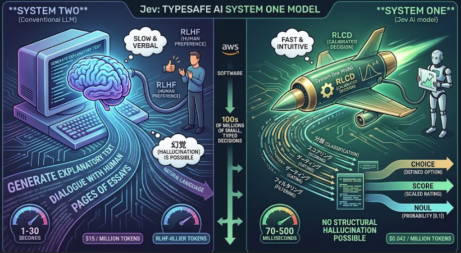

agent利用できるLLM/AGI開発が熱視線の中で、ちょっと変わった言語モデルが発表されました。

このモデルは自己回帰による文章生成ではなく、スコアを出力する過去のBERTのようなモデルです。

今日はそんなモデルについて語っていきます。

## Jevとは

**Jev** は、サンフランシスコに本社を置く [TypeSafe AI](https://typesafe.ai/) 社が開発したAIモデルです。2026年9月15日に限定早期アクセスとして公開され、同社が提唱する「System One model」という新しいクラスの最初のモデルとして位置づけられています。[Jev (AI model)](https://en.wikipedia.org/wiki/Jev_(AI_model))

### 1. LLMとは異なる設計思想

従来の大規模言語モデル（LLM）が人間向けの自然言語テキストを生成することを目的としているのに対し、Jevは**ソフトウェアが直接利用できる型付きの決定**を返すように設計されています。[What is Jev?](https://www.jevtypesafeai.com/what-is-jev)

具体的には、以下の3種類の構造化された出力のみを返します。[Introducing System One Models and Jev](https://typesafe.ai/blog/introducing-system-one-models-and-jev)

| タイプ | 返す内容 |
|--------|----------|
| **Choice** | 定義された選択肢から1つを選ぶ（最大255個の選択肢） |
| **Score** | 2〜10段階の順序付きスケールで評価 |
| **Noul** | Yes/Noの質問に対し、0〜1の確率で回答 |

出力の形式が事前に固定されているため、モデルが定義外の値や無効な型を返すことはありません。TypeSafe AIはこれを「**構造的に幻覚（hallucination）が起こり得ない**」設計として説明しています。[Jev (AI model)](https://en.wikipedia.org/wiki/Jev_(AI_model))

### 2. 「System One」とは

名称は認知心理学における「System One（直感的で高速な思考）」と「System Two（遅く言語的な思考）」の概念から来ています。LLMが「System Two」的な役割（文章を書いて考える）を担うのに対し、Jevは「System One」的な役割、すなわち**瞬時に下される数百万の小さな判断**（ルーティング、スコアリング、フィルタリング、ゲーティングなど）をソフトウェア内で担うことを目指しています。[What is Jev?](https://www.jevtypesafeai.com/what-is-jev)

### 3. 開発背景と創業者

TypeSafe AIは2024年に、元OpenAI研究者の **Diogo Almeida** 氏を中心に創業されました。Almeida氏はOpenAIで約4年間、RLHF（人間のフィードバックによる強化学習）、InstructGPT、ChatGPT、GPT-4の開発に関わった人物です。[Jev (AI model)](https://en.wikipedia.org/wiki/Jev_(AI_model))

Almeida氏の動機は、「モデルはすでに対話で超人的な性能を持っているのに、なぜ自動化が進んでいないのか」という問いでした。彼は対話型モデルが人間を喜ばせることに最適化されすぎており、ソフトウェア内で確実に動作する知性としては不十分だと考え、Jevの開発を始めました。[Introducing System One Models and Jev](https://typesafe.ai/blog/introducing-system-one-models-and-jev)

### 4. トレーニング方法：RLCD

Jevは **RLCD（Reinforcement Learning for Calibrated Decisions）** という独自の学習方法で訓練されています。これは人間の好みではなく、**確率が実際の結果とどれだけ一致するか（calibration）** を最適化する手法です。つまり、Jevが「80%の確信」と言った場合、実際に約80%の確率で正解していることを目指しています。[What is Jev?](https://www.jevtypesafeai.com/what-is-jev)

### 5. 性能と特徴

TypeSafe AIが公表する主な性能指標は以下の通りです。[Introducing System One Models and Jev](https://typesafe.ai/blog/introducing-system-one-models-and-jev)

- **速度**: エンドツーエンドで70〜500ミリ秒。同様のタスクにおいて最先端LLMの約40〜200倍高速
- **コスト**: 入力トークン $0.042/百万トークン。出力トークンは無料
- **並列処理**: 複数の質問を1回のリクエストで並列に評価
- **サンプリング**: トークンを1つずつ順次生成するのではなく、すべての出力を1回のクエリで並列生成

ただし、これらの数値（特に速度とコストの比較）はTypeSafe AI自身のワークフロー評価に基づいており、同社も「現実世界の結果としては上限に近い値である可能性がある」と注意を促しています。[Jev (AI model)](https://en.wikipedia.org/wiki/Jev_(AI_model))

### 6. モデル名の由来

「Jev」という名前は、19世紀のイギリスの経済学者 **William Stanley Jevons** に由来します。彼の提唱した「Jevonsの逆説（技術の進歩によって資源の使用効率が上がると、結果として資源の総消費量が増える）」になぞらえ、Almeida氏は「より安価な機械知能が、はるかに広範な展開につながるだろう」という期待を込めて命名しました。[Jev (AI model)](https://en.wikipedia.org/wiki/Jev_(AI_model))

## 開発背景

Jevが開発された根本的な理由は、**「既存のLLMは人間との対話には長けているが、ソフトウェアによる自動化には向いていない」** という問題意識にあります。以下、TypeSafe AIの創業者であるDiogo Almeida氏の視点を中心に、開発の背景を整理して説明します。

### 1. 「対話は超人的だが、自動化は進まない」という矛盾

Almeida氏はOpenAIでChatGPTの基盤となるRLHF（人間のフィードバックによる強化学習）の研究を行い、言語モデルが人間の指示に従い、自然に対話できるようになった経験がありました。しかし、4年間の研究を通じて彼が抱いたのは「モデルはすでに対話で超人的な性能を持っているのに、なぜ本格的な自動化が進んでいないのか」という疑問でした。[Introducing System One Models and Jev](https://typesafe.ai/blog/introducing-system-one-models-and-jev)

彼にとって、対話型AIは「瓶に閉じ込められた稲妻（lightning in a bottle）」のようなもので、目立ってはいるものの、実際の業務やソフトウェアの中で静かに動作する「知性」としては不十分だと感じていました。[Jev (AI model)](https://en.wikipedia.org/wiki/Jev_(AI_model))

### 2. 人間向け最適化（RLHF）の限界

既存のLLMはRLHFによって「人間が好む応答」を生成するように最適化されています。つまり、読みやすい文章、丁寧な説明、説得力のある回答を出すことに特化しています。

しかしAlmeida氏は、**自動化に必要なのは「人間が気に入る文章」ではなく「ソフトウェアが確実に使える判断」** だと考えました。たとえば：

- サポートチケットを自動で分類・振り分けたい
- 顧客の解約リスクをスコアリングしたい
- LLMの出力に幻覚が含まれていないか検証したい

こうした場面で、長い文章を生成してからパースするのは非効率ですし、モデルが突然予期しない応答を返すリスクもあります。Jevは「人間に読ませるための文章」を生成するのではなく、**機械が直接消費する型付きの値**（選択、スコア、確率）を返すことで、この非効率を解消しようとしています。[What is Jev?](https://www.jevtypesafeai.com/what-is-jev)

### 3. 過度の自信（Overconfidence）という自動化の障壁

既存のLLMは、たとえ95%の確率で正解できるタスクであっても、「自分がいつ5%の失敗をしているか」を正直に伝えられない傾向があります。自信過剰かつ一貫性に欠けるため、人間の確認なしに重要な分岐に組み込むことが困難でした。[Introducing System One Models and Jev](https://typesafe.ai/blog/introducing-system-one-models-and-jev)

Jevの開発において最重要視されたのは、**「較正（calibration）」** です。Jevが「80%の確信」と言ったとき、実際に約80%の確率で正解していることを目指すRLCD（Reinforcement Learning for Calibrated Decisions）という学習方法が採用されました。これにより、ソフトウェアは「確信度が低い場合は人間にエスカレーションする」といった信頼性の高い自動化フローを構築できるようになります。[What is Jev?](https://www.jevtypesafeai.com/what-is-jev)

### 4. 速度とコストという実用的な障壁

LLMをソフトウェアの内部ループ（if文のような分岐判断）に組み込もうとすると、数秒〜数十秒の待ち時間が発生します。これはリアルタイムのアプリケーションや、大量のデータを処理するパイプラインには致命的です。

Jevは「文字列生成」という高価な処理を放棄し、並列サンプリングによって70〜500ミリ秒で応答を返します。Almeida氏のビジョンは、**AIを「時々呼び出す特別な機能」ではなく、「何百万回も呼ばれる日常的な関数」** にすることでした。[Introducing System One Models and Jev](https://typesafe.ai/blog/introducing-system-one-models-and-jev)

## 想定ユースケース

Jevのユースケースは、**「人間が読む文章を生成する」**のではなく、**「ソフトウェアが何億回も呼び出して判断を下す」** 場面に特化しています。以下に、TypeSafe AIが想定している主なユースケースを整理して説明します。

### 1. AIによるワークフロー自動化（Smart If-Statements）

最も基本的なユースケースは、従来のコードでは手書きのif文が複雑になりすぎる、あるいは壊れやすくなるような分岐判断をAIに任せることです。具体的には：

- **分類（Classify）**: サポートメールやチケットをカテゴリに振り分ける
- **ルーティング（Route）**: 問い合わせを適切なチームや担当者に振り分ける
- **スコアリング（Score）**: 顧客の解約リスクや優先度を数値化する
- **抽出・検証（Extract / Verify）**: 文書から情報を抜き出し、正しいか検証する

例えば、サポートメッセージ「2か月連続で二重請求された」に対し、Jevは1回の呼び出しで「カテゴリ：請求問題」「優先度：高」「解約リスク：高」といった複数の型付き判断を並列で返せます。[Introducing System One Models and Jev](https://typesafe.ai/blog/introducing-system-one-models-and-jev)

### 2. 大量データの処理（Map-Reduce over Big Data）

Jevは70〜500ミリ秒で応答し、入力トークンが非常に安価（$0.042/百万トークン）であるため、**ペタバイト級のデータを一つひとつAIで処理・特徴量化**するようなユースケースも想定されています。大量の非構造化データを構造化された特徴やインサイトに変換するパイプラインに組み込むことができます。[Introducing System One Models and Jev](https://typesafe.ai/blog/introducing-system-one-models-and-jev)

-
### 3. リアルタイムアプリケーション

100ミリ秒程度の応答速度を活かし、**UX（ユーザー体験）が重要なリアルタイムアプリ**にも組み込めます。たとえば、ユーザーの入力をリアルタイムで評価し、即座に次の画面や処理を分岐させるような場面です。LLMを使うと数秒の待ち時間が発生してしまうため、こうした用途には従来不向きでした。[Introducing System One Models and Jev](https://typesafe.ai/blog/introducing-system-one-models-and-jev)

### 4. LLMの「検証・監視・ガードレール」（Verify Everything）

興味深いユースケースとして、**Jevが他のLLMの「監視役」として使われる**ことが挙げられています。LLMのプロンプト、推論過程（reasoning traces）、出力をJevに渡し、以下のような判断を下させます：

- この出力に幻覚（hallucination）は含まれているか？
- この回答はルーブリック（採点基準）を満たしているか？
- このプロンプトはjailbreak（越狱）の試みではないか？
- この推論過程に論理的な飛躍はないか？

Jevは確率較正されているため、「自信が低い場合は人間にエスカレーションする」といった信頼性の高いガードレールとして機能します。[Introducing System One Models and Jev](https://typesafe.ai/blog/introducing-system-one-models-and-jev)

### 5. AIエージェントの判断ループ

LangChainの解説記事でも、Jevはエージェントの「評価・判断エンジン」として活用できるとされています。エージェントは「LLMが次のアクションを決定 → ツールが実行 → Jevが結果を評価 → 次のステップへ」というループを回すことができます。Jevがツール実行結果や中間出力を構造化された形で評価することで、エージェントの動作をより堅牢に制御できます。[Building a Harness with Jev](https://www.langchain.com/blog/building-a-harness-with-jev)

## 総括

Jevの本質は、**「人間に話すAI」ではなく「ソフトウェアが呼び出すAI」** です。

従来のLLMが文章を書くのに対し、Jevは**選択肢からの選定・数値スコア・Yes/Noの確率**といった、機械がそのまま使える型付きの判断のみを返します。文章生成をあえてやめることで、**70〜500ミリ秒という高速性**と**構造的に幻覚が起こらない信頼性**を実現しています。

つまり、Jevはチャットボットではなく、**自動化のための「スマートなif文」** として、分類・ルーティング・リスク評価・他のAIの出力検証など、ソフトウェア内部で何度も呼ばれる判断エンジンとして設計されています。
