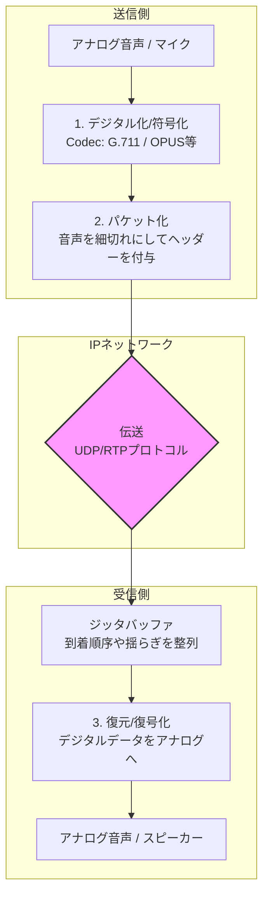

**VoIP（Voice over Internet Protocol）** とは、一言でいうと **「音声データをパケット（細切れのデータ）に変換し、インターネットなどのIPネットワークを通じて送り届ける技術」** のことです。

簡単に言えば、「電話回線」ではなく「インターネットの通り道」を使って電話をする仕組みです。LINE通話、Zoomの音声、会社のIP電話などはすべてこのVoIP技術がベースになっています。

### 1. 音声が届くまでの「4つのステップ」

物理層からアプリケーション層まで、VoIPは以下のようなプロセスで音声を運びます。

1. **デジタル化（符号化）:** マイクが拾ったアナログの音声を「0」と「1」のデジタルデータに変換します。
2. **パケット化:** 長い音声データを、インターネットで送りやすいように小さな「パケット」に切り分けます。
3. **伝送:** IPネットワークを通じて、相手のデバイスまでパケットを飛ばします。
4. **復元:** 届いたパケットを順番通りに並べ直し、再びアナログの音声に戻してスピーカーから流します。

### 2. VoIPを支える「2つの重要プロトコル」

VoIPは、1つのプロトコルではなく、主に役割の違う2つのプロトコルが協力して動いています。

* **SIP（シップ）：電話をかける・切る「合図」**
「呼び出し音を鳴らす」「通話を開始する」「切断する」といった、通話の **制御（シグナリング）** を担当します。
* **RTP（アールティーピー）：音声を運ぶ「運び屋」**
実際の音声パケットをリアルタイムに運ぶ担当です。スピードを重視するため、多少のデータ欠落を許容する**UDP**という通信方式が使われます。

### 3. VoIPのメリットとデメリット

#### メリット

* **コスト削減:** 電話回線を引く必要がなく、インターネット回線を共用できるため、通話料や基本料金が劇的に安くなります。
* **柔軟性:** PC、スマホ、専用電話機など、インターネットにつながるデバイスならどこでも電話番号を使えます。
* **多機能:** ビデオ通話やチャット、画面共有といったデータ通信との親和性が非常に高いです。

#### デメリット

* **品質がネットワークに依存:** ネットが混雑すると「声が遅れる（遅延）」「声が途切れる（パケットロス）」が発生します。
* **停電に弱い:** 従来の電話と違い、ルーターやサーバーの電源が切れると通話ができなくなります。
* **緊急通報の制限:** 110番や119番への発信時に、位置情報の特定が難しい場合があります（現在は改善されつつあります）。

### 4. まとめ：VoIPが変えた世界

VoIPが登場する前は「音声」と「データ」は別々の網で運ばれていましたが、VoIPによってすべてが **「IP」という共通言語** に統合されました。これにより、今日のクラウド会議やテレワークが可能になったと言っても過言ではありません。

| 比較項目 | 従来の電話 (PSTN) | VoIP (IP電話) |
| --- | --- | --- |
| **回線** | 交換機による専用回線 | 共有のIPネットワーク |
| **料金** | 距離や時間に比例 | 基本は定額または格安 |
| **品質** | 非常に安定 | ネット環境に左右される |
| **端末** | 固定電話機のみ | PC, スマホ, IP電話機など |

**次は、VoIPの天敵である「ジッタ（ゆらぎ）」や「遅延」を抑えて、通話品質を安定させるための技術「QoS（Quality of Service）」について詳しく解説しましょうか？**