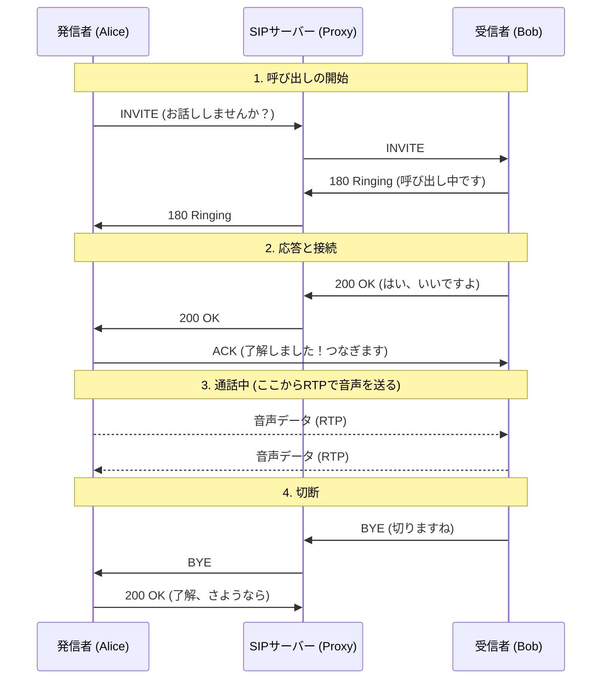

SIP（Session Initiation Protocol）は、電話の **「呼び出し」から「切断」までの手順（セグメント）を管理** するプロトコルです。その動きは非常に人間的で、 **「リクエスト」と「レスポンス」のキャッチボール** で行われます。

具体的な「呼び出し（発信）」の流れを、Mermaidのシーケンス図とステップ解説で見てみましょう。

---

### SIPによる呼び出しのシーケンス（基本形）

---

### 具体的なステップ解説

#### ① INVITE（お話ししませんか？）

発信者が「INVITE」というメッセージを送ります。これには、「私の声の形式（コーデック）はこれです」「私のIPアドレスはここです」といった、**SDP（Session Description Protocol）**と呼ばれる自己紹介データが含まれています。

#### ② 180 Ringing（呼び出し中）

受信者の端末（スマホやIP電話機）が鳴り始めると、受信側から「180 Ringing」という返事が返ってきます。発信者はこれを受け取って「プルルル…」という呼び出し音を再生します。

#### ③ 200 OK（応答）

受信者が受話器を取る（または応答ボタンを押す）と、「200 OK」という承認の返事が送られます。ここで、受信側の自己紹介データ（IPアドレスや音声形式）も発信側に伝えられます。

#### ④ ACK（確認）

発信者が「200 OKを受け取りました！」という最終確認（ACK）を送ることで、**SIPによる「道筋の確保」が完了**します。

---

### SIPサーバー（プロキシ）の意外な役割

上記の図にある「SIPサーバー」は、単に中継しているだけではありません。

* **位置情報の解決:** 相手が今、世界中のどのIPアドレスにいるのかをデータベース（レジストラ）で調べ、正しい宛先へ「INVITE」を転送してくれます。
* **転送・留守電:** 相手が話し中だったり、一定時間出なかったりした場合に、別の番号や留守番電話へ繋ぎ直すのもSIPサーバーの仕事です。

---

### まとめ：SIPは「電話交換手」

SIPはあくまで**「通話のセッティング（制御）」**をするためのプロトコルであり、**実際の音声データは運びません**。

* **SIP:** 「電話をかける、呼び出す、切る」という事務的な手続き。
* **RTP:** 「実際の声を届ける」という運送業務。

この2つが分業しているからこそ、呼び出しはインターネット経由、音声は高品質な専用線経由、といった柔軟な構成が可能になります。

## SDP

**SDP（Session Description Protocol）**とは、一言でいうと**「通信を始める前に、お互いの『スペック』や『ルール』をすり合わせるための自己紹介シート」**のようなプロトコルです。

SIPなどのプロトコルが「電話をかける（呼び出し）」という**動作**を担当するのに対し、SDPはその中で**「どんな形式で通信するか」という内容（中身）**を記述する役割を持っています。

---

### 1. SDPで何を「すり合わせ」ているのか？

オンライン会議やIP電話を始めるとき、お互いのデバイスがバラバラ（iPhoneとWindows、専用電話機など）だと、共通のルールを決めないと声が聞こえません。SDPでは以下の情報を交換します。

* **メディアの種類:** 「音声だけ？ ビデオも送る？」
* **IPアドレスとポート番号:** 「データはどこ（住所）に送ればいい？」
* **コーデック（圧縮方式）:** 「音声はどの形式（G.711やOpusなど）で送る？ どのビデオ形式なら再生できる？」
* **通信のタイミング:** 「セッションの開始時間と終了時間は？」

---

### 2. SDPの書き方（フォーマット）

SDPは人間が読める「テキスト形式」で書かれており、非常にシンプルな **`型 = 値`** というルールで構成されています。

> **（例）SDPの抜粋**
> `v=0` （プロトコルのバージョン）
> `o=alice 2890844526 2890844526 IN IP4 192.168.1.1` （誰が送っているか）
> `c=IN IP4 192.168.1.1` （接続先のIPアドレス）
> `m=audio 49170 RTP/AVP 0` （49170番ポートで、RTPを使って音声を送るよ）
> `a=rtpmap:0 PCMU/8000` （音声形式はPCMUだよ）

---

### 3. SDPが動く仕組み：オファー／アンサー

SDPは単独で動くのではなく、SIPやWebRTCなどの他のプロトコルの「荷物（ボディ）」として運ばれます。

1. **オファー（提示）:** AさんがBさんに「私はこのIPで、この音声形式が使えます。お話ししませんか？」というSDPを送りつけます（INVITEに同封）。
2. **アンサー（回答）:** Bさんが「了解です。私はこのIPで、その音声形式ならOKです」というSDPを返します（200 OKに同封）。

このやり取りが成立して初めて、お互いの間で**RTP（音声データ）**が流れ始めます。

---

### 4. まとめ：SDPの立ち位置

| プロトコル | 役割のたとえ | 具体的な仕事 |
| --- | --- | --- |
| **SIP** | 電話交換手・受付 | 「もしもし」「ガチャ（切断）」の合図を送る |
| **SDP** | **自己紹介シート** | **「私はこの言語で話せます」「ここに送って」を伝える** |
| **RTP** | 運送業者 | 実際の「声」をパケットにして運ぶ |

---

### 意外な事実

SDPは、実は「プロトコル」という名前ですが、それ自体が何かを「転送」する能力はありません。あくまで**「データの書き方のルール」**に過ぎないため、必ずSIPやWebRTC、あるいはメール（MIME）などの「乗り物」を必要とします。

**次は、このSDPの情報を書き換えることで、プライベートIPをグローバルIPに変換して通信を可能にする「NAT越え」の仕組みについて詳しくお話ししましょうか？**
