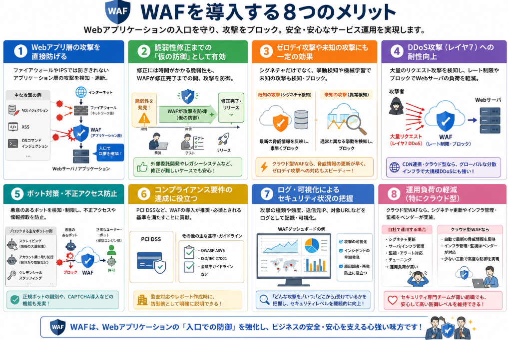

Web上で自分の作ったアプリケーションを公開する場合、ネットは色んな攻撃通信がされ、常に脅威にさらされています。

社内などのネットワークであれば入口にあたるポイントにファイアウォールを導入します。
ただ、ここですべての攻撃を防げるわけではありません。
アプリケーション固有の脆弱性に対する攻撃が行われれる可能性があり、そんなアプリケーション固有の脅威から防御する手段となりえるのがWAF（Web Application Firewall）と呼ばれるものです。

本日テーマ：
>WAFについて説明し、どんな種類で選定すべきかまとめてみる

## 概要
WAFは、Webアプリケーションに対する攻撃を検知・遮断するためのセキュリティサービス／製品です。

### WAFの基本的な役割
- WebサーバやWebアプリケーション（ECサイト、会員サイト、社内システムなど）の前段に配置し、HTTP/HTTPSの通信を監視します。
- SQLインジェクション、クロスサイトスクリプティング（XSS）、OSコマンドインジェクション、ディレクトリトラバーサルなど、アプリケーション層の攻撃を検知・ブロックします。
- 一般的なファイアウォール（ネットワーク層）やIPS（侵入防止システム）では防ぎきれない、アプリケーション特有の脆弱性を狙った攻撃を防ぐことを目的としています。

### 主な機能
1. **シグネチャ型防御**  
   既知の攻撃パターン（シグネチャ）と通信内容を照合し、一致した場合にブロックします。

2. **異常検知・挙動ベース防御**  
   通常の利用パターン（ベースライン）から外れたリクエストを「異常」とみなし、ブロックや警告を行います。

3. **ホワイトリスト／ブラックリスト制御**  
   - ホワイトリスト：許可するIPアドレス・URL・パラメータなどを指定  
   - ブラックリスト：拒否するIP・URL・パラメータなどを指定

4. **ボット対策**  
   悪意のあるボット（スクレイピング、アカウント乗っ取り試行など）を検知・制限します。

5. **DDoS対策**  
   アプリケーション層への大量リクエスト（レイヤー7 DDoS）を検知し、レート制限やブロックを行います。

6. **ログ管理・レポート**  
   攻撃の種類、頻度、送信元IPなどをログとして記録し、レポートやダッシュボードで可視化します。

## ファイアウォールとの違い

WAFとファイアウォール（FW）は、どちらも「通信を制御してセキュリティを高める」という点では共通していますが、**守る対象・レイヤー・判断基準**が大きく異なります。

### 1. 守る対象の違い

- **ファイアウォール（FW）**  
  主に**ネットワーク全体**を守るための装置・ソフトウェアです。  
  例：社内ネットワークとインターネットの境界、部門間のセグメント分離など。

- **WAF（Web Application Firewall）**  
  **Webアプリケーションそのもの**を守るための装置・サービスです。  
  例：ECサイト、会員サイト、社内Webシステムなど、特定のWebアプリの前段に配置されます。

### 2. 動作するレイヤーの違い（OSI参照モデル）

- **ファイアウォール**  
  主に**ネットワーク層（レイヤ3）** や**トランスポート層（レイヤ4）** で動作します。  
  - IPアドレス、ポート番号、プロトコル（TCP/UDP）などを見て、通信を許可・拒否します。  
  - 「どのIPから、どのポート宛ての通信か」を基準にします。

- **WAF**  
  **アプリケーション層（レイヤ7）** で動作します。  
  - HTTP/HTTPSの**中身（リクエスト・レスポンス）** を解析します。  
  - URL、パラメータ、Cookie、HTTPヘッダ、フォーム入力値などを見て、攻撃パターンかどうかを判断します。

### 3. 判断基準の違い

- **ファイアウォール**  
  - 「IPアドレス 192.168.1.100 からの 80番ポートへの通信は許可する」  
  - 「外部からの 22番ポート（SSH）への通信は拒否する」  
  といった、**通信の“宛先”と“送信元”** を基準にします。

- **WAF**  
  - 「`/login` へのPOSTリクエストに `' OR 1=1 --` のような文字列が含まれていたらブロックする」  
  - 「`` のようなスクリプトタグがパラメータに含まれていたらブロックする」  
  といった、**通信の“内容”** を基準にします。

### 4. 防げる攻撃の違い

- **ファイアウォールで防げるものの例**  
  - 不要なポートへの外部からのアクセス  
  - 特定IPからの一方的なスキャン攻撃  
  - ネットワークレベルのDoS攻撃（レイヤ3〜4）

- **WAFで防げるものの例**  
  - SQLインジェクション  
  - クロスサイトスクリプティング（XSS）  
  - クロスサイトリクエストフォージェリ（CSRF）  
  - ディレクトリトラバーサル  
  - アプリケーション層DDoS（レイヤ7 DDoS）

### 5. 配置位置のイメージ

- **ファイアウォール**  
  `[インターネット] ←→ [ファイアウォール] ←→ [社内ネットワーク全体]`

- **WAF**  
  `[インターネット] ←→ [WAF] ←→ [Webサーバ / Webアプリケーション]`

WAFは、ファイアウォールで守られたネットワークのさらに内側、**Webアプリケーションの直前**に配置されることが多いです。

### 比較一覧

| 項目 | ファイアウォール（FW） | WAF |
|------|------------------------|-----|
| 守る対象 | ネットワーク全体 | Webアプリケーション |
| 動作レイヤ | 主にレイヤ3・4（IP・ポート） | レイヤ7（HTTP/HTTPSの中身） |
| 判断基準 | IPアドレス、ポート番号、プロトコル | URL、パラメータ、Cookie、HTTPヘッダなど |
| 防ぐ攻撃 | ポートスキャン、不正アクセス（ネットワーク層） | SQLインジェクション、XSS、アプリ層DDoSなど |

**両者は「どちらか一方で十分」というものではなく、ネットワーク全体を守るFWと、アプリケーションの中身を守るWAFを組み合わせることで、より強固な防御が可能になります。**

## 提供形態

### 提供形態の種類
WAFの形態は3種類あります。

- **クラウド型WAF（SaaS型）**  
  DNSの向き先をWAF提供元に変更するだけで導入できる形態です。自社でサーバを用意せず、初期費用を抑えやすいのが特徴です。

- **オンプレミス型WAF（アプライアンス／ソフトウェア）**  
  自社のデータセンターに専用機器やソフトウェアを導入する形態です。ネットワーク構成の自由度が高く、既存のロードバランサやプロキシと連携しやすい場合があります。

- **ホスティング型／CDN連携型**  
  CDN（コンテンツデリバリネットワーク）事業者が提供するWAF機能を利用する形態です。Webサイトの高速化とセキュリティ強化を同時に実現できます。

### 選定

上記の3種類の中からコスト、導入しやすさ、カスタマイズ性、性能・スケーラビリティ、セキュリティ機能の5基準で比較します。

以下に、3種類のWAF提供形態を5つの基準で比較した表を示します。

| 評価基準 | クラウド型WAF | オンプレミス型WAF | CDN連携型WAF |
|----------|---------------|-------------------|--------------|
| **1. コスト**（初期費用・運用コスト） | **〇**初期費用が低く、月額課金中心。運用負荷も比較的軽い。 | **△〜×** 機器・ライセンス購入で初期費用が高く、運用・保守も自社負担になりがち。 | **〇** 初期費用は低め。CDN利用料とセットで、スケールに応じた課金が多い。 |
| **2. 導入しやすさ**（導入工数・期間） | **〇** DNS変更や簡単な設定で数日〜数週間で開始可能。 | **×** 機器調達・ネットワーク設計・設定が必要で、数ヶ月かかることも多い。 | **〇** CDN利用と同時にWAFを有効化でき、導入は比較的容易。 |
| **3. カスタマイズ性**（ルール・ネットワーク制御の自由度） | **△** ベンダー提供の機能範囲内でのカスタマイズが中心。ネットワーク制御は限定的。 | **〇** 自社ネットワーク内に設置するため、ロードバランサ・FWなどとの連携や細かい制御が可能。 | **△** CDNプラットフォーム上での制御が中心。独自ルールはある程度可能だが、自由度は中程度。 |
| **4. 性能・スケーラビリティ**（処理性能・拡張性・DDoS耐性） | **〇** ベンダーの大規模インフラ上で動作し、トラフィック増加に自動対応。DDoS耐性も高いことが多い。 | **△** 自社機器の性能上限があり、トラフィック増加時は機器増強が必要。DDoS対策は別途検討が必要な場合も。 | **〇** グローバルCDN上で動作し、キャッシュと組み合わせて高スループット・高DDoS耐性を実現。 |
| **5. セキュリティ機能**（防御機能の充実度・最新性） | **〇** シグネチャ・挙動ベース・ボット対策など機能が充実。脅威情報の反映も比較的早い。 | **〇〜△** 機能は充実しているが、シグネチャ更新や運用チューニングを自社で行う必要がある。 | **〇** CDN事業者の大規模な脅威インテリジェンスを活用し、最新の攻撃にも対応しやすい。 |

__選定の目安__

- **コスト重視・導入スピード重視**  
  → クラウド型WAF or CDN連携型WAFが有利です。

- **ネットワーク制御の自由度・特殊要件対応重視**  
  → オンプレミス型WAFが有利です。

- **大規模トラフィック・DDoS対策重視**  
  → クラウド型WAF or CDN連携型WAFが有利です。

- **セキュリティ機能の最新性・運用負荷軽減重視**  
  → クラウド型WAF or CDN連携型WAFが有利です。

このように、用途（どう使うか）と価格（いくらかかるか）のバランスを見ながら、上記5つの基準で比較すると、自社に合ったWAFの提供形態を選びやすくなります。

## WAFを導入するメリット
WAFを導入する主なメリットは、以下のように整理できます。

### 1. Webアプリケーション層の攻撃を直接防げる

- ファイアウォールやIPSでは防ぎきれない、**アプリケーション層の攻撃**（SQLインジェクション、XSS、OSコマンドインジェクションなど）を検知・遮断できます。
- Webサーバやアプリケーションの**入口で防御**するため、脆弱性が残っていても攻撃をブロックできます。

### 2. 脆弱性修正までの「仮の防御」として有効

- Webアプリケーションの脆弱性修正には、開発・テスト・リリースに時間がかかることが多いです。
- WAFは、**修正が完了するまでの間、攻撃を一時的に防ぐ「仮の防御」** として機能します。
- 特に、外部委託開発やレガシーシステムで修正が難しい場合に効果的です。

### 3. ゼロデイ攻撃や未知の攻撃にも一定の効果

- シグネチャ型だけでなく、**挙動ベースの防御**（通常と異なるリクエストを検知）や**機械学習ベースの異常検知**を行うWAFも多く、未知の攻撃パターンにも対応しやすくなります。
- ベンダー側で最新の脅威情報が反映されるクラウド型WAFでは、**ゼロデイ攻撃への対応スピードが速い**傾向があります。

### 4. DDoS攻撃（特にレイヤ7）への耐性向上

- アプリケーション層への大量リクエスト（レイヤ7 DDoS）を検知し、**レート制限やブロック**を行うことで、Webサーバの負荷を軽減できます。
- CDN連携型やクラウド型WAFでは、グローバルな分散インフラを活用して**大規模DDoSにも強い**構成が取りやすいです。

### 5. ボット対策・不正アクセス防止

- スクレイピング、アカウント乗っ取り試行、クレデンシャルスタッフィングなど、**悪意のあるボット**を検知・制限できます。
- 正常なボット（検索エンジンなど）との識別や、**CAPTCHA導入**などの機能も備えたWAFもあります。

### 6. コンプライアンス要件の達成に役立つ

- PCI DSS（クレジットカード情報のセキュリティ基準）など、**WAF導入が推奨または事実上必須**とされる規制・ガイドラインがあります。
- 監査対応やレポート作成の際に、**防御策の一つとして明確に説明できる**メリットがあります。

### 7. ログ・可視化によるセキュリティ状況の把握

- 攻撃の種類、頻度、送信元IP、対象URLなどを**ログとして記録・可視化**できます。
- ダッシュボードやレポート機能により、**自社のWebアプリケーションがどのような攻撃を受けているか**を把握しやすくなります。
- インシデント発生時の**原因調査・再発防止策の検討**にも役立ちます。

### 8. 運用負荷の軽減（特にクラウド型）

- クラウド型WAFでは、ベンダー側で**シグネチャ更新・インフラ管理・監視**を担うため、自社の運用負荷を軽減できます。
- セキュリティ専門チームが薄い組織でも、**比較的少ない工数で高度な防御**を実現しやすくなります。

## 総括

__WAFの用途の本質__
- **Webアプリケーションの「入口」で、HTTP/HTTPS通信を検査し、攻撃を検知・遮断する防御層**です。
- アプリケーションの脆弱性が残っていても、**攻撃が到達する前にブロックする「仮の防御」** として機能します。
- ネットワーク層の防御（FW/IPS）では防げない、**アプリケーション層特有の攻撃（SQLインジェクション、XSSなど）** を対象とします。

__アプリケーションに求められるセキュリティ__
- WAFは**追加の防御層**であり、**アプリケーション自体のセキュアコーディングや脆弱性対策の代替にはなりません**。
- 入力値検証、出力エスケープ、権限管理、セッション管理、ログ出力など、**基本的なセキュリティ対策をアプリケーション側で実装することが前提**です。
- WAF導入後も、**定期的な脆弱性診断・修正・パッチ適用**を継続する必要があります。

作成した成果物をインターネットを経由して提供するという場面において提供者には情報資産の安全を確保することが求められます。
本日説明したWAFは「**入口での防御＋可視化**」、実際に作成するアプリケーションには「**本体の堅牢化**」を行うという役割分担が存在します。  
両方を組み合わせることで、**多層防御（Defense in Depth）** を実現し、リスクを低減して、情報資産の安全を確保し、機能提供が実現できることになります。

