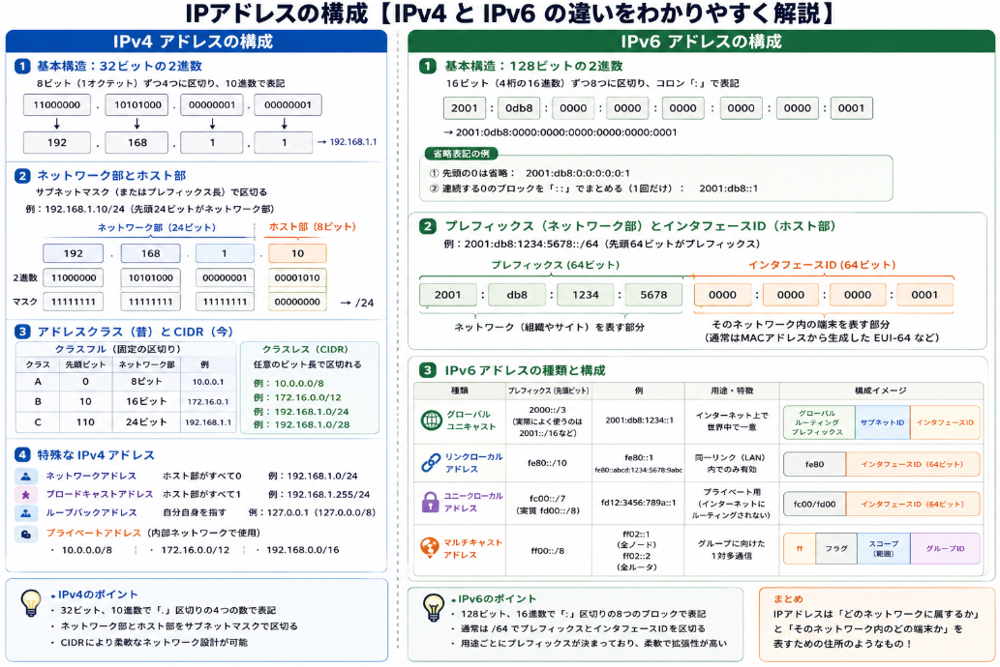

離れた相手と通信する相手を見分けるために利用されるものがIPアドレスです。
何気にたたく `ipconfig` で出てくるIPアドレスや、PCが接続しなくなって問合せするIT担当者が真っ先にしらべるものの一つです。
このIPアドレス、一筋縄ではいかないものです。

本日はそんなIPアドレスについて説明していきます。

## IPアドレスの種類

IPアドレスの「種類」は、通信先の範囲や配信方式によって大きく分けられます。代表的なものは以下の通りです。

### 1. ユニキャスト（Unicast）
- **特徴**：1対1の通信。送信元が特定の1つの宛先IPアドレスにパケットを送ります。
- **例**：WebブラウザがWebサーバにアクセスするとき、メールクライアントがメールサーバに接続するときなど。
- **IPアドレスの範囲**：通常のグローバルIPアドレスやプライベートIPアドレス（例：192.168.1.10）は基本的にユニキャストとして使われます。

### 2. ブロードキャスト（Broadcast）
- **特徴**：同じネットワーク（サブネット）内の**すべてのホスト**に対して一斉送信する方式。
- **用途**：ARP（IPアドレスからMACアドレスを問い合わせる）やDHCP（IPアドレスを自動取得する）など、ネットワーク内の全機器に知らせる必要がある場合に使われます。
- **IPv4の例**：
  - ローカルブロードキャスト：`255.255.255.255`
  - ネットワークブロードキャスト：`192.168.1.255`（サブネット`192.168.1.0/24`の場合）
- **IPv6**：ブロードキャストは存在せず、マルチキャストで代替されます。

### 3. マルチキャスト（Multicast）
- **特徴**：特定のグループに属する**複数のホスト**だけにパケットを送る方式。送信元は1つ、受信者は複数（1対多）。
- **用途**：動画配信、IPテレビ、オンライン会議、ルーティングプロトコル（OSPF、EIGRPなど）でよく使われます。
- **IPv4のマルチキャストアドレス範囲**：
  - `224.0.0.0` ～ `239.255.255.255`
  - 例：
    - `224.0.0.1`：同一ネットワーク上の全ホスト（全システム）
    - `224.0.0.2`：同一ネットワーク上の全ルータ
    - `224.0.0.5`：OSPF All SPF Routers
    - `224.0.0.9`：RIP v2
- **IPv6のマルチキャストアドレス範囲**：
  - `ff00::/8`（プレフィックス `ff`）
  - 例：
    - `ff02::1`：リンクローカルスコープの全ノード
    - `ff02::2`：リンクローカルスコープの全ルータ
    - `ff02::5`：OSPFv3 All SPF Routers
    - `ff02::1:2`：DHCPv6サーバ/リレーエージェント

### 4. エニーキャスト（Anycast）
- **特徴**：同じIPアドレスを複数のサーバ（地理的に離れた場所）に割り当て、**最も近い1台**にパケットが届くようにする方式。実質的には「1対1」ですが、どのサーバに届くかは経路によって変わります。
- **用途**：DNSルートサーバ、CDN（コンテンツ配信ネットワーク）、ロードバランサなどで利用されます。
- **アドレス範囲**：特別なアドレス範囲はなく、通常のユニキャストアドレスを複数箇所に割り当てることで実現します。

### 5. その他の関連概念

__ループバックアドレス（Loopback）__
- 自分自身を指すアドレス。
- IPv4：`127.0.0.1`（`127.0.0.0/8`）
- IPv6：`::1`

__リンクローカルアドレス（Link-Local）__
- 同一リンク（同じLANセグメント）内でのみ有効なアドレス。
- IPv4：`169.254.0.0/16`（APIPA）
- IPv6：`fe80::/10`

__予約アドレス（Reserved / Special-Use）__
- 実験用、ドキュメント用、プライベートネットワーク用など、特別な用途に予約されたアドレス。
- 例：
  - IPv4プライベートアドレス：`10.0.0.0/8`、`172.16.0.0/12`、`192.168.0.0/16`
  - IPv6ユニークローカルアドレス：`fc00::/7`

### まとめ

| 種類         | 通信方式              | 主な用途例                         |
|--------------|-----------------------|------------------------------------|
| ユニキャスト   | 1対1                 | Web閲覧、メール、SSH              |
| ブロードキャスト | 1対（ネットワーク全員） | ARP、DHCP（IPv4のみ）             |
| マルチキャスト   | 1対（グループ）      | 動画配信、ルーティングプロトコル   |
| エニーキャスト   | 1対（最も近い1台）   | DNSルートサーバ、CDN               |

「IPアドレスの種類」というと、上記のような**通信方式による分類**と、**IPv4/IPv6・グローバル/プライベート・予約アドレスなどの範囲による分類**の両方がありますが、ご質問の「マルチキャストなどの種類」という文脈では、ユニキャスト・ブロードキャスト・マルチキャスト・エニーキャストの4つが中心になります。

## IPアドレスの種類が派生した経緯

IPアドレスの種類が分かれるようになったのは、**「通信の目的や効率性の違い」** に対応するためです。それぞれの方式が生まれた背景を順に整理します。

### 1. ユニキャスト（Unicast）の起源：基本の「1対1」通信

- **きっかけ**：もともとIP（Internet Protocol）は、**「ある端末から別の特定の端末へパケットを届ける」** という1対1通信を前提に設計されました。
- **背景**：
  - 1970〜80年代のARPANETでは、リモートログイン（Telnet）、ファイル転送（FTP）、メール（SMTP）など、**特定の相手と通信する用途**が中心でした。
  - そのため、IPアドレスは「**1つのインターフェースを一意に識別する番号**」として設計され、これがユニキャストの基本になりました。
- **特徴**：送信元と宛先が1対1で対応するシンプルなモデルです。

### 2. ブロードキャスト（Broadcast）の導入：同一ネットワーク内の「一斉通知」

- **きっかけ**：**「同じネットワーク内の全員に一度に知らせたい」** という要求が生まれたためです。
- **背景**：
  - たとえば「このIPアドレスに対応するMACアドレスを持っている人は誰？」と聞く**ARP**や、「誰かIPアドレスを配ってくれるサーバはいませんか？」という**DHCP**の探索などでは、**宛先を特定できない段階で全員に問い合わせる**必要がありました。
  - これをユニキャストで1台ずつ送ると、非常に非効率です。
- **対応**：
  - IPv4では「**ブロードキャストアドレス**」（例：`255.255.255.255` や `192.168.1.255`）を定義し、**同一サブネット内の全ホスト**にパケットを届ける仕組みを追加しました。
- **注意**：IPv6ではブロードキャストは廃止され、マルチキャストで代替されています。

### 3. マルチキャスト（Multicast）の導入：効率的な「1対グループ」通信

- **きっかけ**：**「特定のグループだけに効率よく配信したい」** という要求から生まれました。
- **背景**：
  - 1980年代後半〜1990年代にかけて、**音声・動画の配信**や**ルーティングプロトコル（OSPF、RIPなど）** で、「同じ情報を複数の相手に送りたいが、全員に送るのは無駄が多い」という課題が出てきました。
  - ブロードキャストだと「関係ないホストにも届いてしまう」ため、ネットワーク負荷が大きくなります。
- **対応**：
  - 1989年の **RFC 1112 “Host Extensions for IP Multicasting”** でIPv4マルチキャストが標準化されました[Wikipedia](https://ja.wikipedia.org/wiki/Internet_Protocol)。
  - IPv4では `224.0.0.0/4`（`224.0.0.0`〜`239.255.255.255`）をマルチキャスト用に割り当て、**特定のグループだけが参加する通信**を実現しました。
  - IPv6では設計段階からマルチキャストが組み込まれ、`ff00::/8` がマルチキャスト用として定義されています。
- **用途例**：動画配信、Web会議、OSPF/RIP/EIGRPなどのルーティングプロトコル。

### 4. エニーキャスト（Anycast）の登場：「最も近い1台」へのルーティング

- **きっかけ**：**「地理的に分散した同じサービスに、自動的に近い方へ誘導したい」** という要求から生まれました。
- **背景**：
  - DNSルートサーバやCDN（コンテンツ配信ネットワーク）などで、**同じドメイン名やIPアドレスを世界中の複数拠点で運用**し、ユーザーには「最も近いサーバ」にアクセスさせたい、というニーズが高まりました。
  - ユニキャストでは「1つのIPアドレスは1箇所」という前提のため、この用途には不向きでした。
- **対応**：
  - 特別なアドレス範囲は設けず、**同じユニキャストIPアドレスを複数箇所に割り当て、BGPなどのルーティングプロトコルで「最も近い経路」にパケットを誘導する**方式としてエニーキャストが実現されました。
- **用途例**：DNSルートサーバ（例：`198.41.0.4` など）、CDNエッジサーバ、一部のDNSキャッシュサーバ。

### 5. その他のアドレス種別（ループバック、リンクローカルなど）の背景

- **ループバックアドレス**（`127.0.0.1`、`::1`）  
  → 自分自身に対する通信テストやローカルサービス用。ネットワークカードがなくても動作確認できるようにするため。

- **リンクローカルアドレス**（IPv4：`169.254.0.0/16`、IPv6：`fe80::/10`）  
  → DHCPサーバがない環境でも、同一リンク内だけで通信できるようにする「自動設定用」のアドレス。
    この同一リンクとうのは、ルートから先にデータが送られないということを意味します。このリンクローカルのネットワークのことをネットワークセグメントといいます。
    ネットワークセグメントを越えないということは近接するデバイスのみで使われるIPアドレスということです。

- **プライベートアドレス**（IPv4：`10.0.0.0/8`、`172.16.0.0/12`、`192.168.0.0/16`、IPv6：`fc00::/7`）  
  → インターネット上で一意でなくてよい社内・家庭内ネットワーク用に、アドレス空間を節約するために導入。

## IPアドレスの構成

IPアドレスの「構成」は、IPv4とIPv6で大きく異なります。それぞれ「何ビットで」「どのように区切って」「どんな意味を持つか」を順に説明します。

### IPv4アドレスの構成

__1. 基本構造：32ビットの2進数__
- IPv4アドレスは**32ビット**の2進数です。
- 人間が読みやすいように、8ビットずつ4つに区切り、10進数で表記します。
- 例：`11000000.10101000.00000001.00000001` → `192.168.1.1`

__2. ネットワーク部とホスト部__
IPv4アドレスは、大きく分けて次の2つの部分から成ります。

- **ネットワーク部**：どのネットワークに属するかを示す部分。
- **ホスト部**：そのネットワーク内のどの端末かを示す部分。

この区切りは**サブネットマスク**（またはプレフィックス長）で指定します。

__例：`192.168.1.10/24`__
- `/24` は「先頭24ビットがネットワーク部」を意味します。
- 2進数にすると：
  - アドレス：`11000000.10101000.00000001.00001010`
  - マスク：`11111111.11111111.11111111.00000000`
- ネットワーク部：`192.168.1`（先頭24ビット）
- ホスト部：`.10`（残り8ビット）

__3. アドレスクラス（クラスフル）とCIDR（クラスレス）__
- 昔は「クラスA/B/C」という固定の区切りがありましたが、現在は**CIDR（Classless Inter-Domain Routing）** が主流です。
- CIDRでは、任意のビット長でネットワーク部とホスト部を区切れます（例：`/16`、`/24`、`/28`など）。

__4. 特殊なアドレス構成__
- **ネットワークアドレス**：ホスト部がすべて0（例：`192.168.1.0/24`）
- **ブロードキャストアドレス**：ホスト部がすべて1（例：`192.168.1.255/24`）
- **ループバックアドレス**：`127.0.0.0/8`（主に`127.0.0.1`）
- **プライベートアドレス**：`10.0.0.0/8`、`172.16.0.0/12`、`192.168.0.0/16`

### IPv6アドレスの構成

__1. 基本構造：128ビットの16進数__
- IPv6アドレスは**128ビット**の2進数です。
- 16ビット（4桁の16進数）ごとに8つに区切り、`:`で区切って表記します。
- 例：`2001:0db8:0000:0000:0000:0000:0000:0001`
- 省略表記：
  - 先頭の0は省略可能：`2001:db8:0:0:0:0:0:1`
  - 連続する0のブロックは`::`でまとめられる（1回だけ）：`2001:db8::1`

__2. プレフィックス（ネットワーク部）とインタフェースID（ホスト部）__
IPv6アドレスも、大きく分けて次の2つで構成されます。

- **プレフィックス（Prefix）**：ネットワークを表す部分。
- **インタフェースID（Interface Identifier）**：そのネットワーク内の端末を表す部分。

__例：`2001:db8:1234:5678::/64`__
- `/64` は「先頭64ビットがプレフィックス」を意味します。
- プレフィックス：`2001:db8:1234:5678`
- インタフェースID：残り64ビット（例：MACアドレスから生成したEUI-64など）

__3. IPv6アドレスの種類ごとの構成__
IPv6では、用途に応じてアドレスの構成が異なります。

__グローバルユニキャストアドレス（通常のインターネット用）__
- 例：`2001:db8::/32` など
- 構成イメージ：
  - グローバルルーティングプレフィックス（例：`2001:db8`）
  - サブネットID
  - インタフェースID

__リンクローカルアドレス（同一リンク内のみ）__
- プレフィックス：`fe80::/10`
- 例：`fe80::1`、`fe80::abcd:1234:5678:9abc`
- 同一LAN内での通信や近隣探索（Neighbor Discovery）に使われます。

__ユニークローカルアドレス（プライベートネットワーク用）__
- プレフィックス：`fc00::/7`（実質的には`fd00::/8`）
- 例：`fd12:3456:789a::1`
- インターネットにはルーティングされない社内・組織内ネットワーク用です。

__マルチキャストアドレス__
- プレフィックス：`ff00::/8`
- 例：
  - `ff02::1`：リンクローカルスコープの全ノード
  - `ff02::2`：リンクローカルスコープの全ルータ
- 先頭8ビットが`ff`で始まり、その後にフラグ・スコープ・グループIDが続く構成です。

### まとめ：IPアドレスの「構成」のポイント

- **IPv4**：
  - 32ビット、10進数4つで表記。
  - ネットワーク部＋ホスト部（サブネットマスクで区切り）。
  - クラスレス（CIDR）が主流。

- **IPv6**：
  - 128ビット、16進数8ブロックで表記。
  - プレフィックス＋インタフェースID（通常は`/64`などで区切り）。
  - グローバル、リンクローカル、ユニークローカル、マルチキャストなど、用途ごとにプレフィックスが決まっている。

「IPアドレスの構成」というと、上記のような**ビット構造・表記法・ネットワーク/ホストの区切り方**が中心になります。

## 総括

IPアドレスは、**インターネットやネットワーク上で「どの機器か」を一意に識別するための住所**です。  
理解のポイントをざっくりまとめると、次の3つに集約できます。

### 1. IPアドレスは「住所」であり「通信の送り先の指定方法」

- IPアドレスは、**「どのネットワークの、どの端末か」**を表す番号です。
- IPv4は32ビット（例：`192.168.1.1`）、IPv6は128ビット（例：`2001:db8::1`）で、それぞれ**ネットワーク部＋ホスト部**（IPv6ではプレフィックス＋インタフェースID）に分かれています。
- サブネットマスクやプレフィックス長（例：`/24`、`/64`）で、どこまでが「ネットワーク」で、どこからが「端末」かを決めます。

**押さえると良いポイント**  
- IPアドレスは「ネットワーク＋ホスト」の2段階構造になっている  
- ネットワーク部が同じ＝同じLANや同じサブネットに属する

### 2. 通信の目的に応じて「種類（送り方）」が分かれている

IPアドレスは、**「誰に届けるか」** によって送り方が変わります。

- **ユニキャスト**：特定の1台に送る（Web、メール、SSHなど）
- **ブロードキャスト**：同じネットワーク内の全員に送る（IPv4のARP、DHCPなど）
- **マルチキャスト**：特定のグループだけに送る（動画配信、ルーティングプロトコル）
- **エニーキャスト**：同じIPを複数拠点に置き、最も近い1台に届く（DNSルートサーバ、CDN）

**押さえると良いポイント**  
- 用途に応じて「1対1」「1対全員」「1対グループ」「1対（最も近い1台）」を使い分けている  
- IPv6ではブロードキャストがなく、マルチキャストで代替されている

### 3. 用途や範囲ごとに「特別なアドレス」が決まっている

- **ループバック**：自分自身（`127.0.0.1`、`::1`）
- **リンクローカル**：同一LAN内だけで有効（IPv4：`169.254.0.0/16`、IPv6：`fe80::/10`）
- **プライベート**：社内・家庭内など、インターネットに出ない範囲（IPv4：`10.0.0.0/8`、`172.16.0.0/12`、`192.168.0.0/16`、IPv6：`fc00::/7`）
- **マルチキャスト用**：IPv4は`224.0.0.0/4`、IPv6は`ff00::/8`

**押さえると良いポイント**  
- 「インターネットに出るアドレス」と「社内だけで使うアドレス」が分かれている  
- 自分自身・同一LAN内・グループ通信など、用途ごとにアドレス範囲が決まっている

### ざっくり一言でまとめると

> IPアドレスは、**「どのネットワークのどの端末か」を表す住所であり、用途に応じて「誰にどう届けるか」を変えるための仕組み**です。

理解のコツとしては、

1. **IPアドレス＝ネットワーク部＋ホスト部**という構造を押さえる  
2. **ユニキャスト／ブロードキャスト／マルチキャスト／エニーキャスト**の違いを「誰に届けるか」で覚える  
3. **ループバック・リンクローカル・プライベート・マルチキャスト**など、用途ごとのアドレス範囲をざっくり把握する

この3点を押さえておくと、IPアドレスの全体像がかなり整理しやすくなります。

