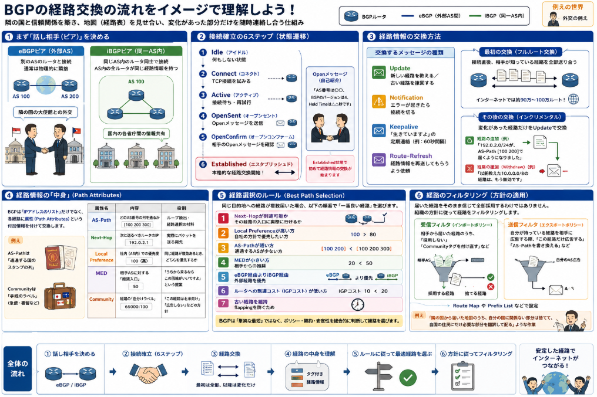

組織の間にはインターネットでつながっていますが、IPパケットを送達させるためのプロトコルがどうしても必要となります。
そして、現時点での組織を接続する経路を決定するプロトコルはBGP-4（Border Gateway Protocol version 4）というもの1択です。

本日は組織間の接続に使われているBGP-4について説明していきます。

## BGPとは

BGP-4は、**インターネット上の「大きな組織同士」が「どの経路でパケットを送れば届くか」を交換するプロトコル**です。
一言で言えば、**国と国の間で郵便の配送ルートを決める外交会議**のようなものです。

### 前提：AS（自律システム）とは

BGPを理解するにはまず「**AS（Autonomous System：自律システム）**」を知る必要があります。

- ASとは、**一つの管理主体（ISP、企業、大学など）が運営するネットワークのまとまり**
- それぞれのASには**AS番号**（例：AS 7517）という固有の番号が割り当てられている
- 例：NTTコミュニケーションズ、KDDI、Google、Amazonなどがそれぞれ独自のASを持っている

> **例え：** ASは「日本」「アメリカ」「ドイツ」のような**国**のようなもの。それぞれの国の中では独自の法律（ルーティングプロトコル）で交通を管理している。

### BGP-4がやっていること

BGP-4は、これらの**AS同士の境界（Border/Gateway）** で、「**どのASを経由すれば、どのIPアドレスの集まり（プレフィックス）に届くか**」という情報を交換します。

- **話す相手**：隣接するASのルータ（BGPピア）
- **交換する情報**：「192.0.2.0/24に行くには、私のAS（例：AS 100）を経由して、さらにAS 200→AS 300と進めば届く」という経路情報
- **使うポート**：TCPの**179番**

### BGP-4の主な特徴

__1. パスベクトル型ルーティング__

BGPは「距離（ホップ数）」ではなく、「**どのAS番号の列（パス）を通るか**」で経路を選びます。これを**AS-Path**と呼びます。

> **例え：** 「東京→大阪→福岡」ではなく、「JR東海→JR西日本→JR九州」という**通過する会社の列**でルートを表現するイメージです。

__2. ポリシー（方針）ベースの選路__

BGPは「一番近い経路」よりも「**経営上・契約上の都合**」を優先して経路を選べます。

- 「あのASは信用できないから、遠回りでも別の経路を使う」
- 「お金を払っている回線（トランジット）より、無料で交換する回線（ピアリング）を優先する」
- 「特定の国のASを経由しないようにする」

> **例え：** 航空会社が「燃料費の安いルート」よりも「航空同盟のパートナー会社を経由するルート」を優先するのと同じです。

__3. 大規模なルーティングテーブルを扱う__

インターネット全体の経路情報（現在約**90万〜100万ルート**前後）を交換・保持します。そのため、通常の企業内ルータより**高機能なルータ**が必要です。

### IGP（OSPFなど）との違い

企業内でよく使われるOSPFやRIPとBGPは、まったく別の役割です。

| 項目 | IGP（OSPFなど） | EGP（BGP-4） |
|------|----------------|--------------|
| **対象範囲** | 企業内・AS内 | AS間（インターネット） |
| **目的** | 中のネットワークを最適に繋ぐ | 組織同士の経路を交換する |
| **選路基準** | 距離・速度（最短路径） | ポリシー・契約・信頼性 |
| **収束速度** | 比較的速い（秒〜分） | 比較的遅い（分〜時間） |
| **規模** | 数百〜数千ルート | 数十万〜100万ルート超 |

> **例え：** IGPは「社内の案内図」、BGPは「国際郵便の配送協定書」です。

### BGP-4の具体例

あなたが自宅から「google.com」にアクセスすると、パケットは以下のような経路を辿ります。

1. **自宅** → プロバイダA（例：AS 4713 オープンインターネット）
2. **プロバイダA** と **Google**（AS 15169）がBGPで経路交換
3. 「GoogleのIPは、AS 15169に直結している」とBGPで知っているため、そちらへ送る
4. Google側も「お客さんのIPは、プロバイダA経由で届く」とBGPで学習している

この「**AS 4713 → AS 15169**」という関係をBGPが管理しています。


## 経路交換

BGPの経路交換は、**隣の国の外交官と、まず信頼関係を作り、次に持っている地図（経路表）を全部見せ合い、その後は変化があった部分だけを随時連絡し合う**という流れで行われます。

### 1. まず「話し相手（ピア）」を決める

BGPは**TCP 179番**で接続を張ります。相手は主に2種類あります。

| ピアの種類 | 説明 |
|-----------|------|
| **eBGPピア** | **外部AS**のルータ（別のISP・別の組織）と接続。通常は物理的に隣接したルータ同士 |
| **iBGPピア** | **同じAS内**のルータ同士で接続。AS内の全ルータが同じ経路情報を持つため |

> **例え：** eBGPは「隣の国の大使館」との外交、iBGPは「国内の各省庁間」の情報共有です。

### 2. 接続確立の6ステップ（状態遷移）

BGPは以下の順番で「会話の準備」を整えます。

```
Idle（何もしない）
  ↓
Connect（TCP接続を試みる）
  ↓
Active（接続待ち・再試行）
  ↓
OpenSent（Openメッセージを送った）
  ↓
OpenConfirm（相手のOpenメッセージを確認）
  ↓
Established（本格的な経路交換開始！）
```

- **Openメッセージ**：「AS番号は〇〇、BGPのバージョンは4、Hold Timeは△△秒です」という自己紹介
- **Established**になって初めて、経路情報の交換が始まります

### 3. 経路情報の交換方法

 Establishedになったら、以下のメッセージタイプで経路をやり取りします。

| メッセージ | 役割 |
|-----------|------|
| **Update** | 「新しい経路を教える」または「古い経路を撤回する」 |
| **Notification** | エラーが起きたら接続を切る |
| **Keepalive** | 「生きていますよ」の定期連絡（デフォルト60秒間隔など） |
| **Route-Refresh** | 経路情報を再送してもらうよう依頼 |

__最初の交換（フルルート交換）__

接続直後、**相手が知っている経路を全部送り合います**。インターネットの場合、これは約**90万〜100万ルート**にもなります。かなり重い作業です。

__その後の交換（インクリメンタル）__

最初の全送り以降は、**変化があった経路だけ**をUpdateメッセージで送り合います。

- **経路の追加**：「192.0.2.0/24が、AS-Path [100 200] で届くようになりました」
- **経路の撤回（Withdraw）**：「以前教えた10.0.0.0/8の経路は、もう無効です」

### 4. 経路情報の「中身」（Path Attributes）

BGPが交換するのは「IPアドレスのリスト」だけではありません。各経路には**属性（Path Attributes）** という付加情報が付いています。これがBGPの強みです。

主な属性は以下の通りです。

| 属性 | 内容 | 役割 |
|------|------|------|
| **AS-Path** | どのAS番号の列を通るか | ループ検出・経路選択の材料 |
| **Next-Hop** | 次に送るべきルータのIP | 実際にパケットを送る宛先 |
| **Local Preference** | 社内（AS内）での優先度 | 同じ経路が複数あるとき、どちらを優先するか |
| **MED** | 相手ASに対する「推奨入口」 | 「うちから来るならこの回線がいいですよ」という提案 |
| **Community** | 経路の「色分けラベル** | 「この経路は北米向け」「広告しない」などの方針を付与 |

> **例え：** AS-Pathは「通過する国のスタンプの列」、Communityは「この手紙は急便扱い」「この手紙は書留」のようなラベルです。

### 5. 経路選択のルール（Best Path Selection）

同じ目的地への経路が複数届いた場合、BGPは**決まった順番で比較**して「一番良い経路」を選びます。主な順番は以下の通りです。

1. **Next-Hopが到達可能か**（その経路の入口に実際に行けるか）
2. **Local Preferenceが高い方**（自社の方針で優先したい方）
3. **AS-Pathが短い方**（通過するASが少ない方）
4. **MEDが小さい方**（相手からの推奨）
5. **eBGP経由よりiBGP経由**（外部経路を優先）
6. **ルータへの到達コスト（IGPコスト）が低い方**
7. **古い経路を維持**（flappingを防ぐため）

このように、BGPは「単純な最短」ではなく、**ポリシー・契約・安定性**を総合的に判断して経路を選びます。



### 6. 経路のフィルタリング（方針の適用）

BGPでは「**届いた経路をそのまま信じて全部採用する**」わけではありません。組織の方針に従って経路を**フィルタリング**します。

- **受信フィルタ**：相手から届いた経路のうち、「これは採用しない」「これはCommunityタグを付け直す」
- **送信フィルタ**：自分が持っている経路を相手に広告する際、「この経路だけ広告する」「AS-Pathを書き換える」

これを**Route Map**や**Prefix List**などで設定します。

> **例え：** 「隣の国から届いた地図のうち、自分の国に関係ない部分は捨てて、自国の住民にだけ必要な部分を翻訳して配る」ような作業です。

## パス属性

**パス属性（Path Attributes）** とは、BGPで交換される**経路（プレフィックス）に「付箋」として貼り付けられた付加情報**です。

BGPは「192.0.2.0/24に行くにはAS100→AS200を通ります」という経路を教えるだけでなく、**その経路に関する「どんな経路か」「どう扱うべきか」という情報（属性）を一緒に送ります**。これがパス属性です。

### なぜパス属性が必要なのか

インターネットには同じ目的地への経路が複数あります。例えば「Googleへ行く道」も、NTT経由でもKDDI経由でも届きます。
その時、「単純に一番近い道」ではなく、以下のような判断が必要です。

- 「この経路は信頼できる相手から教えてもらったものか？」
- 「自社としてはこの回線を優先すべきか？」
- 「相手側にはどの入口から入ってほしいか？」

これらの「**経路の性質・方針・制御情報**」を運ぶのがパス属性です。

### パス属性の4つの分類

BGPのパス属性は、**「全ルータが知っていなければならないか」「必須か」「隣に転送するか」** で4種類に分類されます。

| 分類 | 意味 | 具体例 |
|------|------|--------|
| **Well-known Mandatory**<br>（ well-known 必須） | 全BGP実装が必ず理解し、必ず含めなければならない属性 | AS_PATH, NEXT_HOP, ORIGIN |
| **Well-known Discretionary**<br>（ well-known 任意） | 全BGP実装が理解するが、必ずしも含める必要はない属性 | LOCAL_PREF, ATOMIC_AGGREGATE |
| **Optional Transitive**<br>（ 任意・転送可） | 理解できなくても無視していいが、**他のASにもそのまま送る**属性 | COMMUNITY, AGGREGATOR |
| **Optional Non-transitive**<br>（ 任意・転送不可） | 理解できなくても無視していいし、**他のASには送らない**属性 | MED |

> **例え：** Well-knownは「全員が読める公用語の書類」、Optionalは「専門家だけが読む注記」。Transitiveは「次の部署にも回覧する」、Non-transitiveは「この部署内だけのメモ」です。

### 代表的なパス属性とその役割

__1. AS_PATH（Well-known Mandatory）__

**「どのAS番号の列を通ってここに来たか」** を記録したリストです。

```
例：AS 300 が AS 200 から AS 100 由来の経路を受け取った場合
AS_PATH = [200, 100]
```

- **ループ検出**：自分のAS番号がAS_PATHに入っていたら「自分から出た経路が回ってきた」と判断し破棄
- **経路選択**：AS_PATHが短い方（通過ASが少ない方）を優先

__2. NEXT_HOP（Well-known Mandatory）__

**「次にパケットを送るべきルータのIPアドレス」** です。

- eBGPでは通常、隣接する相手ルータのIP
- iBGPでは、eBGPで教わったときのNext-Hopをそのまま維持することが多い（再配送しない）

__3. ORIGIN（Well-known Mandatory）__

**「この経路情報がどこから生まれたか」** を示す属性。

| 値 | 意味 |
|----|------|
| IGP | 内部ルーティング（OSPFなど）から学習。最も信頼度高い |
| EGP | 古いEGPから学習（現在ほぼ使われない） |
| INCOMPLETE | 再配送（redistribute）などで不明瞭な経路。信頼度低い |

__4. LOCAL_PREF（Well-known Discretionary）__

**「自AS内での優先度」**。同じ目的地への経路が複数の出口（BGPピア）から届いた時、どちらを選ぶかを決める。

- 値が**大きいほど優先**
- **iBGPピア間だけで交換**され、eBGPの外には出ない（自社内の方針だから）

> **例え：** 「出口Aは帯域が広いから優先度100、出口Bは予備だから優先度50」という社内ルール。

__5. MED（MULTI_EXIT_DISC）（Optional Non-transitive）__

**「相手ASへ入るとき、うちのどの入口を使ってほしいか」** という提案。

- 値が**小さいほど優先**
- 基本的に**隣接AS間だけ**で有効で、それ以降のASには転送されない

> **例え：** 「うちの東京都の入口より、大阪府の入口の方が近いですよ」という隣の国への案内。

__6. COMMUNITY（Optional Transitive）__

**「経路に貼る色分けラベル」**。経路のグループ管理や方針適用に使います。

- ただの「タグ」ですが、**意味は運用者間で合意**して使う
- よく使われる例：
  - `no-export`：この経路を外部ASに広告しない
  - `no-advertise`：隣のピアにも広告しない
  - `local-AS`： confederation内だけで有効

> **例え：** 「この手紙は社内回覧のみ」「この手紙は北米支社向け」という色分けシール。

__7. ATOMIC_AGGREGATE / AGGREGATOR__

複数の細かい経路を**1つにまとめた（集約した）** ことを示す属性。

- 詳細な経路情報が失われていることを警告
- AGGREGATORは「誰が・いつ集約したか」を記録

### パス属性の使い方の具体例

ある企業（AS 100）が、ISPのA（AS 200）とISPのB（AS 300）から「8.8.8.0/24（Google DNS）」への経路を教わったとします。

- **ISP-Aからの経路**：AS_PATH=[200, 15169], MED=10, Community=`premium`
- **ISP-Bからの経路**：AS_PATH=[300, 15169], MED=50, Community=通常

企業（AS 100）のBGPルータは以下のように判断します。

1. LOCAL_PREFで社内方針を適用（Community `premium`ならLOCAL_PREFを上げる）
2. AS_PATHの長さを比較（どちらも2ホップなら同じ）
3. MEDを比較（ISP-AのMED=10の方が小さいので優先）
4. → **ISP-A経由を採用**

このように、パス属性が**経路選択の「材料」** となります。

## 総括

BGPとは、インターネット上の「国と国（AS）」が「どの道でパケットを届けるか」を交渉・合意する、唯一の外交プロトコルです。
BGPの本質は、「最短・最速ではなく、信頼と契約に基づいて経路を選ぶ」ことにあります。

__BGPについて3文で__

- **役割**：企業やISPなどの管理境界（AS）を越えて、経路地図を交換する
- **選び方**：距離ではなく、**パス属性（AS-Pathや契約タグなど）** を読み解き、「誰と取引しているか」「どの回線を優先すべきか」という**ポリシー（方針）**で道を選ぶ
- **価値**：全世界のネットワークが共通言語で繋がることで、インターネットという「ネットのネットワーク」が成り立つ

__一言で言えば__

BGPは、インターネット全体を繋ぎ止める「国境間の外交書簡と地図帳」です。
技術的な経路情報そのものではなく、**「組織間の信頼関係とビジネスルール」をネットワーク上で実現する仕組み**がBGPの本質です。
