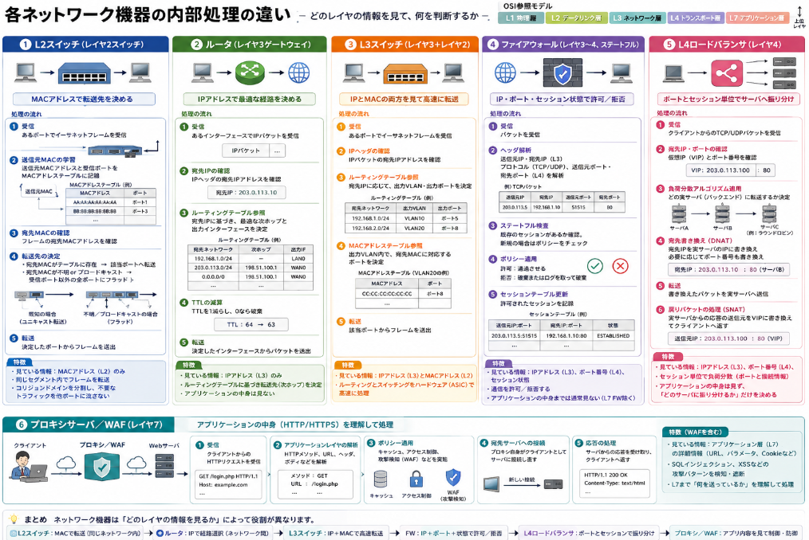

以前[パケットがネットワークで伝達される仕組み](https://yoshishinnze.hatenablog.com/entry/2026/01/14/000000)について説明しました。
ではこのパケットを組織や、インターネットを経由して伝達する実際のデバイスは何でしょうか？

本日テーマ：
>パケットを組織間、インターネットを経由して伝達するデバイスについて説明します。

## 代表的なデバイス

ブリッジとルータなどが相当しますが、実際のデバイスは以下のようなものです。

### L2スイッチ

実際にブリッジを購入するとなるとL2スイッチと呼ばれる機器を購入することになります。
**L2スイッチ（レイヤ2スイッチ）は、機能的には「マルチポートブリッジ(複数のポートを持つブリッジ)」と同じもの**とみなせます。

__1. ブリッジの基本__

- **ブリッジ**は、データリンク層（レイヤ2）で動作し、MACアドレスを見てフレームを転送する機器です。
- 主に2つのポートを持ち、**2つのネットワークセグメントをつなぐ**役割を担います。
- 同じ種類のネットワーク（例：イーサネット同士）をつなぎ、**コリジョンドメイン（衝突の範囲）を分割**します。

__2. L2スイッチの基本__

- **L2スイッチ**も、データリンク層（レイヤ2）で動作し、MACアドレスを見てフレームを転送する機器です。
- ブリッジとの大きな違いは、**ポート数が多い（マルチポート）** ことです。
- 各ポートごとに独立したセグメントとして扱い、**MACアドレステーブル**を基に、必要なポートにのみフレームを転送します。

__3. 「L2スイッチ ＝ マルチポートブリッジ」という考え方__

- 機能的には、**L2スイッチは「複数のブリッジを1つの筐体にまとめたもの」** と考えることができます。
- 歴史的には、**ブリッジ → スイッチ**と進化し、現在では「ブリッジ」という単体機器はほとんど使われず、**L2スイッチがその役割を担っています**。

__4. 実務上の扱い__

- 現在のネットワーク設計では、「ブリッジ」という言葉は主に**概念的な用語**として使われ、実際の機器としては**L2スイッチ**が使われます。
- そのため、**「L2スイッチとブリッジは同じもの」と理解して差し支えありません**。

### ルータ/L3スイッチ
L3レベルのIPパケットを転送するデバイスはルータがよく聞くと思いますが、組織のネットワークを扱う方であればL3スイッチを使うことが多いかもしれません。同じものでないのでしょうか？
結論から言うと、**L3スイッチは「ルーティング機能を持つスイッチ」であり、機能的にはルータとほぼ同等ですが、ルータとは用途や設計思想に違いがあり別物とみるのが適当です**。

__1. L3スイッチとは__

- **レイヤ3（ネットワーク層）で動作するスイッチ**です。
- IPアドレスを見てパケットを転送する**ルーティング機能**を持ちます。
- 同時に、レイヤ2（データリンク層）の**スイッチング機能（MACアドレスベースの転送）** も持っています。
- 主に**社内LANやデータセンター内**で、高速なルーティングとスイッチングを実現するために使われます。

__2. ルータとは__

- **レイヤ3（ネットワーク層）で動作し、異なるネットワーク間の接続と経路制御を行う機器**です。
- IPアドレスとルーティングテーブルを基に、**最適な経路を選択してパケットを転送**します。
- WAN接続（インターネット、拠点間接続など）や、**異なるプロトコル・メディア間の接続**（例：イーサネットとPPP、光回線など）も担当します。

__3. L3スイッチとルータの共通点__

- どちらも**IPパケットをルーティングする**という点では同じです。
- ルーティングプロトコル（OSPF、BGPなど）をサポートし、**経路情報を交換・学習**できます。
- VLAN間ルーティングなど、**サブネット間の通信**を可能にします。

__4. L3スイッチとルータの違い__

| 項目 | L3スイッチ | ルータ |
|------|------------|--------|
| 主な用途 | 社内LAN、データセンター内の高速ルーティング | WAN接続、異種ネットワーク間接続 |
| ハードウェア | ASICや専用チップによる**高速転送**が中心 | ソフトウェア処理が多く、**多機能・高柔軟性** |
| 対応インターフェース | 主にイーサネット（銅線・光） | イーサネットに加え、シリアル、光回線、ADSLなど多様 |
| 機能の重点 | 高速なルーティング＋スイッチング | ルーティング＋WAN機能（暗号化、NAT、VPNなど） |
| 価格・性能 | 同一価格帯で**より高速なパケット転送**が可能なことが多い | 多機能だが、純粋な転送速度ではL3スイッチに劣る場合も |

## [ゲートウェイになりえるデバイス](https://yoshishinnze.hatenablog.com/entry/2025/12/11/000000)

以前異なるネットワーク同士を接続するデバイスを**ゲートウェイ**と説明しました。
具体的に異なるネットワーク同士を接続するデバイスにはどんなものが存在するでしょうか？
実は相当数が該当します。
但し、**ゲートウェイとして機能する各デバイスには、処理の内容に明確なレベルの違いがあります**。

ここでいう「レベル」は、主に**OSIモデルのどのレイヤで処理を行うか**という違いです。

### 1. レイヤ3（ネットワーク層）のゲートウェイ

- **ルータ、L3スイッチ、ファイアウォール（一部）**
- **処理内容**：IPアドレスを見て、**パケットの転送先（経路）を決定**します。
- **特徴**：
  - 異なるネットワーク（サブネット、LAN/WAN）間をつなぎます。
  - プロトコルは基本的にIP（IPv4/IPv6）に限定されます。
  - アプリケーションの中身（HTTPの内容など）は見ません。

### 2. レイヤ4（トランスポート層）のゲートウェイ

- **ロードバランサ（L4）、ファイアウォール（ステートフルFW）**
- **処理内容**：IPアドレスに加え、**ポート番号（TCP/UDP）**を見て、セッション単位で制御します。
- **特徴**：
  - セッションの状態（コネクション確立・維持・終了）を管理します。
  - 例：特定ポート（80番＝HTTP）へのアクセスを許可／拒否、負荷分散など。

### 3. レイヤ7（アプリケーション層）のゲートウェイ

- **プロキシサーバ、アプリケーションゲートウェイ（ALG）、WAF、メールゲートウェイなど**
- **処理内容**：HTTP、SMTP、FTP、SIPなど、**アプリケーションプロトコルの内容そのものを解析・変換・中継**します。
- **特徴**：
  - 例：
    - Webプロキシ：HTTPリクエスト／レスポンスの中身をキャッシュ・フィルタリング
    - メールゲートウェイ：メール本文のスキャン、ウイルスチェック、スパムフィルタ
    - WAF：HTTPリクエスト内の攻撃パターン（SQLインジェクションなど）を検知・遮断
  - **アプリケーションの意味を理解して処理**するため、最も「高レベル」なゲートウェイと言えます。

### 4. プロトコル変換型のゲートウェイ

- **VoIPゲートウェイ、メディアゲートウェイ、IoTゲートウェイ**
- **処理内容**：異なるプロトコル間（例：IP電話 ↔ PSTN、BLE ↔ IP）で**データフォーマットやシグナリングを変換**します。
- **特徴**：
  - レイヤ7に近いが、**特定アプリケーションやデバイス専用**の変換を行います。
  - 例：SIP ↔ ISDN、MQTT ↔ HTTP など。

### レベルの違いのまとめ

| レベル（おおまか） | 代表的なゲートウェイ | 主な処理内容 |
|--------------------|----------------------|--------------|
| レイヤ3（ネットワーク） | ルータ、L3スイッチ | IPアドレスベースのルーティング |
| レイヤ4（トランスポート） | L4ロードバランサ、ステートフルFW | ポート番号・セッション単位の制御 |
| レイヤ7（アプリケーション） | プロキシ、WAF、メールゲートウェイ | HTTP/SMTPなどの中身解析・変換・防御 |
| プロトコル変換 | VoIPゲートウェイ、IoTゲートウェイ | 異なるプロトコル間の変換・中継 |

## 内部処理

各機器がパケットを処理する方法は、**どのレイヤ（OSIモデル）の情報を見て、何を判断するか**によって大きく異なります。

### 1. L2スイッチ

L2スイッチ（レイヤ2スイッチ）のパケット処理は、以下のように簡潔に表現できます。

__処理の流れ（おおまか）__
1. **受信**：あるポートでイーサネットフレームを受信。
2. **送信元MACの学習**：フレームの「送信元MACアドレス」と受信ポートを**MACアドレステーブル**に記録。
3. **宛先MACの確認**：フレームの「宛先MACアドレス」を確認。
4. **転送先の決定**：
   - 宛先MACがテーブルに存在する → 対応するポートからのみ送出。
   - 宛先MACが不明 or ブロードキャスト → 受信ポート以外の全ポートにフラッド（一斉送信）。
5. **転送**：決定したポートからフレームを送出。

__特徴__

- **見ている情報**：MACアドレス（レイヤ2）のみ。
- **何をしているか**：  
  - 同じセグメント内でのフレーム転送（スイッチング）。  
  - コリジョンドメイン（衝突の範囲）を分割し、不要なトラフィックを他ポートに流さない。

### 2. ルータ（レイヤ3ゲートウェイ）

__処理の流れ（おおまか）__
1. **受信**：あるインターフェースでIPパケットを受信。
2. **宛先IPの確認**：IPヘッダの「宛先IPアドレス」を確認。
3. **ルーティングテーブル参照**：
   - 宛先IPがどのネットワークに属するかを調べる。
   - 最適な「次ホップ（ネクストホップ）」のIPアドレスと出力インターフェースを決定。
4. **転送**：決定したインターフェースからパケットを送出。
5. **TTL（Time to Live）の減算**：TTLを1減らし、0なら破棄。

__特徴__
- **IPアドレスだけを見て「どこに送るか」を決める**。
- アプリケーションの中身（HTTPの内容など）は見ない。

### 3. L3スイッチ（レイヤ3＋レイヤ2）

__処理の流れ__
1. **受信**：あるポートでイーサネットフレームを受信。
2. **IPヘッダの確認**：IPパケットの「宛先IPアドレス」を確認。
3. **ルーティングテーブル参照**：宛先IPに応じて出力VLAN・出力ポートを決定。
4. **MACアドレステーブル参照**：出力VLAN内で、宛先MACアドレスに対応するポートを決定。
5. **転送**：該当ポートからフレームを送出。

__特徴__
- **IPアドレス（レイヤ3）とMACアドレス（レイヤ2）の両方を見て転送**。
- ハードウェア（ASIC）による高速処理が中心。

### 4. ファイアウォール（レイヤ3〜4、ステートフル）

__処理の流れ__
1. **受信**：パケットを受信。
2. **ヘッダ解析**：
   - 送信元IP・宛先IP（レイヤ3）
   - プロトコル（TCP/UDP）、送信元ポート・宛先ポート（レイヤ4）
3. **ステートフル検査**：
   - 既存のセッション（コネクション）があるか確認。
   - 新規セッションの場合はポリシー（許可／拒否）をチェック。
4. **ポリシー適用**：
   - 許可：通過させる。
   - 拒否：破棄またはログを取って破棄。
5. **セッションテーブル更新**：許可されたセッションを記録。

__特徴__
- **IP＋ポート番号＋セッション状態**を見て、通信を許可・拒否する。
- アプリケーションの中身までは通常見ない（レイヤ7FWを除く）。

### 5. L4ロードバランサ（レイヤ4）

__処理の流れ__
1. **受信**：クライアントからのTCP/UDPパケットを受信。
2. **宛先IP・ポートの確認**：仮想IP（VIP）とポート番号を確認。
3. **負荷分散アルゴリズム適用**：
   - ラウンドロビン、リーストコネクション、ソースIPハッシュなどで、**どの実サーバ（バックエンド）に転送するか**を決定。
4. **宛先書き換え**：
   - 宛先IPを実サーバのIPに書き換え（DNAT）。
   - 必要に応じてポート番号も書き換え。
5. **転送**：書き換えたパケットを実サーバへ送信。
6. **戻りパケットの処理**：実サーバからの応答パケットの送信元をVIPに書き換え（SNAT）してクライアントへ返す。

__特徴__
- **ポート番号とセッション単位で負荷分散**。
- アプリケーションの中身は見ず、**「どのサーバに振り分けるか」だけを決める**。

### 6. プロキシサーバ／WAF（レイヤ7）

__処理の流れ（プロキシの例）__
1. **受信**：クライアントからのHTTPリクエストを受信。
2. **アプリケーションレイヤの解析**：
   - HTTPメソッド（GET/POST）、URL、ヘッダ、ボディなどを解析。
3. **ポリシー適用**：
   - キャッシュ可能かどうか（キャッシュプロキシ）
   - アクセス許可／拒否（コンテンツフィルタ）
   - 攻撃パターンの有無（WAF）
4. **宛先サーバへの接続**：
   - 必要に応じて、プロキシ自身がクライアントとして宛先サーバに接続し直す。
5. **応答の処理**：
   - サーバからの応答を受け取り、クライアントへ返す。

__特徴（WAFを含む）__
- **HTTP/HTTPSの中身（URL、パラメータ、Cookieなど）を詳細に解析**。
- SQLインジェクション、XSSなどの攻撃パターンを検知・遮断。
- レイヤ7まで **「何を送っているか」を理解して処理** する。

## 総括

__各デバイスのパケット処理のまとめ__

- **L2スイッチ**：MACアドレスだけを見て、「どのポートからフレームを出すか」を決める（レイヤ2）。
- **ルータ**：IPアドレスだけを見て、「どのネットワークに送るか（経路）」を決める（レイヤ3）。
- **L3スイッチ**：IP＋MACを見て、「VLAN間のルーティングとスイッチング」を高速に行う（レイヤ2＋3）。
- **ファイアウォール**：IP＋ポート＋セッション状態を見て、「通信を許可するか拒否するか」を決める（レイヤ3〜4）。
- **L4ロードバランサ**：IP＋ポートを見て、「どのサーバに振り分けるか」を決める（レイヤ4）。
- **プロキシ／WAF**：HTTPなどの中身を見て、「何を送っているか・どう扱うか」を決める（レイヤ7）。

各デバイスは、**OSIモデルのどのレイヤの情報を見るか**によって、パケット処理の内容が決まります。
低レイヤ（2〜4）は「どこに・どう送るか／通すか」を決め、高レイヤ（7）は「何を・どう扱うか」まで扱います。
これらを組み合わせることで、ネットワーク全体の**経路制御・セキュリティ・負荷分散・アプリケーション制御**が実現されます。

