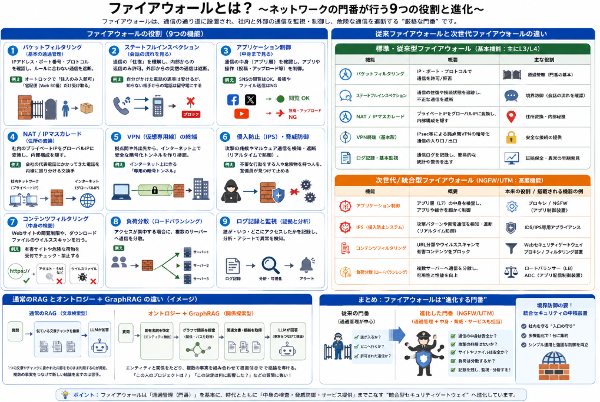

[通信デバイス関係の話の続きで、前回の記事](https://yoshishinnze.hatenablog.com/entry/2026/09/10/043000)にも出てきたファイアウォールについて本日話していこうと思います。
ファイアウォールは通信のセキュリティを向上するための企業のネットワークとインターネットの間に必ず設置されています。

## 概要

ネットワーク機器のファイアウォールは、通信の通り道に設置された**厳格な門番**となる機器です。
外部からの通信が社内ネットワークに入る際や、社内から外部へ出る際に、「この通信は安全か？」「許可されているか？」を確認して、危険な通信を遮断します。
また、近年のセキュリティのニーズの高まりから機能も従来のファイアウォールに比べて次世代ファイアウォールは多機能になってきています。

従来・次世代ファイアウォール具体的な機能を、身近な例えも交えながら説明します。

### 1. パケットフィルタリング（基本の通過管理）
最も基本的な機能です。送り主・宛先の**IPアドレス**、**ポート番号**、**通信プロトコル**（TCP/UDPなど）を確認し、ルールに合わない通信を落とします。
ここだけをとるとルータやL3スイッチとほとんど同じです。

> **例え：** マンションのオートロックで、「住人（特定のIP）のみ入館可」「宅配便（ポート80番・Web）だけ受け取る」といった条件で入館を制限するイメージです。

### 2. ステートフルインスペクション（会話の流れを見る）
単なるパケットフィルタリングより進んだ機能です。通信は「往復」であることを理解し、**内部から外へ出た通信の「返信」だけを通し、外部から勝手に始まった通信は遮断**します。
通信の流れを見て制御を行うことが出来ます。ここはルータやL3スイッチとは異なります。

> **例え：** 自分が電話をかけた相手からの返事は受け取れるが、知らない相手から突然かかってきた電話は留守番電話（遮断）にする、という仕組みです。

### 3. アプリケーション制御（中身まで見る）
ここは従来のファイアウォールにはなかった機能です。
アプリケーション層の中身まで見ることができるファイアウォールがこれです。
従来のファイアウォールは「どのドア（ポート）を通るか」しか見ませんでしたが、近年の製品は**通信の中身（アプリケーション層）まで確認**できます。

- SNS（Facebook、Xなど）の「閲覧は許可するが、投稿・ファイルアップロードは禁止」
- YouTubeの「動画視聴はOK、ライブ配信はNG」

### 4. NAT / IPマスカレード（住所の変換）
内部用のプライベートIPアドレスを、インターネット用のグローバルIPアドレスに変換することが出来ます。
社内のPCがインターネットに接続する際、**プライベートIPアドレスをグローバルIPアドレスに変換**します。これにより、社内のネットワーク構成を外部に隠せます。

> **例え：** 会社の代表電話番号（グローバルIP）にかかってきた電話を、内線（プライベートIP）に振り分ける交換手のような役割です。同時に、各部署の内線番号が外部に漏れるのを防ぎます。

### 5. VPN（仮想専用線）の終端
外出先や支社から社内ネットワークに安全に接続するための**暗号化通信（VPN）の入り口・出口**として機能します。インターネット上に「専用の暗号化されたトンネル」を作り、データを守ります。

### 6. 侵入防止（IPS）・脅威防御
通信のパターンを解析し、**マルウェアの通信やサイバー攻撃の兆候**をリアルタイムで検出・遮断します。

- 同じIPから大量の接続を試みる攻撃（ブルートフォース攻撃）の遮断
- 既知のウイルスやランサムウェアの「コールホーム（外部との通信）」を止める

### 7. コンテンツフィルタリング（中身の検閲）
URLフィルタリング（アダルトサイトやSNSへのアクセス制限）や、ダウンロードするファイルのウイルススキャンも行います。

### 8. 負荷分散（ロードバランシング）
Webサイトなどでアクセスが集中する場合、**複数のサーバーに通信を分散**させる機能も持つファイアウォールがあります。

### 9. ログ記録と監視（証拠と分析）
「誰が、いつ、どこにアクセスしようとしたか」をすべて記録します。これがセキュリティ事故の**原因調査**や、**平時の異常検知**に役立ちます。

## 従来と次世代ファイアウォールの違い

先程説明したファイアウォールの機能を、「**標準・従来型ファイアウォールに備わっている基本機能**」と「**本来は別の役割・または次世代/統合型で追加された高度機能**」に分類して整理しました。

### 標準・従来型ファイアウォールに備わっている基本機能
（主にネットワーク層～トランスポート層（L3/L4）で動作し、ほとんどの企業向けFWが標準搭載している機能です）

| 機能 | 概要 |
|------|------|
| **パケットフィルタリング** | IPアドレス・ポート番号・プロトコルで通信を許可/拒否する最も基本の機能 |
| **ステートフルインスペクション** | 通信の「往復」や接続状態を追跡し、外部からの勝手な侵入を防ぐ機能 |
| **NAT / IPマスカレード** | 社内のプライベートIPをグローバルIPに変換し、内部構造を隠す機能 |
| **VPN終端（基本形）** | IPsecなどによる拠点間VPNの暗号化通信の入り口/出口として機能 |
| **ログ記録・基本監視** | 通過した通信の記録を残し、簡易的な統計・警告を出す機能 |

### 標準・従来型にはなく、次世代/統合型または専用機で実現される機能
（これらは本来「ファイアウォール」以外の専用装置が行っていた役割ですが、近年の**NGFW（次世代FW）**や**UTM（統合脅威管理）**に統合されていることが多いです）

| 機能 | 本来の役割 / 搭載される機器の例 |
|------|------------------------------|
| **アプリケーション制御** | 通信の中身（アプリ層：L7）まで見て、SNSの投稿やファイル転送などを細かく制御。**本来はプロキシやNGFWの領域** |
| **IPS（侵入防止システム）** | 攻撃パターンや異常通信をリアルタイムで検知・遮断。**本来はIDS/IPS専用アプライアンスの役割** |
| **コンテンツフィルタリング** | URL（Webサイト）の分類や、ダウンロードファイルのウイルススキャン。**本来はWebセキュリティゲートウェイやプロキシの役割** |
| **負荷分散（ロードバランシング）** | 複数サーバーに通信を分散。**本来はロードバランサー（LB）やADC（Application Delivery Controller）の専門機能** |

### 補足：なぜ境界が曖昧になったのか
10～20年前は「ファイアウォールは通過管理を、IPSは攻撃検知を、Webフィルタは閲覧制限を」と**役割が分かれていました**。

しかし現在、市販されている多くの「ファイアウォール」と名乗る機器（特に Palo Alto Networks、Fortinet、SonicWall など）は、実態としては **NGFW/UTM** と呼ばれる「統合セキュリティゲートウェイ」です。そのため、上記の「そうではない機能」も**1台に入っていることが普通**になっています。

#### 整理のポイント
- **「ファイアウォールの本分」** = 通過管理（誰がどこへ入るか）と境界防御
- **「統合された高度機能」** = 中身の検査（アプリ・脅威・コンテンツ）や本来別のネットワークサービス

つまり、「ファイアウォールは必須の門番であり、近年は門番に加えて警備員（IPS）や受付（Webフィルタ）の役割も兼ねている」という認識が近いです。

## AI活用

近年のニューラルネットワークの発達により、**ファイアウォールにAIを活用する動きはすでに現実の製品・サービスとして広がっています**。
従来の「決まったルールで通信を通す」門番から、「脅威を学習して自力で判断する警備AI」へと進化しています。

### AIがファイアウォールで担っている主な役割

__1. 未知の脅威（ゼロデイ攻撃）の検出__

従来のファイアウォールは「既知の悪意あるパターン（シグネチャ）」と照合するだけでした。AIは通信の「振る舞い」や「統計的な異常」を学習するため、**初めて世に出た新種の攻撃**も検出できます。<source-chip title="Check Point" url="https://www.checkpoint.com/cyber-hub/network-security/what-is-firewall/ai-powered-firewall/" />

__2. 異常検知と適応学習__

AIはネットワークの「普段の状態」をベースラインとして記憶し、そこから大きく外れた通信（例：深夜の大量ファイル転送、通常と違う国からの接続）を自動で検知します。しかも**運用後も新しいデータから学び続けて精度が上がります**。<source-chip title="Palo Alto Networks" url="https://www.paloaltonetworks.com/cyberpedia/ai-in-threat-detection" />

__3. 誤検知の削減（アラート疲労の解消）__

従来のIPSなどは「怪しいものは全部通報」で、セキュリティ担当者が大量のアラートに埋もれる問題がありました。AIはリスクスコアリングで優先順位を付け、**本当に危険なものだけを浮き彫りにします**。<source-chip title="Palo Alto Networks" url="https://www.paloaltonetworks.com/cyberpedia/ai-in-threat-detection" />

__4. 暗号化通信（HTTPS/TLS）の中身を賢く検査__

現在のWeb通信のほとんどは暗号化されています。AIは復号・再暗号化したトラフィックの中身を解析し、**隠れたマルウェアやデータ漏洩の兆候**を見つけ出します。<source-chip title="Cisco Japan Blog" url="https://gblogs.cisco.com/jp/2024/11/netsecopen-cisco-firewall-outperforms-competition-in-real-world-testing-jp/" />

__5. 自動対応と効率化__

脅威を検出した際に、AIが自動でIPをブロック、端末を隔離、多要素認証を要求するなどの対応を即座に実行。人間の手を介さず**被害の拡大を秒単位で止めます**。<source-chip title="Check Point" url="https://www.checkpoint.com/cyber-hub/network-security/what-is-firewall/ai-powered-firewall/" />

__新たな潮流：「AIそのものを守るファイアウォール」__

近年、特に注目されているのは「ネットワークを守るファイアウォール」から一歩進んで、**「AIシステムそのものを守るファイアウォール」**です。

| 種類 | 概要 |
|------|------|
| **AI Network Firewall** | 社員がChatGPTなどの生成AIを使う際の「プロンプト」と「回答」をリアルタイムで検査。機密情報の漏洩や有害な出力を防ぐ。<source-chip title="Check Point" url="https://www.checkpoint.com/solutions/ai-network-firewall/" /> |
| **AI Factory Firewall** | AIモデルやAIワークロードを動かすデータセンター・クラウド環境を守る。NVIDIAなどと連携した大規模AI基盤向け。<source-chip title="Check Point" url="https://www.checkpoint.com/jp/press-releases/check-point-redefines-ai-security-for-enterprises-with-ai-cloud-protect-powered-by-nvidia-bluefield/" /> |
| **生成AI向けカスタムFW** | 業務用AIの入出力をユースケースごとにフィルタリング。ドメイン知識に基づいた精度の高い制御を行う。<source-chip title="Citadel AI" url="https://citadel-ai.com/ja/news/2025/04/25/lens-custom-firewall/" /> |

つまり、ファイアウォールは「人間の通信を守る」だけでなく、**「AI同士の通信やAIの入出力」を監視・制御する新しい段階に入っています**。

__主要ベンダーの動向__

- **Check Point**：「AI-powered Firewall」「AI Network Firewall」「AI Factory Firewall」を展開。AIトラフィックの可視化と制御を強化。<source-chip title="Check Point" url="https://www.checkpoint.com/solutions/ai-network-firewall/" />
- **Palo Alto Networks**：「Precision AI™」を掲げ、インライン深層学習による脅威検出を実現。2025年のGartner評価でもHybrid Mesh Firewallのリーダーに選出。<source-chip title="Palo Alto Networks" url="https://www.paloaltonetworks.com/network-security/next-generation-firewall" />
- **Huawei**：「HiSecEngine USG6600F Series AI Firewalls」として、AIエンジン搭載のファイアウォールを販売。<source-chip title="Huawei Enterprise" url="https://e.huawei.com/en/products/security/usg6600f" />
- **Cisco・Fortinet・SonicWall**なども、機械学習による脅威検出や自動対応を標準機能として搭載しています。

## 総括

ここまで話してきたファイアウォールについてまとめにいきます。

ファイアウォールの本質はずばり、**「ネットワークの境界に立ち、通すべき通信だけを通し、危険な通信を通さない」という通過管理**にあります。

時代とともにパケットフィルタからステートフル検査、アプリケーション制御、IPS、そしてAIによる未知脅威検出へと進化し、1台で門番・警備員・受付を兼ねる統合ゲートウェイとなりましたが、その核となる役割——**内部と外部の境界を守り、組織の通信を安全に導く**——は変わっていません。

