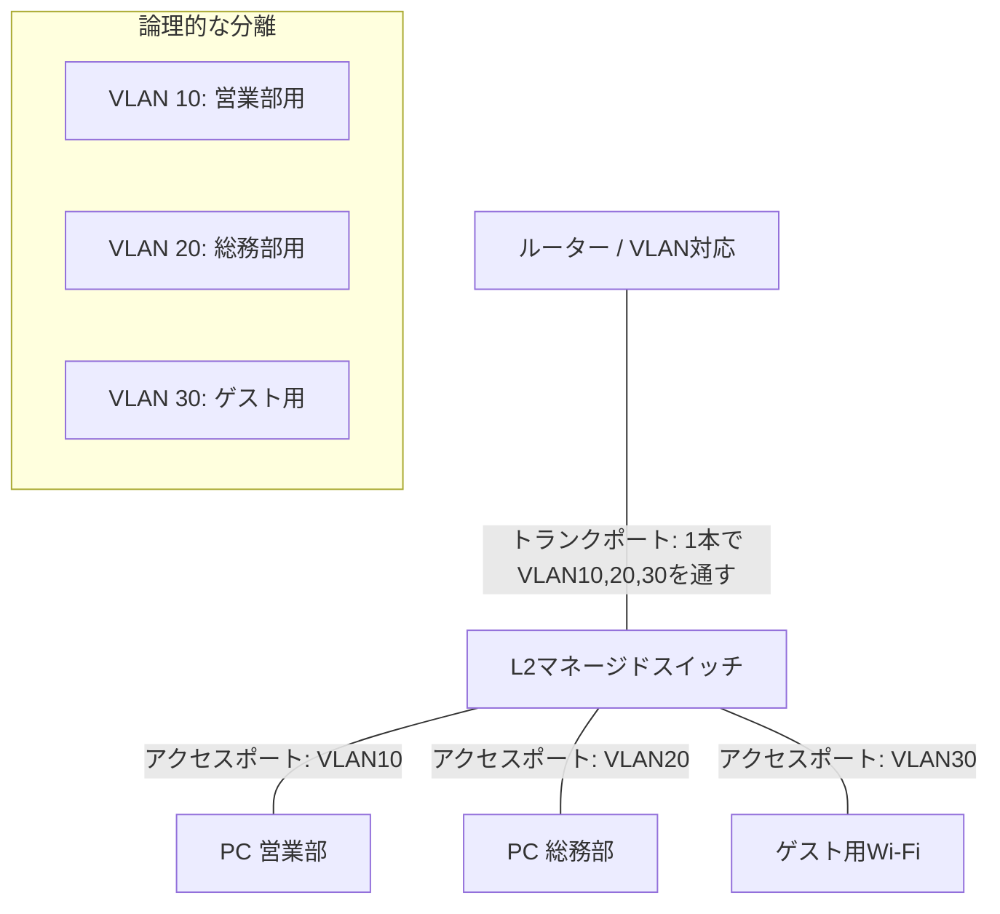
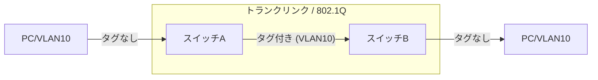

今の組織の内部ネットワークはVLANという論理的に独立したLANで構成されています。
VLANの中でパケットと呼ばれるデータがやり取りされることになります。
このパケットにタグをつけてVLANを構成するフォーマットが**IEEE 802.1Q**（通称：ドット・イチ・キュー）と呼ばれるものです。

## 概要

一言でいうと **「1本の物理的なLANケーブルの中に、複数の仮想的なネットワーク（VLAN）を混在させて運ぶための共通ルール」** です。
一般的には **「タグVLAN」** という名前で親しまれています。

### 1.仕組み

1つの物理的なネットワーク（スイッチやケーブル）の中に、独立した複数の論理ネットワークを構築します。 

- VLANタグの挿入: 通常のイーサネットフレームの中に「VLANタグ（4バイト）」を挿入します。
- VLAN ID: タグ内にある12ビットの領域で、最大4,094個（1〜4094）の識別番号を割り振ることができます。これにより、部署ごとや機能ごとに通信を分離します。

__なぜ IEEE 802.1Q が必要なのか？__

通常、ネットワーク（VLAN）を分けるには、それぞれのグループごとに専用のスイッチやケーブルを用意する必要があります。しかし、これでは配線が複雑になり、コストもかさみます。

* **課題:** 1階と2階に「営業部」と「総務部」がある場合、それぞれの部署用に2本のケーブルを階間に引くのは非効率です。
* **解決:** 1本のケーブルに両方のデータを流し、データの先頭に **「これは営業部のデータ」「これは総務部のデータ」という「目印（タグ）」** を付けることで、1本の線を共有できるようにします。

### 2. 「タグ」の中身

__フレーム構造__

元のフレームの「送信元MACアドレス」と「タイプ/長さ」の間に挿入されます。 
- TPID (2バイト): 規格を識別する値で、常に 0x8100 です。
- PCP (3ビット): 優先度（QoS）を制御するための値です。
- DEI (1ビット): 輻輳時に破棄してもよいフレームかを示します。
- VID (12ビット): どのVLANに所属するかを示すIDです。

__見分けるポイント__

IEEE 802.1Qは、通常のイーサネットフレームの中に **4バイトの「VLANタグ」** を挿入します。このタグの中に含まれる最も重要な情報が **VLAN ID** です。

* **VLAN ID (VID):** 12ビットの数値で、**1から4094**までの番号を指定できます。
* **プライオリティ (PCP):** 3ビットの数値で、実はここで **QoS（優先順位）** を指定することも可能です（IEEE 802.1p）。

### 3. ネットワークの構成

タグVLANを活用した最も標準的で実用的な構成例として、 **「1台のルーターと1台のスイッチで、社内ネットワークを3つに分離する」** ケースを紹介します。

この構成は、小規模オフィスから中規模ネットワークまで幅広く使われている **「Router-on-a-Stick」** 

__1. ネットワーク全体の構成図__

物理的には1本の線ですが、論理的には3つの独立したネットワーク（VLAN）が流れる構成です。

__2. 具体的な設定の役割__

各機器で、以下のような役割分担と設定を行います。

__① ルーターの設定（タグの読み書き）__

ルーターの1つの物理ポートを仮想的に分割し、複数のIPアドレスを持たせます。

* **役割:** 異なるVLAN同士（例：営業部から総務部）の通信が必要な場合に、その「橋渡し（ルーティング）」を行います。
* **設定例:**
* ポート1.10 (VLAN 10用): IP `192.168.10.1`
* ポート1.20 (VLAN 20用): IP `192.168.20.1`
* ポート1.30 (VLAN 30用): IP `192.168.30.1`

__② スイッチの設定（ポートの仕分け）__

スイッチでは、各ポートに「どのVLANを通すか」を指示します。

* **トランクポート（ルーターとの接続口）:**
* タグ（IEEE 802.1Q）を付与したまま通信します。「VLAN 10, 20, 30すべてを通してよし！」という設定です。

* **アクセスポート（PCとの接続口）:**
* 接続されたPCがどのVLANに属するかを固定します。
* ポート1〜5は **VLAN 10**、ポート6〜10は **VLAN 20**...といった具合です。PC側はVLANを意識せず、普通に通信するだけでOKです。

__3. この構成で実現できること__

* **ゲストWi-Fiの隔離:** ゲスト用Wi-Fi（VLAN 30）からは、営業部（VLAN 10）や総務部（VLAN 20）のサーバーへは一切アクセスできないよう、ルーター側でフィルタリング（ACL）を設定できます。
* **将来の拡張性:** 新しく「開発部」が増えたとしても、配線工事をせずにルーターとスイッチの設定だけで **VLAN 40** を追加できます。
* **帯域制御（QoS）との連携:** 「VLAN 10（営業部）のWeb会議データを最優先する」といったQoS設定が、VLAN単位で簡単に行えるようになります。

__アクセスポートとトランクポート__

このプロトコルを扱う上で、スイッチのポートには2つの役割が登場します。

| ポートの種類 | 役割 | 動作 |
| --- | --- | --- |
| **アクセスポート** | 特定のVLANに所属するPCを繋ぐ | タグは付いていない（普通の通信） |
| **トランクポート** | スイッチ同士を繋ぐ「共用道路」 | **IEEE 802.1Qのタグを付けて**複数のVLANを運ぶ |

### 4. データの流れ（タグの付け外し）

1. **送信:** PCから出た「タグなし」のデータがスイッチに入る。
2. **タグ付与:** スイッチが「これはVLAN 10だ」と判断し、**IEEE 802.1Qタグを差し込む**。
3. **転送:** タグが付いたまま、スイッチ間の「トランクリンク」を通り抜ける。
4. **タグ除去:** 宛先側のスイッチがタグを見て「VLAN 10のポートへ送ろう」と判断し、**タグを外して**PCへ届ける。

## 論理分割の用途
タグVLANによってLANを分割することは、特に **「物理的な配線に縛られず、論理的にネットワークを整理・強化したい」** という場面で非常に有用です。

具体的にどのような場面で役立つのか、主要な4つのメリットに整理して解説します。

### 1. 物理的な配線を変えずに「部署移動」に対応したいとき

オフィスの席替えや部署の統廃合が頻繁にある職場では、タグVLANが最も力を発揮します。

* **有用なシーン:** 営業部の人が総務部のエリアに移動した場合でも、LANケーブルを壁の裏までたどって繋ぎ直す必要はありません。
* **メリット:** スイッチの設定を管理画面から変更するだけで、そのポートを瞬時に「営業部用VLAN」に切り替えられます。 **「物理的な位置に関係なく、必要なネットワークに所属できる」** 柔軟性が得られます。

### 2. セキュリティを「役割」ごとに隔離したいとき

一つのネットワークに全社員やゲストが混在していると、セキュリティ上のリスクが非常に高くなります。

* **有用なシーン:** 「基幹システムを扱う財務部」「一般社員」「来客用のゲストWi-Fi」を分離したい場合。
* **メリット:** タグVLANで分割すれば、たとえゲストWi-Fiに侵入者が現れても、そこから財務部のサーバーへはアクセスできません。 **「感染や侵入の被害を特定のグループ内に封じ込める（爆発半径の限定）」** ことができます。

### 3. ネットワークの「渋滞（混雑）」を解消したいとき

PCが増えると、ネットワーク全体に送られる一斉放送のようなパケット（ブロードキャスト）が激増し、全体の速度が低下します。

* **有用なシーン:** 100台以上のPCが同じLANに繋がっており、通信が不安定な場合。
* **メリット:** タグVLANでネットワークを小分けに分割することで、一斉放送が届く範囲を限定できます。これにより、**不要なトラフィックが削減され、ネットワークのレスポンスが向上**します。

### 4. コストと機材スペースを最小限にしたいとき

ネットワークを物理的に分けようとすると、各階ごとに「営業部用スイッチ」「総務部用スイッチ」と複数の機材を買わなければなりません。

* **有用なシーン:** 予算やサーバーラックのスペースが限られている場合。
* **メリット:** タグVLAN（トランクポート）を使えば、**1本のLANケーブルと1台のスイッチで複数のネットワークを運べる**ため、機材代・電気代・保守の手間を劇的に減らすことができます。

## 最新動向

VLANは長年ネットワークの基盤として利用されてきましたが、クラウドやDX、リモートワークの普及により、従来の技術だけでは限界が見え始めています。

現在の最新動向と、現場が直面している課題を整理して解説します。

### 1. 最新動向：VLANから「オーバーレイ」へ

物理的なスイッチ設定に依存する従来のVLANに代わり、ソフトウェアで柔軟にネットワークを構築する技術が主流になっています。

* **VXLAN (Virtual eXtensible LAN):**
VLANのID上限（4094個）を突破するために開発された技術です。IDを24ビット（約1,600万個）に拡張し、データセンターなどの巨大な環境で、物理的な距離を超えたネットワーク構築（L2延伸）を可能にします。
* **SD-LAN / SD-WAN:**
「ソフトウェア定義」のネットワークです。コントローラーから一括でVLAN設定を流し込んだり、ユーザーがログインした場所に合わせて動的にVLANを割り当てたりする（ダイナミックVLAN）運用が一般的になっています。
* **マイクロセグメンテーション:**
VLANよりもさらに細かい単位（アプリケーション単位、あるいはサーバー1台単位）で仮想的な壁を作る技術です。「VLAN内なら通信自由」という考えを捨て、よりセキュアな環境を構築します。

### 2. 現在の大きな課題

VLANが普及しすぎたがゆえに、現代のITインフラでは以下の点がボトルネックとなっています。

#### ① 「VLANスパゲッティ」による管理の複雑化

長年運用していると、「何に使われているか不明なVLAN」が増殖し、ネットワーク構成が複雑になります。

* **課題:** スイッチを1台入れ替えるだけで、何百ものVLANタグ設定をミスのないよう引き継がねばならず、運用の負担が限界に達しています。

#### ② クラウド/仮想化との親和性

物理スイッチに基づくVLANは、クラウドのような「数秒でサーバーが立ち上がる」スピード感についていけません。

* **課題:** 仮想サーバーは頻繁に移動（マイグレーション）しますが、物理スイッチのタグ設定が追いつかず、通信断が発生するリスクがあります。

#### ③ 境界防御の限界（セキュリティ）

「VLANで分けているから安心」という考えは、標的型攻撃や内部犯行には無力です。

* **課題:** 一度VLAN内に侵入を許すと、その中の通信は「信頼されている」としてスルーされてしまうため、被害が横に広がりやすい（ラテラル・ムーブメント）という弱点があります。

## 最後に
物理的に構成されたLANの制約から開放するために使われてきた手法がVLANです。
同じインフラを用途に応じて分割したいという要求は今後も続いていくと思います。

また、大きなネットワークをソフト的に管理するクラウドの普及によって、ネットワーク自体の活用場所の絶対的な量は増加してきています。

そんな背景でVLANの仕組み、ロジックを知っておくと知識の応用はできると思います。

今回の記事の内容、是非ご参考下さい。

