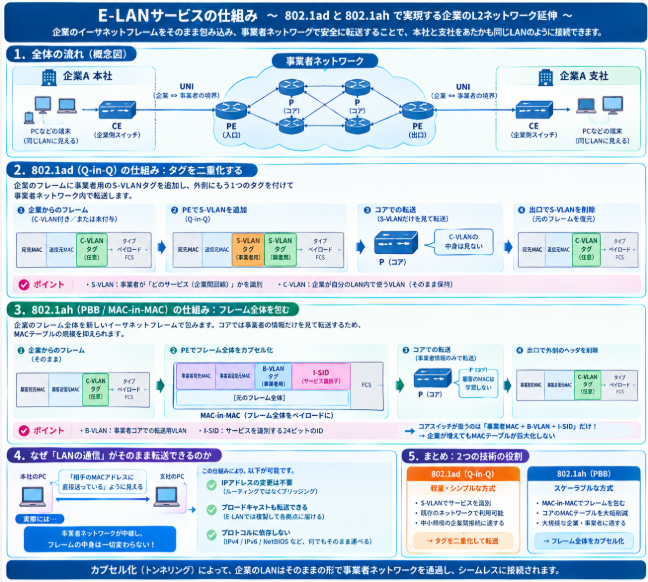

## 広域イーサネット

広域イーサネット（Carrier Ethernet / Wide Area Ethernet）とは、**本来オフィス内LANで使われるイーサネット技術を、通信事業者の回線を使って広域（都市間・全国・国際）にまで拡張したネットワークサービス・技術**のことです。

以下にその概要をまとめます。

### 1. 基本的な考え方

従来、企業の拠点間を結ぶ広域回線には **専用線（ leased line ）** や **フレームリレー・ATM・ MPLS-VPN** などが使われていました。これらは確実でしたが、**回線コストが高く、帯域変更にも時間がかかる**という課題がありました。

広域イーサネットは、**顧客の拠点AのLANポートと拠点BのLANポートを、事業者網を通じて「あたかも同じLANスイッチに繋がっているかのように」見せる**ことで、イーサネットフレームをそのまま広域に転送します。これにより、**ルーターの複雑な設定が不要**になり、帯域の増減も柔軟に行えます。

### 2. 主な特徴

| 特徴 | 内容 |
|------|------|
| **インターフェースの統一** | 拠点ルーター・L3スイッチのイーサネットポート（RJ45やSFP）をそのまま使える |
| **帯域の柔軟性** | 10Mbps から 100Gbps まで、必要に応じて変更可能 |
| **低コスト** | 従来の専用線やフレームリレーと比べて、回線・ポート単価が安い |
| **短い開通期間** | 物理的な配線工事が少なく、論理的な回線設定で開通 |
| **QoS保証** | 音声・映像・業務システムの優先度を設定可能 |
| **マルチポイント接続** | 2拠点間だけでなく、数十拠点を1つの論理LAN（E-LAN）として接続可能 |

### 3. サービスと規格

広域イーサネットのサービス形態は、**MEF（Metro Ethernet Forum）** という業界団体が規格化しています。代表的な3タイプは以下の通りです。

| サービス名 | 接続形態 | 用途の例 |
|-----------|---------|---------|
| **E-Line** | 1対1（P2P）の仮想専用線 | 本社と工場の1対1接続 |
| **E-LAN** | 多対多（any-to-any）の論理LAN | 全国の支社を1つのLANとして統合 |
| **E-Tree** | 1対多（Rooted Multipoint） | 動画配信、放送、校長室→各教室など |


## 開発背景・経緯

広域イーサネット（Carrier Ethernet / Metro Ethernet）の開発は、**2000年代初頭（2001年頃）から本格的に始まり**、その後10年ほどかけて標準化と実用化が進みました。

以下、動機と経緯を段階的に説明します。

### 1. 開発時期の概略

まずは開発経緯についてです。


| 年 | 出来事 |
|----|--------|
| **2001年6月** | **MEF（Metro Ethernet Forum）** が[37社（通信事業者、機器ベンダーなど）によって設立](https://www.lightwaveonline.com/network-design/packet-transport/article/16659688/metro-ethernet-forum-created-to-accelerate-adoption-of-optical-ethernet-in-metro-networks) |
| **2000年代前半** | IEEE 802.1ad（Provider Bridges / Q-in-Q）の策定作業が進行 |
| **2005年** | MEFが **MEF1** コンプライアンスの認証プログラムを開始。[Carrier EthernetをSONET/SDHなどの代替として本格推進](https://www.lightwaveonline.com/network-design/packet-transport/article/16648341/making-the-case-for-ethernet-everywhere) |
| **2006年頃** | IEEE 802.1ah（Provider Backbone Bridges / PBB）の議論が活発化。802.1adのスケーラビリティ限界が明らかになる |
| **2008年** | [IEEE 802.1ah-2008として標準化](https://standards.ieee.org/ieee/802.1ah/3689/) |

### 2. 開発された動機

動機は大きく分けて **「企業側の要望」** と **「通信事業者側の要望」** の2つが交錯したものでした。

__企業側の動機：「LANとWANの統一を！」__

2000年代には、企業の社内ネットワーク（LAN）はすでに**イーサネットで統一**されていました。しかし、拠点間を繋ぐ広域回線（WAN）はATMやフレームリレー、SONET/SDH専用線など、**LANとは異なる技術**が使われていました。

> これにより、
> - **プロトコルの変換コスト**がかかる
> - **帯域の単価が高い**（T1/E1やSONET回線はイーサネットに比べ高価）
> - **柔軟な帯域変更が困難**（専用線の帯域は物理的に決まる）

企業は「LANで使っているイーサネットを、そのまま広域でも使えないか」と求め始めました。

__通信事業者側の動機：「コスト削減と収益性向上」__

通信事業者もまた、従来のインフラに課題を抱えていました。

> - **SONET/SDH機器は高価**で、柔軟な帯域配分が困難
> - **ATM/フレームリレーは時代遅れ**になりつつあり、IP/Ethernetへの統合が進んでいた
> - データトラフィックが増大し、**より低コストでスケールする技術**が必要

2006年のIEEE資料には以下のように記されています。

> 「キャリアグレードEthernet機器の市場が成長している。企業がよりコスト効果の良い帯域とサービスを求め、サービスプロバイダがネットワークインフラコストを削減して収益性を高めようとしている」<source-chip title="IEEE 802.1 PBT Overview" url="https://grouper.ieee.org/groups/802/1/files/public/docs2006/new-bottorff-pbt-overview-1006-01.pdf" />

### 3. 技術的経緯：「普通のイーサネット」では通信事業者ネットワークで使えなかった

ここが最も重要な点です。単に「イーサネットを遠くまで引っ張る」だけでは、通信事業者のネットワークでは**技術的に使えませんでした**。

__普通のイーサネットの限界__

| 限界 | 内容 |
|------|------|
| **VLAN数の制限** | IEEE 802.1QのVLAN IDは12ビット（最大4094個）。通信事業者が複数の企業クライアントを抱えるには不足 |
| **MACアドレスのフラッディング** | 未知のMACアドレスに対し、ネットワーク全体にフレームを氾濫させる。広域では帯域の無駄が致命的 |
| **STP（スパニングツリープロトコル）の制約** | ループ回避のため一部のリンクをブロックするため、帯域が無駄になる。広域ネットワークでは許容しがたい |
| **ブロードキャストドメインの肥大化** | 広域に広がるとブロードキャストが全網に氾濫し、性能を劣化させる |
| **OAM（運用管理保守）の不足** | リンク障害の検知やサービス品質の監視機能が、通信事業者レベルでは不十分 |

> 「ネイティブEthernetスイッチは、通信事業者ネットワークで使用する際に重大なスケーラビリティ問題に直面していた」<source-chip title="Optical Zeitgeist Laboratory" url="https://www.zeitgeistlab.ca/doc/Provider-Bridge-%28PB%29-and-Provider-Backbone-Bridge-%28PBB%29.html" />

__標準化の段階的な進化__

これらの問題を解決するため、以下の技術が順に開発されました。

__第1段：IEEE 802.1ad（Provider Bridges / Q-in-Q）— 2005年頃__

- **VLANタグを二重化**（顧客のVLANタグをそのまま保ちつつ、事業者側のVLANタグを外側に追加）
- これにより、**複数の顧客が同じVLAN IDを使っても衝突しない**
- 顧客と事業者の「最小限の協調」で動作

> 「既存のBridged LANプロトコルと互換・相互運用可能な形で、複数の独立したユーザにMACサービスの分離インスタンスを提供する」<source-chip title="IEEE 802.1" url="https://www.ieee802.org/1/pages/802.1ad.html" />

__第2段：IEEE 802.1ah（Provider Backbone Bridges / PBB）— 2008年__

しかし802.1adでも、事業者側のVLANタグ（S-TAG）が**12ビット（4094個）** に制限されるため、大規模事業者には依然として不足でした。

802.1ahでは以下の革新を導入しました。

- **MAC-in-MACカプセル化**：顧客のイーサネットフレーム全体を、新しい事業者用MACヘッダで包む
- **I-SID（Service Instance VLAN Identifier）**：24ビット（最大約1600万個）のサービス識別子で、**最大2^20サービスインスタンス**をサポート <source-chip title="IEEE Standards Association" url="https://standards.ieee.org/ieee/802.1ah/3689/" />
- 事業者のコアネットワークでは**顧客のMACアドレスを全く学習する必要がない**（スケーラビリティが劇的に向上）

```
【802.1ahのカプセル化イメージ】

[顧客フレーム: 顧客MACsrc → 顧客MACdst, 顧客VLAN]
        ↓
[事業者フレーム: 事業者MACsrc → 事業者MACdst, I-SID, [顧客フレーム]]
```

__並行して：MEFによる「サービス定義」の標準化__

IEEEが「技術的な仕様」を決める一方、MEFは **「事業者が提供するサービスをどう定義するか」** を標準化しました。

- **MEF 6（Metro Ethernet Services Definitions）**：E-Line（ point-to-point）、E-LAN（multipoint-to-multipoint）、E-Tree（root-to-leaves）などのサービスモデルを定義
- **MEF 10**：サービスの属性（帯域保証、遅延要件など）を標準化

これにより、「イーサネット回線1本」ではなく、**「どのようなサービス品質を保証するイーサネット回線」** として事業者間で取引できるようになりました。


## 仕組み

本質は、**「企業のイーサネットフレームを『そのままの形で包み込み』、事業者ネットワークの中では『事業者用の新しいアドレスと識別子』で転送し、出口で元のフレームを取り出す」**という**カプセル化（トンネリング）** の仕組みです。

以下、段階的に追って説明します。

### 1. 全体の流れ（概念図）

```
【企業A 本社】          【事業者ネットワーク】           【企業A 支社】
  [CE] ──UNI──→ [PE] ══════[P]════════[P]══════→ [PE] ────UNI──→ [CE]
              (入口)    (コア)      (コア)      (出口)
```

- **CE**（Customer Edge）：企業側のスイッチ/ルーター
- **PE**（Provider Edge）：事業者ネットワークの入口・出口スイッチ
- **P**（Provider）：事業者コアのスイッチ
- **UNI**（User-to-Network Interface）：企業と事業者の境界

### 2. 802.1ad（Q-in-Q）の仕組み：タグを二重化する

最も基本的な「LANフレームをWAN越しに運ぶ」仕組みです。

__入口（PE）での処理__

企業から来たフレームにはすでに**C-VLANタグ**（顧客のVLAN、802.1Q）が付いている場合と、付いていない場合があります。

```
【企業が送信した元のフレーム】
| 目的MAC | 送信元MAC | [C-VLANタグ] | タイプ | ペイロード | FCS |
```

PEはこのフレームを受け取ると、**外側に事業者用のS-VLANタグ（Service VLAN）を付加**します。

```
【事業者ネットワーク内でのフレーム（802.1ad）】
| 目的MAC | 送信元MAC | S-VLANタグ | [C-VLANタグ] | タイプ | ペイロード | FCS |
              ↑
         「Q-in-Q」：タグが二重になる
```

- **S-VLANタグ**：事業者が「企業Aの本社-支社間の回線」というサービスを識別するためのタグ
- **C-VLANタグ**：企業が自分のLAN内で使っているVLAN。事業者は中身を見る必要がなく、そのまま保持

__コア（P）での転送__

コアのスイッチは**S-VLANタグだけを見て転送**します。C-VLANタグの中身は気にしません。

__出口（PE）での処理__

相手側のPEに到達すると、**S-VLANタグを外して**元のフレームを取り出し、企業側のCEに渡します。

```
【支社のCEに届くフレーム】
| 目的MAC | 送信元MAC | [C-VLANタグ] | タイプ | ペイロード | FCS |
              ↑
         本社で送信した時と「完全に同じ」フレーム
```

> **結果：企業Aは「本社と支社が同じイーサネットセグメントにいるように」見える。事業者の存在を意識しない。**

### 3. 802.1ah（PBB / MAC-in-MAC）の仕組み：フレーム全体を包む

802.1adでは、事業者コアのスイッチが**顧客のMACアドレスを学習する必要がありました**。企業が多くなると、コアスイッチのMACテーブルが巨大化するという問題がありました。

802.1ahはこれを解決するため、**「フレーム全体を新しいイーサネットフレームで包む」** 方式（MAC-in-MAC）を導入しました。

__入口（PE: Provider Backbone Edge Bridge）での処理__

```
【企業が送信した元のフレーム（そのまま）】
| 顧客目的MAC | 顧客送信元MAC | [C-VLANタグ] | タイプ | ペイロード | FCS |
```

PEはこの**フレーム全体をペイロードとして扱い**、外側に新しいヘッダを付けます。

```
【事業者ネットワーク内でのフレーム（802.1ah）】
| 事業者目的MAC | 事業者送信元MAC | B-VLANタグ | I-SID | [元のフレーム全体] | FCS |
                    ↑
         「MAC-in-MAC」：元のフレームが丸ごとペイロードに入る
```

ここで重要なのは以下の3つです。

| フィールド | 役割 |
|-----------|------|
| **B-VLAN**（Backbone VLAN） | 事業者コアネットワーク内での転送用VLAN（S-VLANと役割は似ているが、PBBN専用） |
| **I-SID**（Service Instance ID） | 24ビットのサービス識別子。「企業A 本社-支社間の回線」というサービスを特定 |
| **事業者MACアドレス** | コアネットワーク内での送受信アドレス。顧客のMACアドレスはここには一切出てこない |

__コア（P: Provider Backbone Core Bridge）での転送__

コアスイッチは**事業者MACアドレスとB-VLANだけを見て転送**します。

```
重要：コアスイッチは「顧客のMACアドレス」を全く学習しない
```

企業が1,000社いても、各企業が100台のPCを持っていても、コアスイッチが管理するMACテーブルは**事業者のPE機器のMACだけ**で済みます。これが802.1ahの最大のスケーラビリティ上の利点です。

__出口での処理__

相手側のPEは外側のヘッダ（事業者MAC, B-VLAN, I-SID）を**完全に剥がし**、内側の元のフレームを取り出して企業に渡します。

### 4. なぜ「LANの通信」がそのまま転送できるのか

この仕組みの本質は、**「レイヤー2（イーサネット）のフレームを、より大きなレイヤー2フレームの中にカプセル化して運ぶ」** 点にあります。

__企業側から見た世界__

```
本社のPC ──ICMP Echo Request──→ 支社のPC
              ↑
    「相手のMACアドレスに直接送っている」ように見える
              ↑
    実際には事業者ネットワークが中継しているが、
    フレームの中身は一切変わらない
```

- **IPアドレスの変更は不要**：ルーティング（L3）ではなく、ブリッジング（L2）として転送される
- **ブロードキャストも転送できる**：E-LANサービスでは、ブロードキャスト/マルチキャストフレームも事業者ネットワークが複製して各拠点に届ける
- **プロトコルに依存しない**：IPv4でもIPv6でも、NetBIOSでも、何でもそのまま運べる




