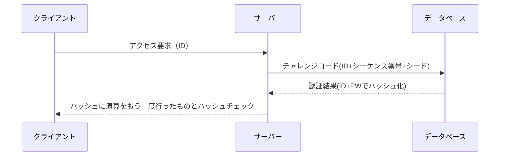
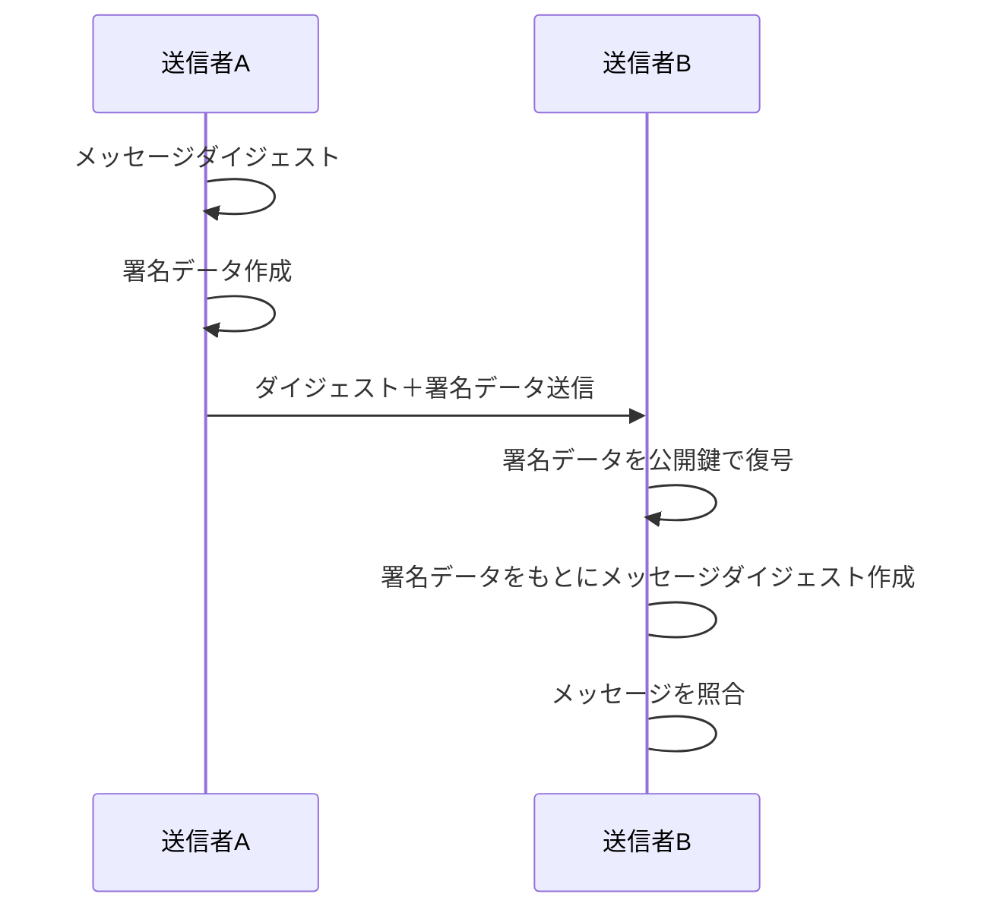

暗号化アルゴリズム（AESなど）における「動作モード」とは、一言でいえば**「長いデータをブロック（一定のサイズ）に切り分けたあと、それらをどういう手順で組み合わせて暗号化するか」という作戦**のことです。

AESという「刃物」を、どのように使って大きな食材（データ）を料理するかという「レシピ」に例えると分かりやすいでしょう。

代表的な動作モードを、特徴とともに整理しました。

---

### 1. ECB (Electronic Codebook) モード

最も単純なモードで、データを切り分けて、それぞれを独立して暗号化します。

* **仕組み:** 各ブロックを個別に暗号化するだけ。
* **メリット:** 並列処理ができるため非常に高速。
* **デメリット:** **「同じ平文は同じ暗号文になる」**ため、データのパターンが丸見えになる致命的な弱点があります。
* **例:** 画像をECBで暗号化すると、色は変わっても「ものの形」が浮き出てしまいます。

---

### 2. CBC (Cipher Block Chaining) モード

先ほど解説した、前のブロックの計算結果を次のブロックに混ぜる「連鎖」方式です。

* **仕組み:** 前の暗号文と次の平文を混ぜてから暗号化する。
* **メリット:** 同じデータでも暗号文がバラバラになり、パターンが隠される。
* **デメリット:** 前の計算が終わるのを待つ必要があるため、並列処理（高速化）ができない。

---

### 3. CTR (Counter) モード

暗号化アルゴリズムを「乱数発生器」として使う、スマートな方式です。

* **仕組み:** 「カウンター値（1, 2, 3…）」を暗号化して作ったランダムな値と、平文を足し合わせます。
* **メリット:** **超高速。** 前のブロックを待たずに、すべてのブロックを同時に計算（並列処理）できます。
* **特徴:** 暗号化と復号が全く同じ手順で行えるため、実装が非常にシンプルです。

---

### 4. GCM (Galois/Counter Mode) ★現代の主流

現在のTLS 1.3などで標準的に使われている、最強のモードです。

* **仕組み:** **「CTRモード（高速暗号化）」 **に、** 「改ざん検知（認証）」**の機能を組み合わせたものです。
* **メリット:**
  1. **高速:** 並列処理が可能。
  2. **安全:** データが途中で書き換えられていないかチェックできる（認証付き暗号：AEAD）。
* **用途:** HTTPS通信、Wi-Fiの暗号化（WPA3）など。

---

### 動作モード比較まとめ

| **モード** | **高速さ** | **パターン隠蔽** | **改ざん検知** | **評価**              |
| ---------------- | ---------------- | ---------------------- | -------------------- | --------------------------- |
| **ECB**    | ◎ 最高          | × できない            | × なし              | **使用禁止** （危険） |
| **CBC**    | △ 遅い          | ○ できる              | × なし              | 以前の標準（TLS 1.2まで）   |
| **CTR**    | ◎ 速い          | ○ できる              | × なし              | 高速だが改ざんに弱い        |
| **GCM**    | ◎ 速い          | ○ できる              | **◎ あり**    | **現在の世界標準**    |

---

### まとめ

「AESで暗号化する」と言っても、この**動作モード選び**を間違えると、セキュリティに穴が開いたり、通信速度が極端に落ちたりします。

現代のネットワークエンジニアが選定する場合、基本的には**「AES-GCM」**一択と考えて間違いありません。

**次は、GCMモードがどのようにして「データの改ざん（書き換え）」を瞬時に見破っているのか、その「タグ（MAC）」の仕組みについて解説しましょうか？**

## 共通鍵暗号方式

暗号化とはネットワークを流れるデータを内容が分からないようにすること。
暗号化方式について、暗号化をするときに仕様する鍵の存在によって共通鍵と公開鍵の2種類に分けられる。

共通鍵例：DES,IDEA,AES
公開鍵例：RSA,楕円曲線暗号

### 時刻同期方式
トークンと呼ばれるワンタイムPWを生成するカードを利用者に配布し、PINをトークンカードに配布する。

### チャレンジレスポンス方式

認証する側が乱数などのチャレンジコードを暗号化し、レスポンスコードとして認証装置に送信し、サーバからクライアントにチャレンジコードを連結したものをハッシュ化して認証する方法。

S/KEY方式

### FIDO UAF

FIDO2、FIDO UAF、FIDO U2F

FIDO UAF
生体認証を用いてパスワードレス認証

FIDO U2F

パスワード認証ともう一つの認証を組み合わせた仕組み

FIDO2

デバイス側で生体認証を用いた利用者認証を行い、オンラインサービスと公開鍵認証を行う手法。

## ディジタル署名

本人認証とメッセージ認証を同時に行う仕組み
公開鍵の利用によって実現される

代表的なハッシュ関数はMD5、SHA-1、SHA-2など

デジタル署名には否認防止という効果もある。

