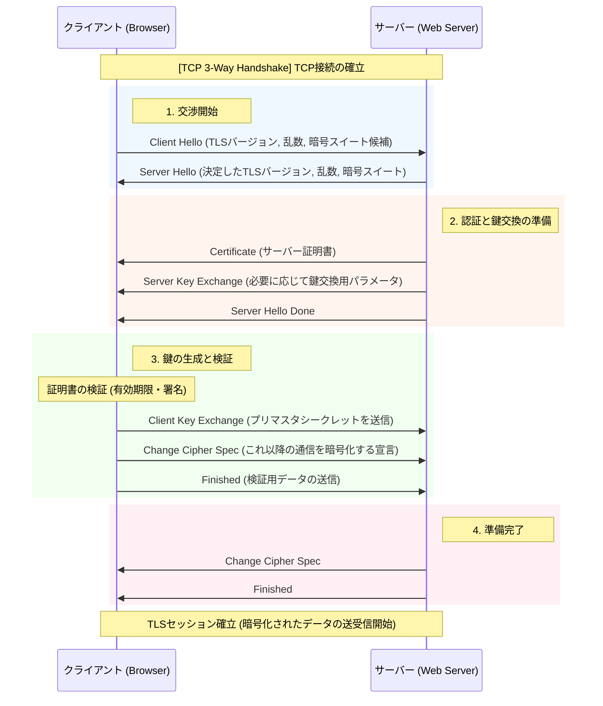

## SSL / TLS

ハンドシェイクとレコードプロトコルから構成されている。

>レコードプロトコル  
>ハンドシェイク中に作成されたキーを使用してアプリケーション データをセキュリティで保護します。 
>レコード プロトコルは、アプリケーション データをセキュリティで保護し、その 整合性 と配信元を確認する役割を担います。
>つまり。上位プロトコルのメッセージを暗号化するためのプロトコル。
>例. HTTPSで通信するときはレコードプロトコルのヘッダ情報でカプセル化され、ペイロードに格納される。

>ハンドシェイクプロトコル  
>TLSセッションIDで使用する共通鍵、MACシークレットの生成の他、使用する暗号化アルゴリズムやMACアルゴリズムを折衝する。

Client Hello / Server Hello: 「挨拶」です。利用可能な暗号の組み合わせ（暗号スイート）を出し合い、共通のルールを決めます。

Certificate: サーバーが自分の身分証明書を送ります。クライアントは、その証明書が信頼できる機関（認証局）から発行されたものかを確認します。

Client Key Exchange: ここが最も重要です。共通鍵の元となる「プリマスタシークレット」という秘密の値を共有します。
- RSA方式の場合：サーバーの公開鍵で暗号化して送ります。
- DH方式の場合：お互いのパラメータから計算で導き出します。

Change Cipher Spec / Finished: 「これから暗号化を始めるよ」という合図です。

PPTPは **Point-to-Point Tunneling Protocol** の略で、インターネット上に仮想的な専用回線（VPN）を構築するための通信プロトコルです。

---

### 主な特徴

- **開発**: Microsoft、Ascend Communications、3Comなどが1996年頃に開発
- **目的**: 遠隔地のユーザーが企業の内部ネットワークに安全にアクセスするためのVPN接続を実現
- **仕組み**: PPP（Point-to-Point Protocol）フレームをIPパケット内にカプセル化し、トンネリングして送信
- **使用ポート**: TCP 1723番ポートを制御用に使用し、GRE（Generic Routing Encapsulation）プロトコルでデータを転送

---

### セキュリティ上の問題

PPTPは**現在では推奨されないプロトコル**として知られています。

- **暗号化の脆弱性**: MPPE（Microsoft Point-to-Point Encryption）の暗号化方式に設計上の弱点があり、暗号鍵の復元が比較的容易です。
- **認証の問題**: MS-CHAP v1/v2（Microsoft Challenge Handshake Authentication Protocol）には既知の脆弱性があり、オフラインの辞書攻撃や暗号解読が可能です。
- **攻撃の実例**: 2012年にはMS-CHAP v2の暗号化が事実上破られ、24時間以内に解読できることが実証されました。

---

### 現在の位置づけ

- **推奨される代替プロトコル**: 現在では、OpenVPN、IPsec/IKEv2、WireGuardなどがPPTPの代替として広く推奨されています。
- **使用場面**: 古いシステムや簡易的な用途でまだ使われることがありますが、セキュリティを重視する環境では避けるべきとされています。
- **OSでの対応**: Windows、macOS、Linux、iOS、Androidなど多くのOSで標準サポートされていますが、セキュリティ意識の高い組織では無効化される傾向があります。

---

### まとめ

PPTPはVPNの先駆け的なプロトコルとして広く普及しましたが、暗号化と認証の両方に重大な脆弱性が存在するため、**現在ではセキュリティ要件の高い用途には全く適していません**。VPNを構築する際は、より現代的で安全なプロトコルを選択されることをお勧めします。

少し訂正が必要です。PPTPは **P2P（Peer-to-Peer）技術ではなく**、**Point-to-Point（1対1通信）** のプロトコルです。名称の「P2P」は「Peer-to-Peer」とは別物で、「Point-to-Point」の略とも読めますが、通常はPPTPの「PP」は「Point-to-Point Protocol（PPP）」を指します。

その上で、**P2P（Peer-to-Peer）** と **通常のTCP接続（クライアント・サーバーモデル）** の違いについて整理します。

---

## 1. 概念的な違い

| 観点 | 通常のTCP接続（クライアント・サーバー） | P2P（Peer-to-Peer） |
|------|--------------------------------------|-------------------|
| **役割の分離** | サーバー（提供側）とクライアント（受信側）が明確に分かれている | すべてのノード（ピア）が対等で、提供・受信の両方を同時に行える |
| **トポロジー** | スター型（中央のサーバーに全クライアントが集まる） | メッシュ型または分散型（ノード同士が直接つながる） |
| **ボトルネック** | 中央サーバーの処理能力・帯域が限界になる | 参加者が増えるほど帯域・リソースが分散され、強くなる傾向がある |
| **代表例** | Webサイト（HTTP）、メール（SMTP）、FTP | BitTorrent、Skype（旧版）、IPFS、ブロックチェーン |

---

## 2. 技術的な違い

### 接続の仕方

**通常のTCP接続（クライアント・サーバー）:**
- サーバーは固定の公网IPとポートで**常時待ち受け（listen）**している
- クライアントはサーバーのIPとポートを知っていれば、そこにTCP接続を開くだけでよい
- 構造が単純で、ファイアウォールやNATも比較的容易に越えられる（サーバー側が公网にいればよい）

**P2P:**
- 両方のピアがプライベートIPやNAT（ルーター）の内側にいることが多い
- お互いのIPを知らない、または直接繋がれない場合が多い
- そのため **NAT越え（NAT Traversal）** が重要になる
  - STUNサーバー：自分の公网IPを教えてくれる
  - TURNサーバー：中継してくれる
  - ICE：上記を組み合わせて最適な経路を選ぶ
  - **ホールパンチング**：両者が同時に外向きの通信を開けて、NATの穴を開け合う手法

### TCPの使い方

- **P2PでもTCPを使うことは普通です**。BitTorrentはTCPとUDPの両方を使います。
- TCPは「トランスポート層」のプロトコル（データを確実に届ける仕組み）であり、P2Pは「アーキテクチャ・通信モデル」の概念です。
- つまり「P2P vs TCP」は対比にならず、**「P2PでTCPを使うかUDPを使うか」**という話になります。

---

## 3. なぜPPTPとP2Pを混同しやすいのか

- **PPTPの「PP」** は **Point-to-Point Protocol（PPP）** の略で、電話回線や専用線で「1対1」の通信を確立するためのプロトコルです。
- **P2P** は **Peer-to-Peer** の略で、「中央サーバーなしで対等なノード同士が通信する」方式です。
- 両方とも「P」が2つ並ぶため、混同しやすいですが、全く異なる概念です。

---

## まとめ

- **PPTPはP2Pではなく**、1対1のVPNトンネリングプロトコル（Point-to-Point）です。
- **P2P（Peer-to-Peer）** は、中央サーバーを介さずノード同士が直接通信する**アーキテクチャ**です。
- **通常のTCP接続** はトランスポート層のプロトコルであり、クライアント・サーバーモデルでもP2Pでも使えます。
- P2Pの技術的な特徴は「対等性」と「分散性」にあり、特に**NAT越え**がクライアント・サーバーモデルよりも複雑になります。