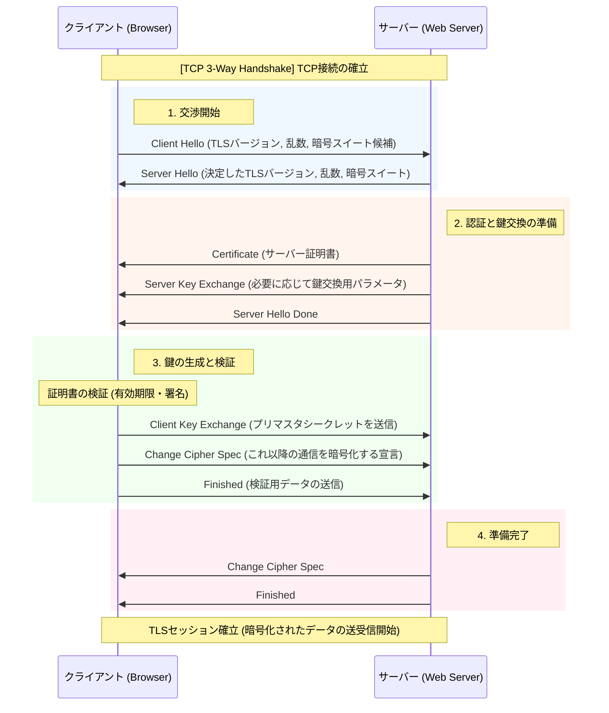

## SSL / TLS

ハンドシェイクとレコードプロトコルから構成されている。

>レコードプロトコル  
>ハンドシェイク中に作成されたキーを使用してアプリケーション データをセキュリティで保護します。 
>レコード プロトコルは、アプリケーション データをセキュリティで保護し、その 整合性 と配信元を確認する役割を担います。
>つまり。上位プロトコルのメッセージを暗号化するためのプロトコル。
>例. HTTPSで通信するときはレコードプロトコルのヘッダ情報でカプセル化され、ペイロードに格納される。

>ハンドシェイクプロトコル  
>TLSセッションIDで使用する共通鍵、MACシークレットの生成の他、使用する暗号化アルゴリズムやMACアルゴリズムを折衝する。

Client Hello / Server Hello: 「挨拶」です。利用可能な暗号の組み合わせ（暗号スイート）を出し合い、共通のルールを決めます。

Certificate: サーバーが自分の身分証明書を送ります。クライアントは、その証明書が信頼できる機関（認証局）から発行されたものかを確認します。

Client Key Exchange: ここが最も重要です。共通鍵の元となる「プリマスタシークレット」という秘密の値を共有します。
- RSA方式の場合：サーバーの公開鍵で暗号化して送ります。
- DH方式の場合：お互いのパラメータから計算で導き出します。

Change Cipher Spec / Finished: 「これから暗号化を始めるよ」という合図です。

PPTPは **Point-to-Point Tunneling Protocol** の略で、インターネット上に仮想的な専用回線（VPN）を構築するための通信プロトコルです。

---

### 主な特徴

- **開発**: Microsoft、Ascend Communications、3Comなどが1996年頃に開発
- **目的**: 遠隔地のユーザーが企業の内部ネットワークに安全にアクセスするためのVPN接続を実現
- **仕組み**: PPP（Point-to-Point Protocol）フレームをIPパケット内にカプセル化し、トンネリングして送信
- **使用ポート**: TCP 1723番ポートを制御用に使用し、GRE（Generic Routing Encapsulation）プロトコルでデータを転送

---

### セキュリティ上の問題

PPTPは**現在では推奨されないプロトコル**として知られています。

- **暗号化の脆弱性**: MPPE（Microsoft Point-to-Point Encryption）の暗号化方式に設計上の弱点があり、暗号鍵の復元が比較的容易です。
- **認証の問題**: MS-CHAP v1/v2（Microsoft Challenge Handshake Authentication Protocol）には既知の脆弱性があり、オフラインの辞書攻撃や暗号解読が可能です。
- **攻撃の実例**: 2012年にはMS-CHAP v2の暗号化が事実上破られ、24時間以内に解読できることが実証されました。

---

### 現在の位置づけ

- **推奨される代替プロトコル**: 現在では、OpenVPN、IPsec/IKEv2、WireGuardなどがPPTPの代替として広く推奨されています。
- **使用場面**: 古いシステムや簡易的な用途でまだ使われることがありますが、セキュリティを重視する環境では避けるべきとされています。
- **OSでの対応**: Windows、macOS、Linux、iOS、Androidなど多くのOSで標準サポートされていますが、セキュリティ意識の高い組織では無効化される傾向があります。

---

### まとめ

PPTPはVPNの先駆け的なプロトコルとして広く普及しましたが、暗号化と認証の両方に重大な脆弱性が存在するため、**現在ではセキュリティ要件の高い用途には全く適していません**。VPNを構築する際は、より現代的で安全なプロトコルを選択されることをお勧めします。

少し訂正が必要です。PPTPは **P2P（Peer-to-Peer）技術ではなく**、**Point-to-Point（1対1通信）** のプロトコルです。名称の「P2P」は「Peer-to-Peer」とは別物で、「Point-to-Point」の略とも読めますが、通常はPPTPの「PP」は「Point-to-Point Protocol（PPP）」を指します。

その上で、**P2P（Peer-to-Peer）** と **通常のTCP接続（クライアント・サーバーモデル）** の違いについて整理します。

---

## 1. 概念的な違い

| 観点 | 通常のTCP接続（クライアント・サーバー） | P2P（Peer-to-Peer） |
|------|--------------------------------------|-------------------|
| **役割の分離** | サーバー（提供側）とクライアント（受信側）が明確に分かれている | すべてのノード（ピア）が対等で、提供・受信の両方を同時に行える |
| **トポロジー** | スター型（中央のサーバーに全クライアントが集まる） | メッシュ型または分散型（ノード同士が直接つながる） |
| **ボトルネック** | 中央サーバーの処理能力・帯域が限界になる | 参加者が増えるほど帯域・リソースが分散され、強くなる傾向がある |
| **代表例** | Webサイト（HTTP）、メール（SMTP）、FTP | BitTorrent、Skype（旧版）、IPFS、ブロックチェーン |

---

## 2. 技術的な違い

### 接続の仕方

**通常のTCP接続（クライアント・サーバー）:**
- サーバーは固定の公网IPとポートで**常時待ち受け（listen）**している
- クライアントはサーバーのIPとポートを知っていれば、そこにTCP接続を開くだけでよい
- 構造が単純で、ファイアウォールやNATも比較的容易に越えられる（サーバー側が公网にいればよい）

**P2P:**
- 両方のピアがプライベートIPやNAT（ルーター）の内側にいることが多い
- お互いのIPを知らない、または直接繋がれない場合が多い
- そのため **NAT越え（NAT Traversal）** が重要になる
  - STUNサーバー：自分の公网IPを教えてくれる
  - TURNサーバー：中継してくれる
  - ICE：上記を組み合わせて最適な経路を選ぶ
  - **ホールパンチング**：両者が同時に外向きの通信を開けて、NATの穴を開け合う手法

### TCPの使い方

- **P2PでもTCPを使うことは普通です**。BitTorrentはTCPとUDPの両方を使います。
- TCPは「トランスポート層」のプロトコル（データを確実に届ける仕組み）であり、P2Pは「アーキテクチャ・通信モデル」の概念です。
- つまり「P2P vs TCP」は対比にならず、**「P2PでTCPを使うかUDPを使うか」**という話になります。

---

## 3. なぜPPTPとP2Pを混同しやすいのか

- **PPTPの「PP」** は **Point-to-Point Protocol（PPP）** の略で、電話回線や専用線で「1対1」の通信を確立するためのプロトコルです。
- **P2P** は **Peer-to-Peer** の略で、「中央サーバーなしで対等なノード同士が通信する」方式です。
- 両方とも「P」が2つ並ぶため、混同しやすいですが、全く異なる概念です。

---

## まとめ

- **PPTPはP2Pではなく**、1対1のVPNトンネリングプロトコル（Point-to-Point）です。
- **P2P（Peer-to-Peer）** は、中央サーバーを介さずノード同士が直接通信する**アーキテクチャ**です。
- **通常のTCP接続** はトランスポート層のプロトコルであり、クライアント・サーバーモデルでもP2Pでも使えます。
- P2Pの技術的な特徴は「対等性」と「分散性」にあり、特に**NAT越え**がクライアント・サーバーモデルよりも複雑になります。

はい、PPTPはセキュリティ上の理由から**推奨されない**プロトコルではありますが、現実には以下のようなケースで**今も使われ続けている**ことがあります。

---

## 1. レガシー機器・古いシステムとの互換性

- **古いルーターやNAS、IoT機器**にはPPTPクライアント/サーバー機能が組み込まれているものが多く、ファームウェア更新が終了しているため、他のVPNプロトコル（OpenVPNやWireGuard）に対応していません。
- 企業内の**老朽化したネットワーク機器**をそのまま使い続ける環境では、PPTPが唯一動作する選択肢になることがあります。
- 一部の**古いモバイルOS（Androidの古いバージョンなど）**や組み込み機器では、PPTPが唯一標準搭載されている場合もあります。

---

## 2. 設定の簡単さ・手軽さ

- PPTPは**設定が非常に簡単**です。ユーザー名・パスワード・サーバーアドレスだけで接続でき、証明書の管理や複雑な設定が不要です。
- 技術的な知識がない個人ユーザーや小規模オフィスでは、「とりあえずVPNが使えればよい」という理由でPPTPを選択するケースがあります。
- 一部の**無料VPNサービスや安価なVPNプロバイダー**は、メンテナンスが簡単なPPTPを提供し続けていることがあります。

---

## 3. 速度重視の場面（暗号化のオーバーヘッドが小さい）

- PPTPの暗号化（MPPE）は**現代の標準から見れば脆弱**ですが、その分、暗号化・復号の処理負荷が小さいため、**古いハードウェアでも比較的高速**に動作します。
- 厳密な機密性が求められない場面（例：単にIPアドレスを隠したいだけ、地理制限を回避したいだけ）で、ユーザーが「とにかく速いプロトコル」を選ぶ結果、PPTPを使うケースがあります。
- ただし、これは「セキュリティを捨てて速度を取る」選択であり、推奨されるものではありません。

---

## 4. 企業内のレガシーインフラ・移行コストの問題

- 大規模な組織では、**数十年前に構築されたPPTPベースのリモートアクセス基盤**が残存していることがあります。
- 全従業員のクライアント設定を変更し、新しいプロトコルへの移行テストを行うには**コストと工数**がかかるため、「今も動いているからそのままにする」という判断がなされることがあります。
- 特に**工場や基幹システム**など、ダウンタイムが許容できない環境では、意図的に古いまま維持されることもあります。

---

## 5. 教育・テスト・実験目的

- ネットワーク技術の学習や、VPNの仕組みを理解するための**教育目的**でPPTPが使われることがあります。
- 「まずPPTPでVPNの概念を学び、その後にIPsecやOpenVPNへ移行する」という流れは、教材や資格試験の文脈でも見られます。
- セキュリティを全く気にしない**閉鎖的なテスト環境**（例：内部ラボネットワーク）では、手軽さからPPTPが使われることもあります。

---

## 6. 誤った認識による使用

- 「VPNを使えば安全」という**表面的な理解**だけでPPTPを選択しているユーザーが、個人レベルではまだ一定数います。
- 一部の古い情報や、更新されていないブログ記事・チュートリアルがPPTPの設定方法を紹介し続けていることも、使われ続ける一因です。

---

## 重要な注意点

上記のようなケースで使われていることは事実ですが、**以下のリスクは明白**です。

- **パスワード・通信内容の漏洩リスク**: 現代の計算リソースでは、PPTPの暗号化は比較的容易に破られます。
- **中間者攻撃（MitM）の脆弱性**: 認証プロセスの設計上、セッションのハイジャックが可能です。
- **規制・コンプライアンス違反の可能性**: 個人情報や機密データを扱う場合、PPTPを使うこと自体が監査で問題になることがあります。

---

## まとめ

PPTPが使われる主な理由は、**「古い機器との互換性」「設定の簡単さ」「移行コストの回避」「速度」**です。しかし、これらはいずれも「セキュリティを妥協したトレードオフ」です。新規導入や機密性の高い通信には**絶対に使用すべきではなく**、既存で使われている場合も、可能な限り早くOpenVPN、IPsec/IKEv2、WireGuardなどの現代的なプロトコルへの移行を検討すべきです。

「Point-to-Point（1対1接続）」と「クライアントーサーバー」は、**階層の異なる概念**です。前者は「通信経路の形態」を、後者は「システムの役割分担」を指します。ただし、対比して整理すると以下のようになります。

---

## 1. 概念の違い（階層の違い）

| 観点 | Point-to-Point（1対1接続） | クライアントーサーバー |
|------|--------------------------|---------------------|
| **何を指すか** | 通信経路・リンク層のトポロジー | アプリケーション・システムアーキテクチャ |
| **本質** | 「2つのノード間を直接つなぐ」という構造 | 「サービス提供側と消費側を分離する」という設計思想 |
| **対称性** | 両端は基本的に対等（どちらが上/下ではない） | 明確な非対称性（サーバーが提供、クライアントが要求） |

---

## 2. 構造・トポロジーの違い

**Point-to-Point:**
- 論理的に**2点間だけ**がつながっている
- 中継機器（ルーター等）を物理的に経由していても、通信のエンドポイントは常に1対1
- 3台以上が相互通信するには、それぞれのペア間に個別のリンクが必要（n台なら n(n-1)/2 本）

**クライアントーサーバー:**
- **1対多**の構造。1台のサーバーに多数のクライアントが接続する
- クライアント同士は直接通信せず、必ずサーバーを介する（原則）
- スケール時はサーバーを強化・分散させることで対応

---

## 3. 役割と関係性の違い

**Point-to-Point:**
- 両端のノードは**役割が固定されていない**ことが多い
- どちらからも通信を開始でき、対等にデータを送受信できる
- 「接続の相手」が重要で、「サービスを提供する特別な存在」は必ずしもいない

**クライアントーサーバー:**
- **サーバー**: 常時待ち受け、リソース（データ・サービス）を保有し、要求に応える
- **クライアント**: 必要に応じて接続を開始し、サーバーに要求を送る
- サーバーがないとシステムが成立しない中央集権的な構造

---

## 4. 代表例

**Point-to-Point:**
- PPP（電話回線・ダイヤルアップ接続）
- 専用線（leased line）
- Bluetoothの1対1ペアリング
- USBケーブルによる2台のPC接続

**クライアントーサーバー:**
- Webサイト（HTTP: ブラウザがクライアント、Webサーバーがサーバー）
- メール（SMTP/POP3）
- データベース（SQLクライアント → DBサーバー）
- オンラインゲームの一部（ゲームクライアント → ゲームサーバー）

---

## 5. 重要な補足：両者は排他的ではない

実は、**クライアントーサーバー方式のアプリケーションは、多くの場合、下位層でPoint-to-Point的な接続を使っています**。

- WebブラウザがWebサーバーに接続する際、TCPコネクションは「ブラウザの1点」と「サーバーの1点」を論理的に直接つなぐ**Point-to-Point的な通信**です。
- つまり、**Point-to-Pointは「配管」**、**クライアントーサーバーは「その配管を使ったサービスの設計思想」**と捉えると分かりやすいです。

---

## まとめ

- **Point-to-Point**は「誰と誰が直接つながっているか」という**通信経路の形態**です。
- **クライアントーサーバー**は「誰がサービスを提供し、誰がそれを消費するか」という**システムの役割分担**です。
- 両者は対立する概念ではなく、**階層が異なる**ため、実際には組み合わせて使われることがほとんどです。