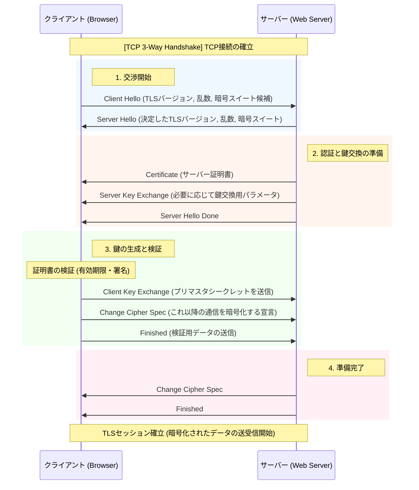

## SSL / TLS

ハンドシェイクとレコードプロトコルから構成されている。

>レコードプロトコル  
>ハンドシェイク中に作成されたキーを使用してアプリケーション データをセキュリティで保護します。 
>レコード プロトコルは、アプリケーション データをセキュリティで保護し、その 整合性 と配信元を確認する役割を担います。
>つまり。上位プロトコルのメッセージを暗号化するためのプロトコル。
>例. HTTPSで通信するときはレコードプロトコルのヘッダ情報でカプセル化され、ペイロードに格納される。

>ハンドシェイクプロトコル  
>TLSセッションIDで使用する共通鍵、MACシークレットの生成の他、使用する暗号化アルゴリズムやMACアルゴリズムを折衝する。

Client Hello / Server Hello: 「挨拶」です。利用可能な暗号の組み合わせ（暗号スイート）を出し合い、共通のルールを決めます。

Certificate: サーバーが自分の身分証明書を送ります。クライアントは、その証明書が信頼できる機関（認証局）から発行されたものかを確認します。

Client Key Exchange: ここが最も重要です。共通鍵の元となる「プリマスタシークレット」という秘密の値を共有します。
- RSA方式の場合：サーバーの公開鍵で暗号化して送ります。
- DH方式の場合：お互いのパラメータから計算で導き出します。

Change Cipher Spec / Finished: 「これから暗号化を始めるよ」という合図です。

