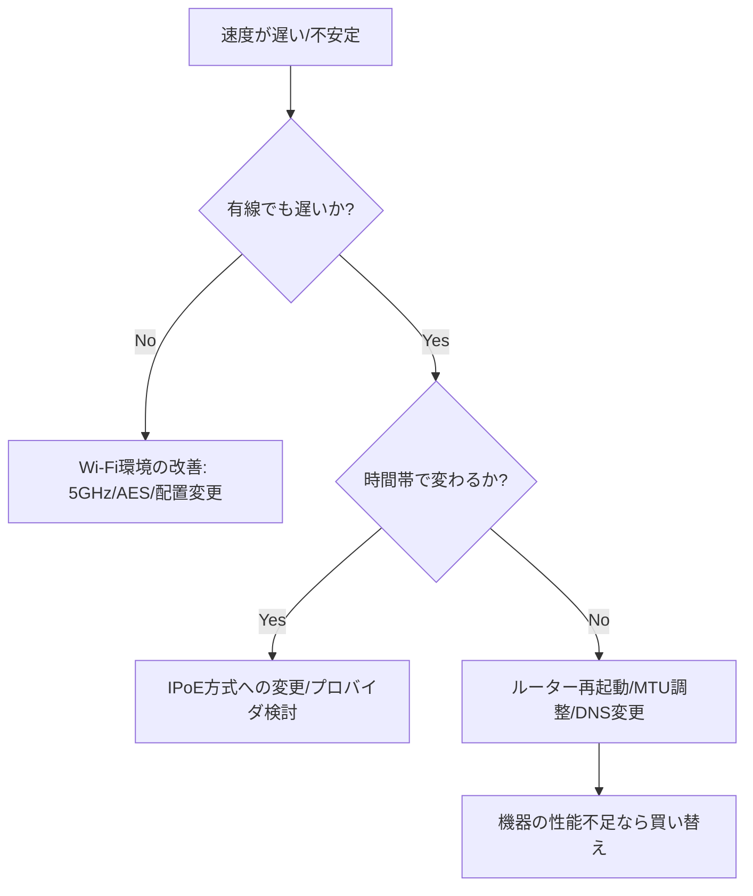

ネットワークのスピードが遅い。
動画やウェブサイトの画面更新が遅いということがあれば、それは通信の速度が遅くなっているからかもしれません。

本日はそんなネットワークの通信速度に関するお話です。

## 問題

ネットワーク速度が「遅い」と感じる現象は、単にデータが届くのが遅いだけでなく、裏側では複数の要因が複雑に絡み合っています。

ユーザーが直面する現象を、技術的な背景とともに詳しく紐解いていきましょう。

### 1. スループット（実効速度）の低下

「1Gbpsの光回線なのに、測ってみると30Mbpsしか出ない」という、最も分かりやすい現象です。

- **現象:** データの「土管」が細くなっている状態です。ファイルのダウンロードに時間がかかり、高画質動画が途中で止まってしまいます。
- **原因の裏側:**  **回線の輻輳（ふくそう）:** プロバイダーの設備（PPPoEの終端装置など）で、近隣住民や社員全員の通信が集中し、交通渋滞が起きている。
- **規格の不一致:** ルーターやハブが古く、物理的に100Mbpsまでしか対応していない（いわゆる「ボトルネック」）。

### 2. レイテンシ（遅延）の増大

「速度測定の結果は悪くないのに、操作の反応がワンテンポ遅れる」という現象です。

- **現象:** データの往復時間（Ping値）が長くなっている状態です。Webサイトをクリックしてから表示が始まるまでが長く、オンライン会議では声が遅れて聞こえます。
- **原因の裏側:**
- **経路の遠回り:** VPNサーバーを経由して遠隔地へ通信している場合や、海外のサーバーにアクセスしている。
- **バッファブロート:** ルーターの処理能力を超えたパケットが溜まりすぎて、順番待ちが発生している。

### 3. ジッタ（ゆらぎ）とパケットロス

「声がロボットのようになる」「急に画面が固まって、数秒後に倍速で動き出す」という、リアルタイム通信で顕著な現象です。

- **現象:** データが届く間隔がバラバラになったり（ジッタ）、一部のパケットが目的地に届かずに消えてしまったり（ロス）します。
- **原因の裏側:**
- **Wi-Fiの電波干渉:** 電子レンジや近隣のWi-Fiルーターと同じ周波数（2.4GHz帯）を使ってしまい、ノイズでデータが壊れている。
- **機器の過負荷:** ルーターのメモリやCPUが限界で、処理しきれないパケットを捨てている。

### 4. 特定のプロトコル・サイトのみの遅延

「YouTubeは平気なのに、社内システムだけ異様に重い」といった現象です。

- **現象:** 全体ではなく、特定の通信経路や特定の種類のデータだけが遅くなります。
- **原因の裏側:**
- **MTUの問題:** 先ほどお話しした「カプセル化によるヘッダーの肥大化」で、大きなパケットが分割（フラグメンテーション）され、効率が極端に落ちている。
- **DNSの応答遅延:** 「名前解決（URLをIPアドレスに変える作業）」に時間がかかっており、通信が始まる前の「住所検索」で足止めを食らっている。

### 5. まとめ：速度低下の正体

これらをまとめると、ユーザーが感じる「遅さ」は以下の3つのどれかに集約されます。

| ユーザーの感じ方 | 専門的な現象 | 主な原因箇所 |
| --- | --- | --- |
| **「進まない」** | 低スループット | プロバイダー、LAN規格 |
| **「反応が鈍い」** | 高レイテンシ | ルーター、サーバー距離 |
| **「ガタガタする」** | ジッタ・ロス | 無線環境、機器の故障 |

## 原因の切り分け

通信速度のトラブル解決は、闇雲に設定をいじるのではなく、 **「OSI参照モデルの下（物理層）から順番に」** 切り分けていくのが最も効率的です。

プロのネットワークエンジニアが現場で行う、5つのステップによる切り分け手順を解説します。

### ステップ1：物理的な接続と「範囲」の特定

まずは、問題が「どこで」起きているかを絞り込みます。

- **1台だけか、全員か？**
- 1台だけなら、その端末（PC/スマホ）か、その端末が繋がっているポート・ケーブルの疑い。
- 全員なら、ルーター、スイッチ、あるいはプロバイダー（回線）の疑い。

- **有線にしても遅いか？**
- Wi-Fiをやめて有線LANケーブルでルーターに直結してみてください。
- **改善した場合：** 原因はWi-Fiの電波干渉や規格（TKIPを使っている等）です。
- **改善しない場合：** 原因はルーター、またはそれより外側の回線にあります。

### ステップ2：測定値から「現象」を分類する

スピードテストサイト（Fast.comやGoogle速度テストなど）を使い、数値を確認します。

- **スループット（下り速度）を見る:** 10Mbps以下なら「帯域不足」。回線の混雑やLAN規格のボトルネックです。
- **レイテンシ（Ping/レイテンシ）を見る:** 100msを超えるなら「反応遅延」。VPNの経由や、ルーターの処理過負荷が疑われます。
- **ジッタ（Jitter）を見る:** 数値が激しく変動するなら、パケットロスが発生しており、Web会議が途切れる原因になります。

### ステップ3：ルーターと「外の世界」の切り分け

自分の管理下（LAN）の問題か、プロバイダー側の問題かを切り分けます。

- **ルーターを再起動する:** 溜まったNATセッションやメモリの断片化が解消され、これだけで直ることも多いです。
- **「traceroute (tracert)」コマンドを実行する:**
- Windowsのコマンドプロンプトで `tracert 8.8.8.8` と入力します。
- 1番目のホップ（自分のルーター）で時間がかかっていれば、社内LANの問題。
- 2番目以降のプロバイダー内のIPで時間がかかっていれば、回線網の混雑です。

### ステップ4：プロトコルと特定のサービスを疑う

「特定のサイトだけ遅い」場合の切り分けです。

- **DNSの切り分け:** ブラウザで開けない時、IPアドレス（例：`http://1.1.1.1`）で直接開けるか試します。開けるならDNSサーバーの設定不備です。
- **MTUの切り分け（VPN利用時など）:**
- `ping -f -l 1460 google.com` を実行。
- 「パケットの断片化が必要ですが、DFが設定されています」と出る場合、カプセル化によるMTUサイズオーバーが原因でパケットが捨てられています。

## 対応策
通信トラブルの原因が特定できたら、次はその原因に応じた「処方箋」を実行します。切り分けのステップに対応した、具体的なアクションプランを整理しました。

### 1. Wi-Fi（無線）が原因だった場合の対応

有線では速いのに無線で遅い場合、電波の「通り道」を整理する必要があります。

- **周波数帯の変更:** 2.4GHz（電子レンジ等の干渉に弱い）から **5GHz（干渉に強く高速）** へ切り替えます。
- **チャンネルの固定:** 近隣のルーターと電波が重なっている場合、ルーター設定画面から空いているチャンネルへ手動で固定します。
- **暗号化方式の確認:** 前述の通り、**TKIP**が設定されていると速度が54Mbpsに制限されます。必ず **AES (CCMP)** を選択してください。
- **設置場所の改善:** ルーターを床に置かず、高さ1m以上の見通しの良い場所へ移動させます。

### 2. 回線の混雑（夜だけ遅い等）が原因の場合の対応

プロバイダー側の「関所（終端装置）」が混んでいる場合、通信の「通り道」自体を変えるのが最も効果的です。

- **IPv6 IPoE (IPv4 over IPv6) への切り替え:** 「v6プラス」や「OCNバーチャルコネクト」などの名称で提供されているサービスです。従来のID/PW認証（PPPoE）をスキップして、混雑の少ない次世代の網を通るようにします。
> **注意:** 契約の変更と、対応ルーターへの買い替えが必要です。

- **プロバイダーの変更:** IPoEを導入しても遅い場合は、バックボーン（網の太さ）がより強力なプロバイダーへの乗り換えを検討します。

### 3. ルーターの負荷や性能不足が原因の場合の対応

ルーターが「いっぱいいっぱい」になっている場合、負荷を減らすか、処理能力を上げます。

- **定期的な再起動:** 多くの家庭用ルーターは、再起動によってメモリがリフレッシュされ、一時的に速度が回復します。
- **NATセッションの管理:** P2Pソフトや過度な多台数接続を控え、ルーターのセッション管理負荷を下げます。
- **上位モデルへの買い替え:** 接続台数が増えている場合（スマート家電等）、CPU性能が高い「戸建て用/オフィス用」の高機能ルーターに変更します。

### 4. ネットワーク構成（MTU・L2ループ）が原因の場合の対応

技術的な設定不備による不具合への対応です。

- **MTU/MSS値の調整:** VPN環境などで特定のサイトが見られない場合、ルーター側のMTU設定を少し小さく（例：1454や1400）設定します。これにより、パケットの「サイズオーバーによる破棄」を防ぎます。
- **STP（スパニングツリー）の有効化:** L3SW/L2SWでループが発生している場合、物理的な配線のミスを直すとともに、ループを自動検知して遮断するSTP設定を有効にします。

### 5. 端末側（PC/スマホ）が原因の場合の対応

インフラではなく、手元のデバイスに問題がある場合の対応です。

- **DNSサーバーの手動設定:** プロバイダーのDNSが遅い場合、Googleが提供するパブリックDNS（`8.8.8.8`）などに変更すると、Webの読み込み開始が速くなることがあります。
- **バックグラウンド更新の停止:** Windows Updateやクラウドストレージ（OneDrive/iCloud）の同期が帯域を使い切っていないか確認し、作業中は一時停止します。

### 対応マニュアルまとめ

| 切り分け結果 | 最優先アクション | 期待される効果 |
| --- | --- | --- |
| **Wi-Fiが遅い** | 5GHz帯への変更 + AES設定 | 安定性と最高速度の向上 |
| **夜間だけ遅い** | IPv6 IPoE サービスへの加入 | 渋滞の回避、速度の劇的改善 |
| **時々固まる** | ルーターの再起動 or 買い替え | 処理落ちの解消 |
| **VPN経由が遅い** | MTU値の最適化 | データの欠落防止、表示速度の安定 |

## 総括

通信速度が遅いという問題は、単に「回線が悪い」という一言では片付けられない、複数のレイヤーが絡み合った複雑なパ現象です。

原因は物理的な要因、論理的な原因、インフラの要因などが関係しています。

そして通信の問題は複雑であるからこそ、原因の切り分けが重要となります。

これらの原因に対する対応方法について今回はまとめてみました。
通信の環境を改善したい、原因と対策を知りたいということがあれば、ご参考下さい。

