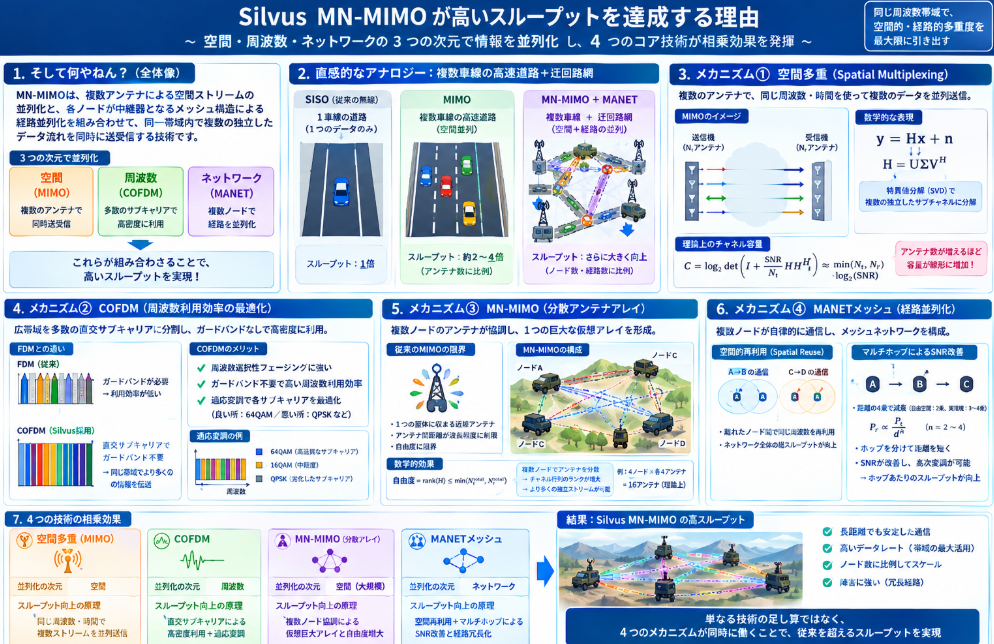

無線通信の技術には種類は数多いですがコスト重視で広域展開する民生向けの無線通信技術から、産業・インフラのような特定用途の無線通信技術が存在します。
民生向けはWi-Fiや、携帯で使われるLTEなどが代表例です。

産業用の用途のものは衛星通信、Private 5Gなどが存在します。そんな中、ちょっと変わり種の通信技術にSILVUSというものがあります。

本日テーマ：
>産業用無線通信技術のSILVUSについて説明する

## 概要
SILVUSとは、正確には**Silvus Technologies**（シルバス・テクノロジーズ）という米国の無線通信機器メーカーです。ただし通信分野では、この会社が開発した独自の波形技術**MN-MIMO（Mobile-Networked MIMO）** を指して言及されることが多いです。

以下、その技術的な中身を解説します。

### 1. まず何やねん

> **MN-MIMOは「COFDM＋MIMOアンテナ技術＋MANET（移動自組織網）」を融合した波形で、過酷な環境下でも高帯域・長距離・耐妨害性の高いメッシュ通信を実現する。**

### 2. 直感的なアナロジー：「賢い伝書鳩の網」

伝統的な無線は「1対1の直通」や「基地局への依存」が前提です。MN-MIMOは：

- **各無線機が「中継器」にもなる**：鳩が他の鳩に手紙を渡して次々と運ぶ
- **複数のアンテナで同時に送受信**：複数の鳩が同時に異なる経路を飛ぶ
- **電波の反射を逆手に取る**：壁にぶつかるのを利用して情報量を増やす

### 3. MN-MIMOの3本柱

Silvus Technologiesの公式サイト <source-chip title="Silvus Technologies" url="https://silvustechnologies.com/why-silvus/technology/" /> によれば、MN-MIMOは以下の3技術の融合です。

| 技術 | 役割 | MN-MIMOでの貢献 |
|------|------|----------------|
| **COFDM** | 広帯域信号を多数の狭帯域サブキャリアに分割 | マルチパス（反射波）に強く、障害物の多い環境でも安定 |
| **MIMO** | 複数アンテナで空間的に独立した信号路を作る | スループット向上とリンク信頼性の向上 |
| **MANET** | 各ノードが自律的にメッシュ網を形成 | 基地局不要で、ノード同士が中継し合う |

### 4. 技術的な特徴

__4.1 Mobile-Networked MIMO（MN-MIMO）の本質__

通常のMIMOは「1つの送受信点に複数アンテナ」を想定しますが、MN-MIMOは **「移動中の複数ノードが協調してMIMOを形成する」** 点が異なります。

つまり：
- ノードA、B、Cがそれぞれ独立に移動しながら
- それらのアンテナが**仮想的に1つの巨大なMIMOアレイ**として機能する

これにより、単一ノードの物理的制約を超えた空間多路利用が可能になります。

__4.2 主な性能特徴__

| 特徴 | 内容 |
|------|------|
| **高スループット** | 従来の単一天線無線に比べ、MIMOによる空間多重で高データレート |
| **長距離通信** | ビームフォーミングによる指向性制御で距離を延伸 |
| **耐妨害性（LPI/LPD）** | 低確率傍受/低確率検出に対応した波形設計 |
| **自己修復メッシュ** | ノードの増減に応じて経路を自動再構築 |
| **非視界（NLOS）通信** | 建物や地形の陰でも反射波を利用して通信維持 |

### 5. 用途

SilvusのStreamCasterシリーズは、主に以下の分野で使用されています <source-chip title="Silvus Technologies" url="https://silvustechnologies.com/" />：

- **軍事・防衛**：戦術無線（米陸軍AN/PRC-169など）
- **公共安全**：警察・消防・救急の現場通信
- **無人システム**：UAV/UGV/USV間の広帯域データリンク
- **産業用**：海上・石油・ガス施設など過酷環境での通信

## コア技術
SilvusのMN-MIMOが高いスループットを達成する理由は、**「空間」・「周波数」・「ネットワーク」という3つの次元で情報を並列化している**ことにあります。
以下、Silvusのコア技術について物理的・数学的な根拠から段階的に解説します。

### 1. そして何やねん

> **MN-MIMOは、複数アンテナによる空間ストリームの並列化と、各ノードが中継器となるメッシュ構造による経路並列化を組み合わせることで、同一帯域内で複数の独立したデータ流れを同時に送受信する。**

### 2. 直感的なアナロジー：「複数車線の高速道路＋迂回路網」

- **通常の無線（SISO）**：1車線の道路。1台の車（データ）しか同時に走れない。
- **MIMO**：同じ道路幅で**複数車線**を並行して走れる。車線が増えれば輸送量が増える。
- **MN-MIMO＋MANET**：複数車線の高速道路が、さらに**交差点なしで相互に接続された迂回路網**になっている。1本が混雑しても別経路が即座に使える。

### 3. スループット向上の4つの物理的メカニズム

__メカニズム①：空間多重（Spatial Multiplexing）__

MIMOの最も基本的なスループット向上原理です。

__数学的な記述__

送信アンテナ数 $N_t$、受信アンテナ数 $N_r$、チャネル行列を $\mathbf{H} \in \mathbb{C}^{N_r \times N_t}$ とします。受信信号は：

$$\mathbf{y} = \mathbf{H}\mathbf{x} + \mathbf{n}$$

ここで $\mathbf{x}$ は送信信号ベクトル、$\mathbf{n}$ は雑音です。

チャネル行列 $\mathbf{H}$ を**特異値分解（SVD）**すると：

$$\mathbf{H} = \mathbf{U}\mathbf{\Sigma}\mathbf{V}^H$$

$\mathbf{\Sigma}$ は特異値 $\sigma_1, \sigma_2, \ldots, \sigma_{\min(N_t, N_r)}$ を対角に持つ行列です。

これにより、元のMIMOチャネルは**複数の独立した並列サブチャネル（空間ストリーム）** に分解されます：

$$y_k' = \sigma_k x_k' + n_k', \quad k = 1, 2, \ldots, \min(N_t, N_r)$$

各サブチャネルは**同じ周波数・同じ時間**を使いながら、異なるデータを運べます。

__スループットへの寄与__

理想的なMIMOのチャネル容量は：

$$C = \log_2 \det\left(\mathbf{I}_{N_r} + \frac{\text{SNR}}{N_t}\mathbf{H}\mathbf{H}^H\right) \approx \min(N_t, N_r) \cdot \log_2(\text{SNR})$$

つまり、**アンテナ数の少ない方の次元に比例して容量が線形に増加**します。2×2 MIMOなら理論上約2倍、4×4なら約4倍のスループットが可能です。

SilvusのStreamCasterは複数アンテナを搭載し、この空間多重を活用しています <source-chip title="Silvus Technologies" url="https://silvustechnologies.com/why-silvus/technology/" />。

__メカニズム②：COFDMによる周波数利用効率の最適化__

__COFDMの原理__

COFDM（Coded Orthogonal Frequency Division Multiplexing）は、広帯域チャネルを**多数の直交サブキャリア**に分割します：

- 各サブキャリアの帯域は狭く、**周波数選択性フェージング**の影響を受けにくい
- サブキャリア間は直交しているため、**ガードバンドが不要**で周波数利用効率が高い
- コーディングにより、劣化したサブキャリアの情報を復元できる

__スループットへの寄与__

伝統的なFDM（周波数分割多重）ではサブチャネル間に保護帯域が必要ですが、COFDMでは直交性によりこの保護帯域を省略できます。その結果、**同じ総帯域幅でより多くの情報を運べます**。

さらに、チャネル状態に応じて**適応変調**を各サブキャリアに適用できます。良いサブキャリアには高次変調（64QAMなど）、悪いサブキャリアには堅牢な変調（QPSKなど）を割り当てることで、全体のスループットを最大化します。

__メカニズム③：Mobile-Networked MIMOによる「分散アンテナアレイ」効果__

これがMN-MIMOの独自性です。

__従来MIMOの限界__

通常のMIMOは、**1つの筐体に収まる近接アンテナアレイ**を前提とします。アンテナ間距離が波長程度に制限されるため、空間的な自由度にも限界があります。

__MN-MIMOの革新__

MN-MIMOでは、**地理的に分散した複数ノードのアンテナが協調して1つの巨大な仮想アレイ**を形成します。

- ノードA、B、Cがそれぞれ独立に移動
- それぞれが複数アンテナを持つ
- 全アンテナが協調送信・協調受信を行う

__数学的効果__

分散配置により、**チャネル行列 $\mathbf{H}$ のランクが増大**します。チャネル行列のランクが高いほど、独立した空間ストリーム数（自由度）が増えます：

$$\text{自由度} = \text{rank}(\mathbf{H}) \leq \min(N_t^{\text{total}}, N_r^{\text{total}})$$

例えば、4ノード×各4アンテナ＝計16アンテナが協調すれば、理論上は16本の独立ストリームが可能です。これは単一筐体MIMOでは実現困難なスケールです。

__メカニズム④：MANETメッシュによる「経路並列化」__

MANET（Mobile Ad Hoc Network）の特性がスループットに寄与します。

__空間的再利用（Spatial Reuse）__

メッシュ網では、**地理的に離れたノード間では同じ周波数を同時に再利用**できます。

- ノードA→Bの通信と、ノードC→Dの通信が同時に行われても、互いに十分離れていれば干渉は小さい
- これにより、**ネットワーク全体の総スループット**がノード数に応じてスケールします

__マルチホップによるSNR改善__

長距離直接通信では、距離の4乗に比例して信号が減衰（自由空間では2乗、実環境では3〜4乗）します：

$$P_r \propto \frac{P_t}{d^n}, \quad n \approx 2 \sim 4$$

マルチホップ（A→B→C）にすると、各ホップの距離が短縮され、各リンクのSNRが改善します。高いSNRは高次変調を可能にし、結果として**ホップあたりのスループットが向上**します。

### 4. 4つのメカニズムの相乗効果

| メカニズム | 並列化の次元 | スループット向上の原理 |
|-----------|------------|---------------------|
| **空間多重（MIMO）** | 空間 | 同じ周波数・時間で複数ストリームを並列送信 |
| **COFDM** | 周波数 | 直交サブキャリアによる高密度周波数利用＋適応変調 |
| **MN-MIMO（分散アレイ）** | 空間（大規模） | 複数ノード協調による仮想巨大アレイと自由度増大 |
| **MANETメッシュ** | ネットワーク | 空間再利用＋マルチホップによるSNR改善と経路冗長化 |

これらが**同時に**働くことで、SilvusのMN-MIMOは単一技術の和を超えたスループットを達成します。

### 5. 技術の総括

Silvus MN-MIMOの高スループットは、**「空間ストリームの並列化（MIMO）」＋「周波数の高密度利用（COFDM）」＋「分散ノードによる大規模仮想アレイ（MN-MIMO）」＋「メッシュ網による経路並列化（MANET）」** の4つの物理的メカニズムが重ね合わさった結果です。

一言で表せば：

> **「同じ周波数帯域で、空間的・経路的多重度を最大限に引き出す」** ことが高スループットの根拠です。



## 優位性

SilvusのMN-MIMOが他の無線通信技術に対して優位性を持つ点は、**「インフラ非依存」「過酷環境耐性」「空間的スケーラビリティ」の3つの観点**に集約されます。以下、代表的な技術と対比させながら解説します。

### 1. 一言でいうと

> **Silvus MN-MIMOは、基地局・固定インフラを一切必要とせず、ノードが移動しながら自律的に高帯域メッシュ網を形成し、障害物・干渉・妨害に対しても通信を維持できる。**

### 2. 他技術との比較：優位性のマトリクス

| 比較軸 | 従来Wi-Fi | 4G/5Gセルラー | 従来MANET | Silvus MN-MIMO |
|--------|-----------|--------------|-----------|----------------|
| **インフラ依存** | アクセスポイント必須 | 基地局必須 | 不要 | **不要** |
| **移動中のMIMO** | 限定的 | 基地局間ハンドオーバーが必要 | 非対応 | **対応（MN-MIMO）** |
| **NLOS（非視界）耐性** | 弱い | 中程度 | 中程度 | **強い（COFDM＋MIMO）** |
| **耐妨害性/LPI** | 弱い | 中程度 | 中程度 | **強い（波形設計）** |
| **帯域幅** | 中程度 | 高い | 低〜中程度 | **高い** |
| **遅延** | 低 | 中〜高（コア網経由） | 低 | **低（ピアツーピア）** |
| **スケーラビリティ** | APのキャパシティ制限 | 基地局のキャパシティ制限 | ノード数増で劣化 | **大規模メッシュ対応** |

### 3. 具体的な優位性：5つの柱

__優位性①：インフラゼロでの高帯域通信__

**5Gとの対比**：
- 5Gは高帯域ですが、**基地局・コア網・バックホール**が必須です。山岳地帯や海上、災害現場では機能しません。
- Silvusは**ノードだけで自立したネットワーク**を形成します。最初の1台があれば、そのノードが他ノードの「基地局代わり」になります。

**Wi-Fiとの対比**：
- Wi-Fiもメッシュ（如くWi-Fi Mesh）は存在しますが、基本的に**固定インフラを前提**とし、移動体の高速メッシュには不向きです。

> **優位性**：「基地局なしで、5G級の帯域を実現できる」。

__優位性②：移動中のノード同士でMIMOを形成する（MN-MIMO）__

**従来MIMOとの対比**：
- 通常のMIMOは、**送信機と受信機が固定**（または相対速度が低い）ことを前提に設計されています。
- SilvusのMN-MIMOは、**各ノードが高速移動しながらも、複数ノードのアンテナが協調して1つの仮想巨大アレイ**を形成します。

**これが重要な理由**：
- UAV（ドローン）群、車両群、歩兵チームなど、**全員が動いている状況**でも空間多重が機能します。
- 従来技術では、移動によるチャネル変化が速すぎてMIMOの利得が得られませんでした。

> **優位性**：「動いているノード同士でも、空間ストリームの並列化による高スループットを維持できる」。

__優位性③：過酷環境でのNLOS（非視界）通信__

**物理的メカニズム**：
- **COFDM**：反射波・回折波を積極的に利用。直接波が届かなくても、壁や建物の反射経路を合成して復元します。
- **MIMO**：複数アンテナによる空間ダイバーシティ。1本の経路が遮断されても、他の経路で補完します。

**従来無線との対比**：
- 従来の軍用無線（如くSINCGARS）は狭帯域で堅牢ですが、**データレートが極めて低い**です。
- Silvusは「高帯域でありながらNLOSに強い」という、通常はトレードオフの関係を両立しています。

> **優位性**：「建物の陰、山の向こう、森の中でも、高画質映像をリアルタイムで送れる」。

__優位性④：耐妨害性・LPI/LPD（低確率傍受/低確率検出）__

Silvusの波形は、米陸軍などの研究機関と共同で開発された経緯があり、以下の特性を持ちます <source-chip title="Silvus Technologies" url="https://silvustechnologies.com/why-silvus/research-development/" />：

| 技術 | 効果 |
|------|------|
| **スペクトラム拡散** | 信号を広い帯域に拡散し、雑音と区別がつきにくくする |
| **適応ビームフォーミング** | 意図的な干渉方向にNullを向け、通信方向にビームを集中 |
| **周波数ホッピング** | 妨害電波を避けて周波数を瞬時に切り替え |
| **低電力密度送信** | 検出されにくい電力レベルで通信 |

**Wi-Fi/5Gとの対比**：
- 民生技術は「妨害に強い」ことを前提に設計されていません。混信があれば単純に速度が落ちます。
- Silvusは**電子戦（EW）環境**を想定した設計です。

> **優位性**：「妨害や傍受のリスクが高い環境でも、通信の機密性と継続性を確保できる」。

__優位性⑤：スケーラビリティと自己修復性__

**従来MANETとの対比**：
- 従来のMANETプロトコル（如くOLSR、AODV）は、ノード数が増えると**制御オーバーヘッドが爆発的に増加**し、実用的な帯域が確保できなくなります。
- SilvusのMN-MIMOは、ノードの増加が**空間自由度の増加**と**経路多様性の増加**に直結します。

**自己修復メッシュ**：
- ノードが破壊・離脱しても、残りのノードが自動的に経路を再計算します。
- これは**中央司令系統なし**で各ノードが自律的に行います。

> **優位性**：「ノードを増やせば増やすほど、網が強靭になり、総帯域も向上する」。

## 総括

Silvusの本質は、**「インフラに依存しない過酷環境で、基地局型5Gに匹匹敵する帯域と、軍用無線並みの堅牢性を、移動するノード群で同時に実現する」** ことにあります。

以下、3つの命題としてその本質をまとめます。

### 命題1：「3つの技術の単なる足し算」ではなく、「相乗効果による乗算」である

SilvusはCOFDM、MIMO、MANETという既存技術を組み合わせていますが、本質的な価値は**単なる組み合わせではなく、それらが互いの弱点を補い合う点**にあります。

| 技術 | 単独の限界 | Silvusでの役割 |
|------|-----------|--------------|
| **COFDM** | マルチパス耐性はあるが、単一天線では容量に限界 | MIMOとの組み合わせで「NLOS環境での空間多重」を可能にする |
| **MIMO** | 固定近接アンテナを前提。移動体では性能が落ちる | MN-MIMOにより「分散ノード間の協調MIMO」に拡張 |
| **MANET** | ノード増加で制御オーバーヘッドが爆発 | MIMOの空間再利用により、ノード増加が「帯域増加」に直結 |

つまり、Silvusの本質は **「COFDMがMIMOをNLOSで使えるようにし、MIMOがMANETをスケーラブルにし、MANETがMIMOを大規模分散化する」** という、3技術の**相乗的融合**にあります。

### 命題2：「インフラなしで、インフラありの性能を出す」という逆説的な設計思想

通常の無線通信は、性能を上げるほどインフラ（基地局・コア網・固定回線）に依存します。Silvusはこの常識を覆しています。

```
従来の技術のトレードオフ：
高性能 ←────────────────→ インフラ非依存
   5G/LTE                      旧式軍用無線
   Wi-Fi                       従来MANET

Silvusの位置：
高性能 ←────── 両立 ──────→ インフラ非依存
         （MN-MIMO + MANET）
```

**本質的な逆説**：「基地局がないから性能が落ちる」のではなく、「ノード同士が協調すれば、むしろ基地局なしで高帯域が出せる」という設計思想です。これは分散アンテナアレイによる空間自由度の増大と、メッシュ経路の並列化によって実現されます。

### 命題3：「過酷環境でこそ真価を発揮する」という用途特化

Silvusの本質は、**「一般的に使いやすい無線」を目指していない**点にもあります。

| 民生技術（Wi-Fi/5G） | Silvus MN-MIMO |
|---------------------|----------------|
| 整備された環境を前提 | 整備されていない環境を想定 |
| 基地局・インフラがあれば機能 | 基地局がなくても機能 |
| 障害物があると性能が落ちる | 障害物（反射体）を利用して性能を出す |
| 妨害があれば速度が落ちる | 妨害を波形設計で相殺する |

Silvusは **「最悪の条件下で最低限の性能を保証する」** のではなく、**「最悪の条件下で最高の性能を引き出す」** ことを目指した、極めて特化した無線技術です。

### 一言でまとめると

> **Silvus（MN-MIMO）は、「基地局不要・移動体対応・過酷環境耐性」という3つの制約条件下で、空間・周波数・ネットワークの3次元並列化により、インフラ依存型通信と同等以上の帯域を実現する、産業・防衛特化の分散MIMOメッシュ無線技術である。**
> 
